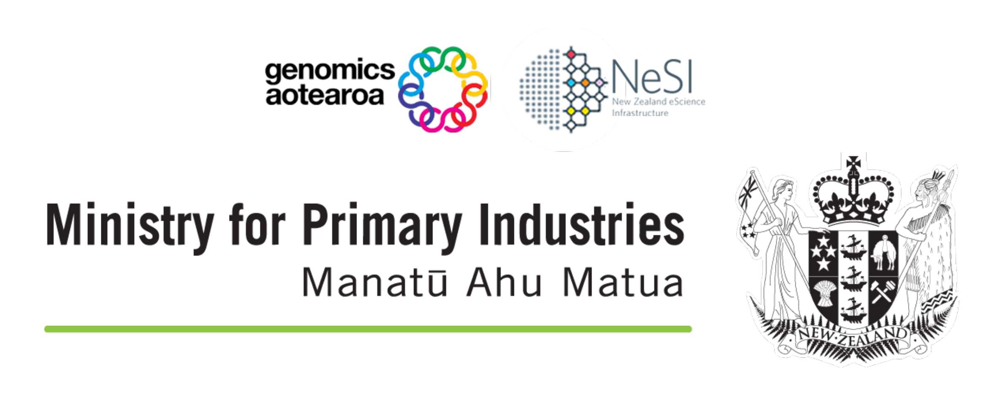

{width="400"}

# High Throughput Sequencing

!!! rectangle-list "Level 1 - Beginner"

    **Introduction to NeSI**

    1. [Connecting to NeSI](./level1/11_nesi_connection.md)
    1. [Navigation on the command line](./level1/12_shell_navigation.md)
    1. [Working with files on the command line](./level1/13_shell_manipulation.md)
    
    **Quality filtering Illumina data**

    1. [Inspecting reads](./level1/21_illumina_inspection.md)
    1. [Trimming paired-end reads](./level1/22_illumina_filtering.md)

    **Quality filtering Nanopore data**

    1. [Inspecting reads](./level1/31_nanopore_inspection.md)
    1. [Trimming long-read Nanopore data](./level1/32_nanopore_filtering.md)

    **Annotating sequences with BLAST**

    1. [Submitting a BLAST job to NeSI](./level1/41_blastn_annotation.md)
    1. [Introduction to slurm](./level1/42_slurm_introduction.md)
    1. [Interpreting BLAST outputs](./level1/43_blast_interpretation.md)

!!! rectangle-list "Level 2 - Advanced"

    **Working in the shell**

    1. [Working with files](./level2/11_shell_manipulation.md)
    1. [Variables and loops](./level2/12_shell_variables.md)
    1. [Redirection](./level2/13_shell_redirection.md)
    1. [Understanding the NeSI environment](./level2/14_nesi_environment.md)

    **_De novo_** assembly of sequencing data

    1. [Overview](./level2/21_assembly_de_novo.md)
    1. [Short read assembly with SPAdes](./level2/22_assembly_spades.md)
    1. [Long read assembly with Flye](./level2/23_assembly_flye.md)
    1. [Assessing the quality of a genome](./level2/24_assembly_evaluation.md)
    1. [Polishing of genome assemblies](./level2/25_assembly_polishing.md)

    **Mapping reads to a reference**
    
    1. [Overview](./level2/31_coverage_mapping.md)
    1. [Illumina mapping with bowtie2](./level2/32_illumina_mapping.md)
    1. [Nanopore mapping with minimap2](./level2/33_nanopore_mapping.md)
    1. [Filtering and sorting mapping files](./level2/34_mapping_filters.md)
    1. [Summarising mapping statistics](./level2/35_mapping_statistics.md)

---

!!! database "Data used in training"

    This workshop provides a basic introduction to working with the slurm scheduling system, and begins working with Illumina MiSeq and Oxford Nanopore Technology sequence data. The data used in this workshop is mostly using simulated reads, produced using InSilicoSeq[^2] from the Mycoplasma bovis 8790 reference genome NZ_LAUS01000004.1. We also make use of publicly available sequencing data from the studies PRJNA813586, PRJEB38441, and PRJEB38523.

    Additional teaching materials were sourced from:

    - Genomics Aoteoroa Metagenomic Summer School workshop2.
    - Long-Read, long reach Bioinformatics Tutorial3.
    - Galaxy Training! sequence analysis resources4.

!!! book-atlas "Citations"

     1. Erin Alison Becker, Anita Schürch, Tracy Teal, Sheldon John McKay, Jessica Elizabeth Mizzi, François Michonneau, *et al.* (2019, June). datacarpentry/shell-genomics: Data Carpentry: Introduction to the shell for genomics data, June 2019 (Version v2019.06.1). Zenodo. [http://doi.org/10.5281/zenodo.3260560](http://doi.org/10.5281/zenodo.3260560).
     
     2. Hadrien Gourlé, Oskar Karlsson-Lindsjö, Juliette Hayer, Erik Bongcam-Rudloff (2019). Simulating Illumina metagenomic data with InSilicoSeq. Bioinformatics 35(3), 521-522.
     
     3. Jian Sheng Boey, Dinindu Senanayake, Michael Hoggard *et al.* (2022). Metagenomics Summer School [https://github.com/GenomicsAotearoa/metagenomics_summer_school](https://github.com/GenomicsAotearoa/metagenomics_summer_school).
     
     4. Tim Kahlke (2021). Long-Read Data Analysis [https://timkahlke.github.io/LongRead_tutorials/](https://timkahlke.github.io/LongRead_tutorials/).
     
     5. Joachim Wolff, Bérénice Batut, Helena Rasche (2023). Sequence Analysis (revision 96e01807afff10d6060ac0691d004f0469676534). [https://training.galaxyproject.org/training-material/topics/sequence-analysis/](https://training.galaxyproject.org/training-material/topics/sequence-analysis/).
     