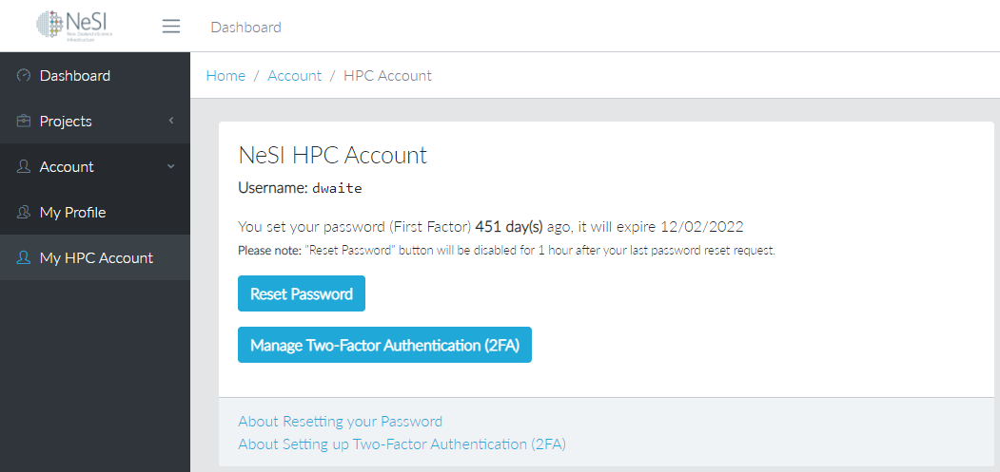
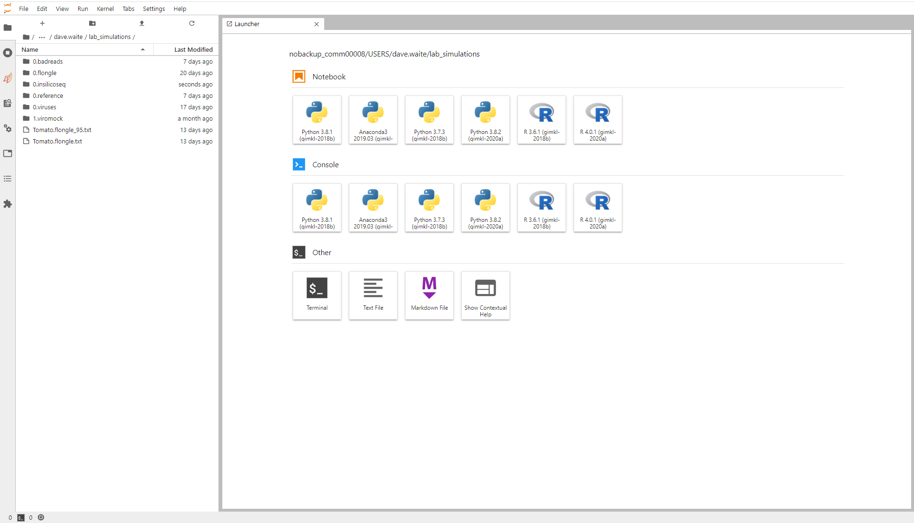

# 1.1 - Connecting to NeSI

## Overview

!!! clock "time"

    * Teaching: 10 minutes
    * Exercises: 5 minutes

!!! circle-info "Learning objectives"

    **Objectives**
    
    * Understand how to connect to NeSI using the JupyterHub web portal.
    
    **Key points**
    
    * You can connect to NeSI from any computer with internet access using the [NeSI JupyterHub portal](https://jupyter.nesi.org.nz/).
    * This allocates a small server instance from which you can perform simple operations, or prepare larger analysis scripts for deployment.

---

## Background

**What is a shell and why should I care?**

A shell is a computer program that presents a command line interface which allows you to control your computer using commands entered with a keyboard instead of controlling graphical user interfaces (GUIs) with a mouse/keyboard combination.

Command line interfaces are very common when working in bioinformatics, as creating a GUI is platform-dependant. To create a tool with a GUI that works on Windows, OS X, and Linux requires at least three different versions of the tool to be written. In contrast, the command line is common to all three platforms.

!!! note "Apart from this practical issue, there are many reasons to learn about the shell:"

    **The shell makes your work less boring**
    
    In bioinformatics you often need to do the same set of tasks with a large number of files.
    
    Learning the shell will allow you to automate those repetitive tasks and leave you free to do more exciting things.
    
    **The shell makes your work less error-prone**
    
    When humans do the same thing a hundred different times (or even ten times), they're likely to make a mistake.
    
    Your computer can do the same thing a thousand times with no mistakes.

    **The shell makes your work more reproducible**
    
    When you carry out your work in the command-line your computer keeps a record of every step that you've carried out, which you can use to re-do your work when you need to.
    
    It also gives you a way to communicate unambiguously what you've done, so that others can check your work or apply your process to new data.
    
    **Many bioinformatic tasks require large amounts of computing power and can't realistically be run on your own machine**
    
    These tasks are best performed using remote computers or cloud computing.
    
    These devices require a remote connection which is most stably provided through a command line interface.

In this lesson you will learn how to use the command line interface to move around in your file system.

---

## How to access NeSI

To access the shell on your own computer requires platform-specific software. For all work in this training we will be connecting to the NeSI platform and using their web-based shell environment. We will access this through your web browser, by navigating to NeSI's [JupyterHub](https://jupyter.nesi.org.nz/). 

!!! jupyter "When you arrive at this website, you will be prompted to provide your access details."

    

    You need to provide three pieces of information to log in. Your **username** was assigned to you when you registered for your NeSI account. It is *usually* either given as `<First name><Last name>` or `<Last name><First initial>`.

If you cannot remember your user name, navigate to the [MyNeSI](https://my.nesi.org.nz/) account management website. Once you have logged in, there is an option on the left-hand menu titled **My HPC Account**. Clicking here will show your user name.

??? key "Forgotten username"

    

You will also need to provide your password, and the current two-factor code displayed by the Authenticator app. Once these details are submitted, you will be redirected to a loading page.

!!! jupyter "Launching your NeSI session."

    
{width="600"}

    Click the `Select Project` dropdown box and select project `nesi03181`. This is the project we will be working under for training. Select a number of hours appropriate to the training session, and leave the other settings at default.

    >Please note that project `nesi03181` is open to all users participating in training projects on NeSI. **DO NOT** use this project for diagnostic work!

!!! jupyter "Loading a shell environment."

    After logging in, you will see a screen showing something like this: 

    

    Once the Jupyter server has finished loading, you will then transfer through to the following view:

    

    For now, we will just launch a basic terminal environment, so click on the **Terminal** icon. This will lauch the command line interface that we will be using for the remainder of this workshop.

    

    We will spend most of our time learning about the basics of the shell by manipulating some experimental data. Some of the data we're going to be working with is quite large, so a copy of the data has been placed in your working directory for this workshop. We will now begin to explore the working directory.
    
---

## Uses of JupyterHub

!!! jupyter ""

    Using the JupyterHub portal has two main functions. Primarily, this is a simple and easy to follow method for connecting to the NeSI HPC cluster without using specialised software. As long as you have a supported web browser you will be able to connect to NeSI from any location with internet access.
    
    The JupyterHub portal also provides you with a dedicated slice of NeSI resources so you can run small and medium sized commands directly on this terminal without worrying about the NeSI usage policy (which is a consideration if connecting directly). When you log into the JupyterHub portal you request a certain number of CPUs, an amount of computer memory (RAM) and the time you want these resources for. Once your session begins these are allocated directly to you and cannot be touched by other users. Commands you run here take place in real time and as long as they complete before your time allocation expires there are no limitations to what you can do.
    
    If you are planning to run a job that takes significantly longer than requested, the JupyterHub portal still acts as a good staging ground to log into NeSI, set up your `slurm` batch file and then submit the job. This is covered in different tutorials, but in these cases it is better to request a minimal number of cores and hours as all you really need to do is set up some directories, and write a few text files.
    
    
    
