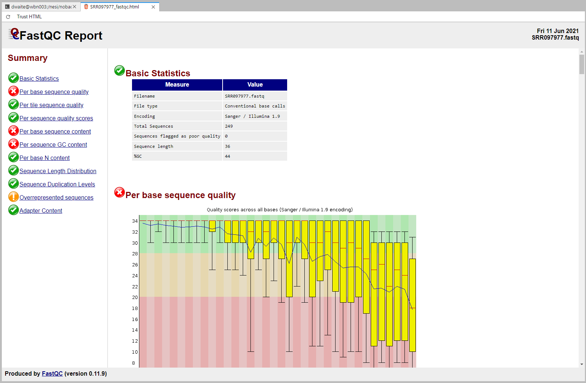
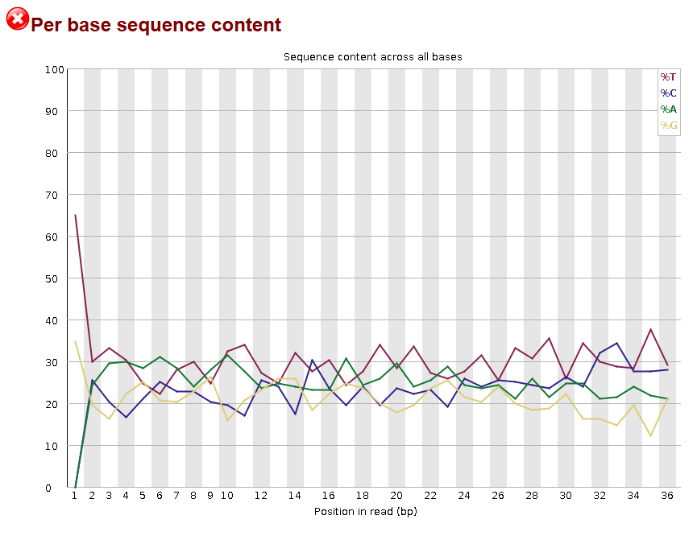
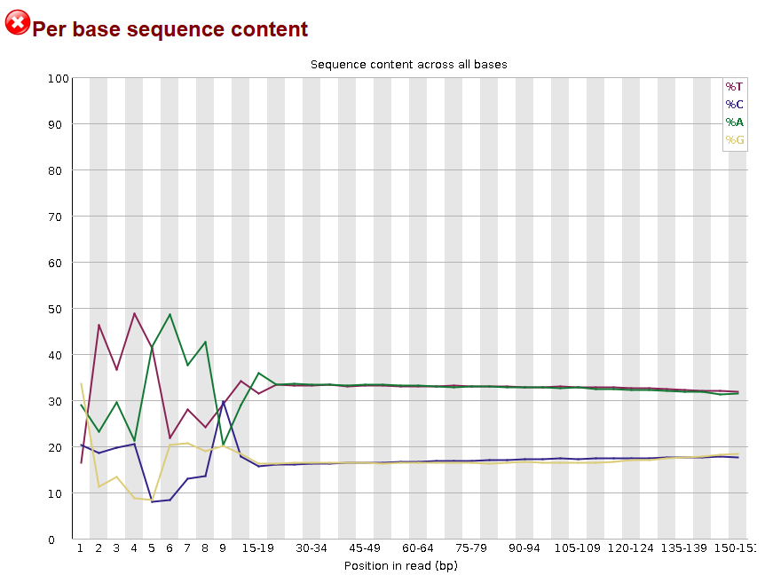
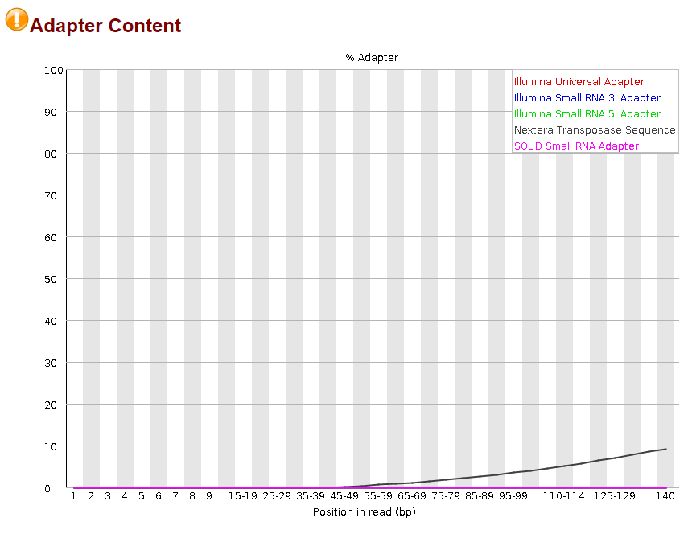

# 2.1 - Assesing Illumina data

!!! clock "time"
    * Teaching: 20 minutes
    * Exercises: 20 minutes

!!! circle-info "Learning objectives"

    **Objectives**
    
    * Know how to assess the quality of Illumina sequence data using visualisation tools such as `FastQC`.
    
    **Key points**
    
    * Raw sequencing data is usually not appropriate for immediate analysis.
    * `FastQC` is a powerful tool for quickly generating visual reports to summarise key aspects of Illumina data.

---

## Assessing sequence quality

When we obtain data from a sequencing facility, it is always important to check the overall quality of the sample, and to confirm whether or not sequencing constructs have been removed from the seqence data. In particular, we want to know:

!!! quote ""

    1. Are there adapter and/or barcode sequences attached to the reads
    1. Are there any obvious low-quality regions of sequence
    1. Is there a quality drop-off towards the end of read-pair sequence which might necessitate trimming

A very useful tool for answering these questions is `FastQC`. This tool takes a set of fastq files as input and produces reports for each one to allow us to answer the questions above, as well as examine over features of the sequences such as compositional bias, *k*-mer frequency profiles, and sequence duplication levels.

Navigate to your `level1/` folder and then enter the `quality_illumina/` sub-folder. Once you are in the correc tlocation run `FastQC` on the sample `SRR097977` using the following commands:

!!! terminal "code"

    ```bash
    module load FastQC/0.11.9

    cd /nesi/project/nesi03181/phel/USERNAME/level1/quality_illumina/
    fastqc -o results/ reads/SRR097977.fq.gz
    ```

    ??? success "Output"

        ```bash
        Started analysis of SRR097977.fq.gz
        Analysis complete for SRR097977.fq.gz
        ```

`FastQC` generates output reports in `.html` files and a `.zip` file that contains the main display resources. These can be viewed in a standard web browser. Since we are connection to NeSI using the JupyterHub system, we can view these directly:

!!! note "Note"

    `FastQC` does not load the forward and reverse pairs of a library in the same window, as it works on individual fastq files and is not aware of any read pairing in your library. You need to be mindful of how your samples relate to each other and in which order you have opened them if you are trying to compar the forward and reverse complement of a sequencing library.

!!! file-code "Open .html"

    1. Click on the folder icon in the top left to open the folder navigator pane (if not already open).
    1. Use the file browsing system to navigate through t your current location.
    1. Double click on the output `.fastqc.html` files to open them in the a new tab.

Let's now look at some of the outputs, starting with the summary for sample `SRR097977`.

!!! jupyter "FastQC output"

    
 
    This is the basic view for `FastQC` output. At the left-hand side of the tab is a navigation menu, which can move you quickly through the pages of summary information. Alternatively, you can simply scroll down the page to find the section you are most interested in.

From the summary view, the main point of interest is the 'Basic Statistics' table. This gives you some brief summary information for your input file, such as the name of the file read (this can be important if you are working with many files), the fastq encoding, the numbers of sequences and the average length. You should already have a rough expectation for these numbers based from correspondence with your sequencing provider.

---

## Per base sequence quality

Scrolling down (or clicking on the 'Per base sequence quality' link) will take us to the main piece of information we wish to know about the samples - the overall quality of the sequences.

!!! jupyter "FastQC output"

    

This view provides us with a nice graphical summary of the average sequence quality along the length of our reads. Fastq Q-scores are ranked on the y-axis and the nucleotide position in the read (or range of positions, for reads which are several hundred nucleotides in length) are plotted sequentially along the x-axis.

The sample `SRR097977` shows a severe, but expected pattern of quality, whereby the sequence quality degrades as the reading window moves towards the right-hand side of the sequence.

This view provides us with two pieces of information - how strictly we need to trim our sequences, and what effect we could expect to see on our number of sequences and sequence length after quality filtering.

---

## Per base sequence content

The next piece of information which can be helpful to check is the average distribution of nucleotides across the sequence length. When examining this feature of an Illumina run, we do not expect to see an even split between the four nucleotides at each position.

This is because most genomes have a bias for a high or low proportion of G-C pairs compared with A-T pairs. For example, the human genome is on average 41% G and C nucleotides, and 59% A and T nucleotides.

On average then, when we look to the nulcotide frequency distribution for a random genome we should not expect 25% of each nucleotide in each position, but *we should* see equal frequencies of A/T and G/C.

!!! jupyter "FastQC output"

    

This is not the case in the `SRR097977` data which we were looking at, but we already know that this is a reasonably low-quality library. For a more realistic result, let's take a look at some better data taken from the Sequence Read Archive.

!!! terminal "code"

    ```bash
    fastqc -o results/ reads/ERR4179828_*.fq.gz
    ```

    ??? success "Output"

        ```bash
        Started analysis of ERR4179828_1.fq.gz
        Approx 5% complete for ERR4179828_1.fq.gz
        Approx 10% complete for ERR4179828_1.fq.gz
        Approx 15% complete for ERR4179828_1.fq.gz
        Approx 20% complete for ERR4179828_1.fq.gz
        Approx 25% complete for ERR4179828_1.fq.gz
        Approx 30% complete for ERR4179828_1.fq.gz
        Approx 35% complete for ERR4179828_1.fq.gz
        Approx 40% complete for ERR4179828_1.fq.gz
        Approx 45% complete for ERR4179828_1.fq.gz
        Approx 50% complete for ERR4179828_1.fq.gz
        Approx 55% complete for ERR4179828_1.fq.gz
        Approx 60% complete for ERR4179828_1.fq.gz
        Approx 65% complete for ERR4179828_1.fq.gz
        Approx 70% complete for ERR4179828_1.fq.gz
        Approx 75% complete for ERR4179828_1.fq.gz
        Approx 80% complete for ERR4179828_1.fq.gz
        Approx 85% complete for ERR4179828_1.fq.gz
        Approx 90% complete for ERR4179828_1.fq.gz
        Approx 95% complete for ERR4179828_1.fq.gz
        Analysis complete for ERR4179828_1.fq.gz
        Started analysis of ERR4179828_2.fq.gz
        Approx 5% complete for ERR4179828_2.fq.gz
        Approx 10% complete for ERR4179828_2.fq.gz
        Approx 15% complete for ERR4179828_2.fq.gz
        Approx 20% complete for ERR4179828_2.fq.gz
        Approx 25% complete for ERR4179828_2.fq.gz
        Approx 30% complete for ERR4179828_2.fq.gz
        Approx 35% complete for ERR4179828_2.fq.gz
        Approx 40% complete for ERR4179828_2.fq.gz
        Approx 45% complete for ERR4179828_2.fq.gz
        Approx 50% complete for ERR4179828_2.fq.gz
        Approx 55% complete for ERR4179828_2.fq.gz
        Approx 60% complete for ERR4179828_2.fq.gz
        Approx 65% complete for ERR4179828_2.fq.gz
        Approx 70% complete for ERR4179828_2.fq.gz
        Approx 75% complete for ERR4179828_2.fq.gz
        Approx 80% complete for ERR4179828_2.fq.gz
        Approx 85% complete for ERR4179828_2.fq.gz
        Approx 90% complete for ERR4179828_2.fq.gz
        Approx 95% complete for ERR4179828_2.fq.gz
        Analysis complete for ERR4179828_2.fq.gz
        ```

Take a look at the result of the `ERR4179828_1` file. The per base sequence content plot should look similar to this:

!!! jupyter "FastQC output"

    

Here we can see a much more realistic result for the sequencing output. These sequencing data are from an *M. bovis* genome (BioProject [PRJEB38523](https://www.ncbi.nlm.nih.gov/bioproject/PRJEB38523). *M. bovis* has an average GC richness of ~29%, which is consistent with the results in this figure - both the `C%` and `G%` values are between 15% and 18% for the length of the sequence, and the `A%` and `T%` are slightly over 30%.

This is true for *most* of the sequence, but at the starting nucleotides something is clearly different. A pattern such as this is quite a common occurance and is due to methodological biases inherent in library preparation strategies. This phenomenon has been demonstrated in the context of RNASeq libraries<sup>[1](#hansen), [2](#vangurp)</sup> and has also been observed in DNA libraries prepared with transposon-based kits such as the Nextera preparation kits. If you follow the link above to [ERR4179828](https://www.ncbi.nlm.nih.gov/sra/ERR4179828) you can see in the metadata that these sequences are from an Illumina MiSeq run prepared with the Nextera XT system.

!!! note ""

    <a name="hansen"><sup>1</sup></a>Hansen KD, Brenner SE, Dudoit S (2010) Biases in Illumina transcriptome sequencing caused by random hexamer priming. Nucleic Acids Res. 38(12):e131. https://doi.org/10.1093/nar/gkq224

    <a name="vangurp"><sup>2</sup></a>van Gurp TP, McIntyre LM, Verhoeven KJF (2013) Consistent Errors in First Strand cDNA Due to Random Hexamer Mispriming. PLoS ONE 8(12): e85583. https://doi.org/10.1371/journal.pone.0085583

---

## Adapter content

As you will know from the previous Nanopore exercises, when sequencing is peformed we must add adapter sequences to our extracted DNA (or cDNA) to facilitate sequencing. Because these adapter constructs become part of the DNA sequence, they are also read by the sequencing machine and reported as observed sequence.

It is *generally* good practice for a sequencing facility to scrub these adapter sequences from your data before returning it to you, and if you are using a multiplexed (barcoded) method of sequencing this almost certainly must be performed before your sequence is made available.

However, this is never guaranteed and it is always good practice to confirm that there are no adapters or barcodes in your library before you attempt to analyse the data. Since adapters are attached to the start of the DNA fragment being sequenced, they will always appear in the starting positions of your reads if not removed.
 
!!! question "Exercise"

    Think about what the per base sequence content of a library that has not had adapters removed would look like. How could you go about detecting whether or not adapters your present at the start of your sequences if;
    
    1. You know what adapters were used in your sequencing experiment? (i.e. the sequencing centre has told you what preparation method was used)
    2. You *do not* know what adapters were used in your sequencing experiment? (i.e. you know that some preparation was performed, but the sequencing centre has not revealed the information to you)
    
    Try to formulate your answers in terms only of tools used in this workshop, or the previous Level 1 training.

    ??? circle-check "Solution"

        **Note:** These are not the only valid answers. If you have an answer that differs from the answers below, share it with the workshop attendees to discuss it.

        1. You could use a tool such as a search function in `less`, or `grep` to count the instances of the adapter sequence within your library.
        2. If you were to use the per base sequence content view from `FastQC`, the frequencies for the first 10 - 20 nucleotides would skew to 100% for the adapter sequence used.

It is important to think carefully about the expected attributes of your sequence data as you work with it. Although there are plenty of tools (`FastQC` included) which can automatically detect the common library adapters, 'common' is a relative term and depends on how frequently updated the tool is compared with the latest sequencing technologies.

Take a look at the adapter content view for the `ERR4179828_1` library. Are there any adapter or preparation sequences detected in these data? Are they where you would expect them?

!!! jupyter "FastQC output"

    

It appears that any Illumina sequencing adapters that were used in the library preparation has already been removed from the start of the sequences, but there are Nextera transposase sequences present in the tail end of some sequences.

!!! question "Exercise"

    Considering what you know about the Illumina sequencing platform, how do you think it is possible to get adapters or sequencing constructs on the tail end (far end) of a sequence?

    ??? circle-check "Solution"

        This is a phenomenon known as read-through. When the DNA fragment being sequenced is shorter than the read length. For example, in these data the read length is 150 bp. If a fragment of only 80 nucleotides in length is sequenced, the sequencing machine does not know that there are only 80 positions to read and it will not terminate after those 80 nucleotides are processed.

        Instead, the sequencer will continue to read the sequence it can find at the 5' end of the 80 nucleotides, which will be the reverse adapter.

---
