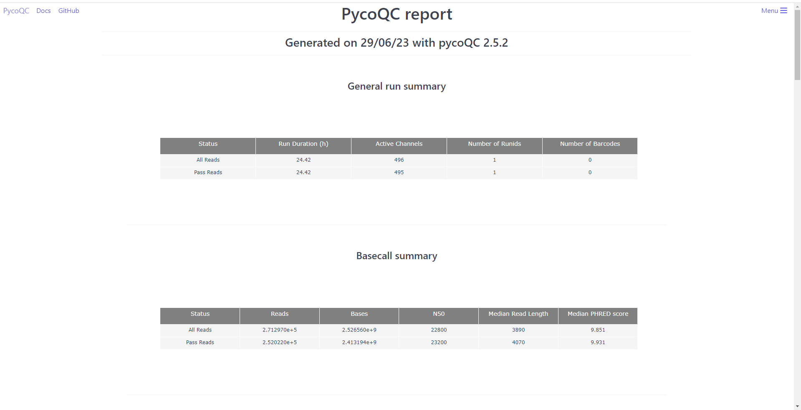

# 3.2 - Assesing Nanopore data

!!! clock "time"

    * Teaching: 10 minutes
    * Exercises: 10 minutes

!!! circle-info "Learning objectives"

    **Objectives**
    
    * Know how to assess the quality of Oxford Nanopore data using visualization tools such as `pycoQC`
    
    **Key points**

    * Quality filtering can be performed natively by the `MinKNOW ` software during sequencing
    * It is important to use tools designed specifically for long read data when performing assessment and trimming of Nanopore reads

---

## Background

The process of translating the electrical current differentials generated by Nanopore sequencers into the nucleotide information is known as '*base calling*'. Base calling is in most cases performed in real time as sequencing happens, so that when the sequencing run is finished we have our data ready for analysis.

The tool which performs base calling during sequencing is `guppy` and among its functions it is capable of performing quality filtering for us as it operates. As such, you may not need to perform quality trimming on your Nanopore data.

When setting up the sequencing run parameters using the sequencing software (`MinKNOW`), we can specify if we want the base calling to be performed automatically by the computer. When the basecalling option is ON, the output of the sequencing run will be saved in fastq files. As part of the set up, we are also given the choice of quality filtering and it is standard procedure to use these settings:

!!! jupyter "Enabling quality filtering in MinKNOW"

    

!!! jupyter "Configuring quality filtering in MinKNOW"

    

However, there are still several cases where we may need to revisit our data and perform filtering. For example;

1. If receiving sequence data from an online source, we may not be able to verify what filtering was applied so need to perform our own to be sure of the data quality.
1. Quality filtering may have been perofrmed, but it is of a level not appropriate for our work (e.g. the filtering criteria were too lenient and poor quality sequences have still slipped through).

---

## Assessing sequence quality

Assuming that we do not know the origin of our data (as you do not in this exercise), the initial step for any sequencing project is quality control to assess the quality of your data. This will give you some statistics of your sequencing data, such as length and quality score distributions, and may be used to identify potential problems with your input DNA/RNA, the sequencing run or the output itself.

We are going ot start with a the tool `pycoQC`. This is a data visualisation and quality control tool for Nanopore data. In contrast to many other assessment tools, it does not take your sequencing files as input but instead requires a Nanopore-specific output file generated during the sequencing run.

To run `pycoQc`, navigate to your working folder and run the following commands:

!!! terminal "code"

    ```bash
    module load pycoQC/2.5.2-gimkl-2020a-Python-3.8.2

    cd  /nesi/project/nesi03181/phel/<username>/level1/quality_nanopore/
    pycoQC -f reads/sequencing_summary.txt -o results/sequencing_report.html
    ```

!!! bell "As the tool runs you might see some output that looks like:"
    ```
    (base) [dwaite@wbl002 quality_nanopore]$ pycoQC -f reads/sequencing_summary.txt -o results/sequencing_report.html
    /opt/nesi/CS400_centos7_bdw/pycoQC/2.5.2-gimkl-2020a-Python-3.8.2/lib/python3.8/site-packages/plotly-4.1.0-py3.8.egg/_plotly_utils/utils.py:203: SyntaxWarning: "is" with a literal. Did you mean "=="?
      if (iso_string.split("-")[:3] is "00:00") or (iso_string.split("+")[0] is "00:00"):
    /opt/nesi/CS400_centos7_bdw/pycoQC/2.5.2-gimkl-2020a-Python-3.8.2/lib/python3.8/site-packages/plotly-4.1.0-py3.8.egg/_plotly_utils/utils.py:203: SyntaxWarning: "is" with a literal. Did you mean "=="?
      if (iso_string.split("-")[:3] is "00:00") or (iso_string.split("+")[0] is "00:00"):
    ```

This is fine, just a warning that the way `pycoQC` was written was not best practice in a few areas. It does not affect the performance at all.

Once the command is finished, you can load it into yout `JupyterHub` session by navigating to it in the file browser, right-clicking, and selecting `Open in New Browser Tab`

??? image "Opening by double-clicking (incorrect)"

    

!!! jupyter "Opening by right-click"

    

`pycoQC`  generates output reports as html files, which we can open the same way as we did for `FastQC`.

!!! question "Exercise"

    Inspect the different plots and statistics to answer the following questions:

    1. How many reads do you have in total?
    1. What is the median, minimum, and maximum read length?
    1. What do the mean quality and the quality distribution of the run look like? (Remember, Q10 means an error rate of 10%)

    ??? circle-check "Solution"

        1. ~270k reads in total (see the Basecall summary of `pycoQC`'s output page)
        1. The median read length can also be found in the same place. The median length is 3,890 bp for all reads, or 4,070 for those that passed `MinKNOW`'s quality filtering.
           1. To find the minimum and maximum read lengths look at the 'Basecalled read lengths' plot.
           1. If you hover over the start and the end of the plotted length distribution you will see the length followed by the number of reads.
           1. The minimum read length for the passed reads is about 200 bp, the maximum length ~130,000 bp.
        1. The median quality of the reads can be found in the basecall summary, and the distribution in the 'Basecalled reads PHRED quality plot'.
           1. The majority of the reads has a Q-score below 10, i.e., an error rate of >10%.
           1. These results can be considered normal although it is possible to obtain better quality.

In addition to read statistics, `pycoQC` also gives a lot of information about the sequencing run and the flowcell itself such as sequencing run, yield over time, number of active pores, and so on.

One of the strengths of `pycoQC` is that it is interactive and highly customisable. Plots can be cropped, you can zoom in and out, sub-select areas and export figures. For detailed usage and examples see the `pycoQC` documentation: [https://a-slide.github.io/pycoQC/](https://a-slide.github.io/pycoQC/).

---
