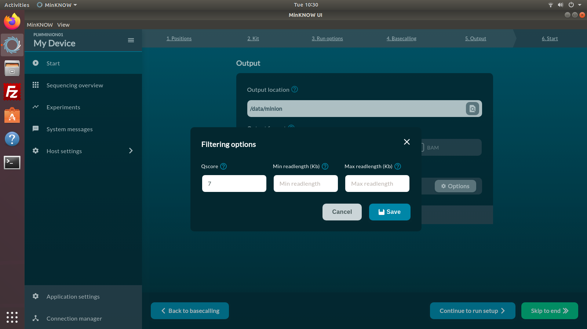
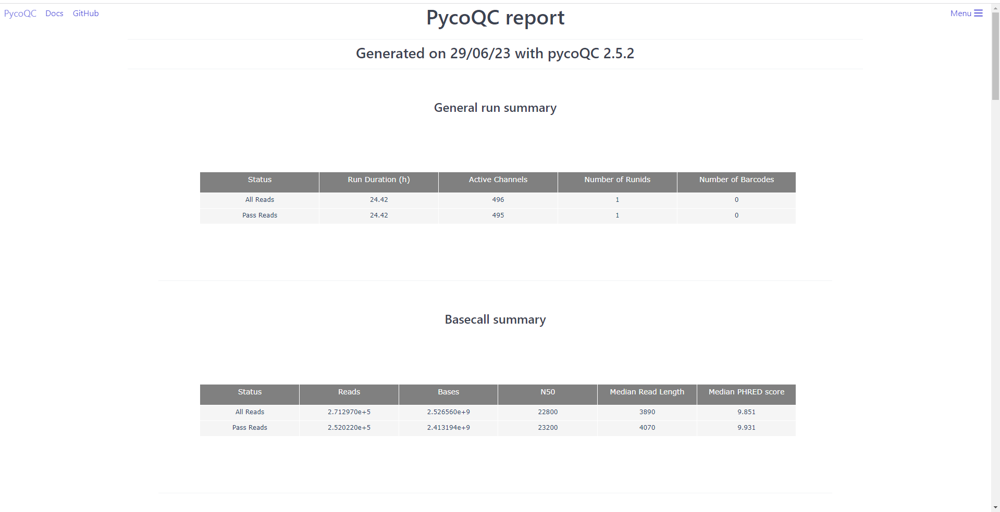

# Nanopore - Sequence quality

!!! clock "time"

    * Teaching: 30 minutes
    * Exercises: 30 minutes

!!! circle-info "Learning objectives"

    **Objectives**
    
    * Know how to assess the quality of Oxford Nanopore data using visualization tools such as `pycoQC`
    * Be able to perform quality filtering of Nanopore data to remove short reads and adapter sequences
    
    **Key points**
    
    * Sequences can be filtered to remove low quality reads and short reads using tools such as `Nanofilt`
    * It is important to use tools designed specifically for long read data when performing assessment and trimming of Nanopore reads
    * Identifying and removing residual sequencing adapters is not always necessary, but tools exist for it if required

---

## Background

The process of translating the electrical current differentials generated by Nanopore sequencers into the nucleotide information is known as '*base calling*'. Base calling is in most cases performed in real time as sequencing happens, so that when the sequencing run is finished we have our data ready for analysis.

The tool which performs base calling during sequencing is `guppy` and among its functions it is capable of performing quality filtering for us as it operates. As such, you may not need to perform quality trimming on your Nanopore data.

When setting up the sequencing run parameters using the sequencing software (`MinKNOW`), we can specify if we want the base calling to be performed automatically by the computer. When the basecalling option is ON, the output of the sequencing run will be saved in fastq files. As part of the set up, we are also given the choice of quality filtering and it is standard procedure to use these settings:

!!! jupyter "Enabling quality filtering in MinKNOW"

    

!!! jupyter "Configuring quality filtering in MinKNOW"

    

However, there are still several cases where we may need to revisit our data and perform filtering. For example;

1. If receiving sequence data from an online source, we may not be able to verify what filtering was applied so need to perform our own to be sure of the data quality.
1. Quality filtering may have been perofrmed, but it is of a level not appropriate for our work (e.g. the filtering criteria were too lenient and poor quality sequences have still slipped through).

---

## Assessing sequence quality

Assuming that we do not know the origin of our data (as you do not in this exercise), the initial step for any sequencing project is quality control to assess the quality of your data. This will give you some statistics of your sequencing data, such as length and quality score distributions, and may be used to identify potential problems with your input DNA/RNA, the sequencing run or the output itself.

We are going ot start with a the tool `pycoQC`. This is a data visualisation and quality control tool for Nanopore data. In contrast to many other assessment tools, it does not take your sequencing files as input but instead requires a Nanopore-specific output file generated during the sequencing run.

To run `pycoQc`, navigate to your working folder and run the following commands:

!!! terminal "code"

    ```bash
    module load pycoQC/2.5.2-gimkl-2020a-Python-3.8.2

    cd  /nesi/project/nesi03181/phel/<username>/level1/quality_nanopore/
    pycoQC -f reads/sequencing_summary.txt -o results/sequencing_report.html
    ```

!!! bell "As the tool runs you might see some output that looks like:"
    ```
    (base) [dwaite@wbl002 quality_nanopore]$ pycoQC -f reads/sequencing_summary.txt -o results/sequencing_report.html
    /opt/nesi/CS400_centos7_bdw/pycoQC/2.5.2-gimkl-2020a-Python-3.8.2/lib/python3.8/site-packages/plotly-4.1.0-py3.8.egg/_plotly_utils/utils.py:203: SyntaxWarning: "is" with a literal. Did you mean "=="?
      if (iso_string.split("-")[:3] is "00:00") or (iso_string.split("+")[0] is "00:00"):
    /opt/nesi/CS400_centos7_bdw/pycoQC/2.5.2-gimkl-2020a-Python-3.8.2/lib/python3.8/site-packages/plotly-4.1.0-py3.8.egg/_plotly_utils/utils.py:203: SyntaxWarning: "is" with a literal. Did you mean "=="?
      if (iso_string.split("-")[:3] is "00:00") or (iso_string.split("+")[0] is "00:00"):
    ```

This is fine, just a warning that the way `pycoQC` was written was not best practice in a few areas. It does not affect the performance at all.

Once the command is finished, you can load it into yout `JupyterHub` session by navigating to it in the file browser, right-clicking, and selecting `Open in New Browser Tab`

??? image "Opening by double-clicking (incorrect)"

    

!!! jupyter "Opening by right-click"

    

`pycoQC`  generates output reports as html files, which we can open the same way as we did for `FastQC`.

!!! question "Exercise"

    Inspect the different plots and statistics to answer the following questions:

    1. How many reads do you have in total?
    1. What is the median, minimum, and maximum read length?
    1. What do the mean quality and the quality distribution of the run look like? (Remember, Q10 means an error rate of 10%)

    ??? circle-check "Solution"

        1. ~270k reads in total (see the Basecall summary of `pycoQC`'s output page)
        1. The median read length can also be found in the same place. The median length is 3,890 bp for all reads, or 4,070 for those that passed `MinKNOW`'s quality filtering.
           1. To find the minimum and maximum read lengths look at the 'Basecalled read lengths' plot.
           1. If you hover over the start and the end of the plotted length distribution you will see the length followed by the number of reads.
           1. The minimum read length for the passed reads is about 200 bp, the maximum length ~130,000 bp.
        1. The median quality of the reads can be found in the basecall summary, and the distribution in the 'Basecalled reads PHRED quality plot'.
           1. The majority of the reads has a Q-score below 10, i.e., an error rate of >10%.
           1. These results can be considered normal although it is possible to obtain better quality.

In addition to read statistics, `pycoQC` also gives a lot of information about the sequencing run and the flowcell itself such as sequencing run, yield over time, number of active pores, and so on.

One of the strengths of `pycoQC` is that it is interactive and highly customisable. Plots can be cropped, you can zoom in and out, sub-select areas and export figures. For detailed usage and examples see the `pycoQC` documentation: [https://a-slide.github.io/pycoQC/](https://a-slide.github.io/pycoQC/).

---

## Identifying and removing adapters

Before we start worring about the raw sequencing quality of our reads, there is one factor to consider. When creating HTS libraries for sequencing, barcode and adpater sequences are appended to the ends of the template DNA to facilitate sequencing. These are an artificial construct, not reflective of the read biology of our sample, but are sequenced the same as the template DNA by the sequence device.

Adapters may be found at the start of end of a sequence, as with Illumina reads, but an issue unique to Nanopore sequencing is the occurence of *mid-sequence* adapters. This occurs when a sequence moves through the sequencing pore and is immediately followed by another read. If this happens quickly enough that the base calling tool can realise the first sequence has ended, the the new sequence is appended to tail of the first.

When this phenomenon happens you end up with a chimeric fusion of the first and second sequence, separated by the adapter of the second sequence. While mid-sequence adapaters artifacts are rare (typically less than 1% of a sequencing library) they are very easy to screen for, and it is important to identify and correct them in order to get the best classification or assembly result possible.

Like quality filtering, adapater removal (including mid-sequence adapters) can be performed during base calling, but if it was not, we can use the tool `porechop` to identify and remove adapaters:

!!! terminal "code"

    ```bash
    module load Porechop/0.2.4-gimkl-2020a-Python-3.8.2
    porechop --threads 2 -i reads/nanopore.fq.gz -o results/nanopore.porechop.fq
    ```

    ??? success "Output"

        ```bash
        Trimming adapters from read ends
             SQK-NSK007_Y_Top: AATGTACTTCGTTCAGTTACGTATTGCT
          SQK-NSK007_Y_Bottom: GCAATACGTAACTGAACGAAGT
             1D2_part_2_start: CTTCGTTCAGTTACGTATTGCTGGCGTCTGCTT
               1D2_part_2_end: CACCCAAGCAGACGCCAGCAATACGTAACT

        3,722 / 3,722 (100.0%)

        3,120 / 3,722 reads had adapters trimmed from their start (68,630 bp removed)
          834 / 3,722 reads had adapters trimmed from their end (9,680 bp removed)


        Splitting reads containing middle adapters
        3,722 / 3,722 (100.0%)

        20 / 3,722 reads were split based on middle adapters
        ```

Watch the output as `porechop` runs, and see how many residual adapters were found in your mock data set. One of the really nice features of `porechop` is that we do not need to know which adapter sequences were used in library construction - the tool has a built-in reference set of the common adapter sequences and reads are screened for all by default.

!!! question "Exercise"

    From the output of `porechop`, answere the following questions:

    1. Which adapter sets were used to produce this library?
    1. How many sequences were flagged as carrying a forward or reverse adapter sequence?
    1. How many sequences had mid-sequence adapaters which needed removal?

    ??? circle-check "Solution"

        1. The adapters from the **SQK-NSK007** and **1D2** sequencing kits were found in this library. 
        1. 3,120 sequences were found to have a forward adapter attached, and 834 sequences had an end adapter attached.
        1. 20 of the reads were found ot have a mid-sequence adapter.

---

## Removing short and low quality reads

Finally, we need to remove low quality data from the sequencing library. It can also be helpful to remove short reads from the data set at this point, as these can negatively impact the results of your downstream analysis in some situations.For example, if you are trying to assemble a genome from the data, the short reads may interfere with the assembly process and result in a worse genome that you would get if they were screened rom the library beforehand.

`NanoFilt` is a tool that can filter reads by quality score and length. It is also capable of cropping a specified number of bases from the start or the end of a read, which can be useful sometimes as read quality is not uniform along the sequences - in Nanopore data it is common to see that the average quality score in the first few dozen nucleotides is significantly worse than the rest of the sequence.

Unload `porechop`, and load the `NanoFilt` module to:

* Remove all reads with quality scores under 15
* Remove all reads shorter than 500 bp
* Trim the first 50 nucleotides off all reads

!!! terminal "code"

    ```bash
    module purge
    module load nanofilt/2.6.0-gimkl-2020a-Python-3.8.2

    NanoFilt -q 15 -l 500 --headcrop 50 < results/nanopore.porechop.fq > results/nanopore.qc.fq
    ```

!!! note "Note"

    `NanoFilt` behaves a bit strangely in the way it takes input data and writes output. Rather than specifying files with flags such as `-i` and `-o`, it reads a data from a stream called `stdin`, and writes to a separate channel called `stdout`.

    Working with these channels is part of the Level 2 training, for now you just need to know that the `<` character sets the `stdin` input, and `>` specifies where the `stdout` data will go.

We can get a quick estimate for how much data passed our quality requirements by checking the number of lines in the output file. If you have read the [fastq description file](../supplementary/fastq_format.md) you will know how data is recorded in the fastq file format. We can quickly use the `wc` command to count the number of lines in the input and output files, to compare how many reads we started with and how many remain after filtering:

!!! terminal "code"

    ```bash
    wc -l results/*
    ```

    ??? success "Output"

        ```bash
        14940 results/nanopore.nanopore_porechop.fq
         5252 results/nanopore.qc.fq
        20192 total
        ```

How many sequences did we lose in the process?

---
