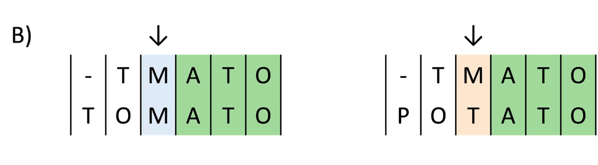
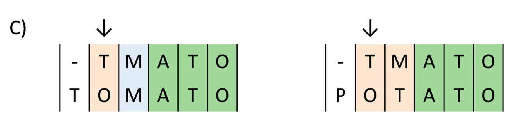

# 4.1 - Annotating with BLAST

!!! clock "time"

    * Teaching: 15 minutes
    * Exercises: 15 minutes

!!! circle-info "Objectives and Key points"

    #### Objectives

    * Understand the basic idea behind the `BLAST` algorithm
    * Learn how to submit `BLAST` jobs to the NeSI cluster using `slurm`
    * Understand the differences between nucleotide and protein sequence matching
    * Be aware of which publicly available databases are appropriate for which data

    #### Keypoints

    * Annotation is required in order to identify the function and origin of sequences obtained from HTS analysis
    * There are different databases available for annotation and classification

---

## The `BLAST` process

BLAST (**B**asic **L**ocal **A**lignment **S**earch **T**ool) was developed in 1990 [Altschul *et al.*, 1990](https://doi.org/10.1016/S0022-2836(05)80360-2) and is now one of the most well known, and widely used Bioinformatics tools. BLAST compares novel (query) sequences against a database of reference sequences (target sequences) and reports back the similarity between each query and target sequence. Using the metadata associated with each reference sequence we can make inferences about the query sequence such as taxanomic origin, or function.

!!! note "Overview of `BLAST` steps"

    {width="600"}

    Where matches are found, BLAST then extends the ends of the seed one position at a time and assesses how well the seed continues to match the targets.  

    {width="600"}

    Matches and mismatches are recorded and the seed extenstion continues.    

    {width="600"} 

    BLAST is also able to introduce insertions to preserve a match between query and target sequences.  

    {width="600"} 

The quality of the match between the query and the target are evaluated in terms of how well conserved the sequence composition is between the pair, including how many insertion or deletion events need to be introduced to maintain the matching.

In a BLAST analysis, every query sequence will be compared with every target in the database. Results are ranked by the quality of each match. Typically, we restrict our results to only return a certain number of the best matches, rather than everything with any degree of similarity to the query. Regardless of how many results are returned, for high quality matches we would expect to see a strong consensus in the gene function and taxonomy of the top matches. From these matches we can make inferences about the origin and function of the query sequence. 

---

## Submitting a nucleotide `BLAST` job on NeSI

The power of `BLAST` lies in its ability to exhaustively search for query sequences in very large databases of target sequence data, however this can make BLAST a computationally expensive process. This means that on NeSI, when we run a BLAST analysis we need to use `slurm` to request resources and schedule our job. 

`BLAST` is a commonly used tool and NeSI have template `slurm` scripts available for us to use. We will use a template today to prepare a `slurm` script to use `BLAST` to annotate a collection of sample sequences.

??? note "Different `BLAST` options"

    There are different types of `BLAST` we can use depending on the type of sequence data we have as input, and the types of databases we want to search to generate output. 

    {width="700"}

Here we want to classify some nucleotide sequences, such as might be generated during diagnostic work. Since we are searching with nucleotide query sequences against a nucleotide reference database, we will use `BLASTn`.

Navigate to the `blast_annotation/` folder and see what files have been placed there.

!!! terminal "code"

    ```bash
    cd /nesi/project/nesi03181/phel/<username>/level1/blast_annotation/

    ls
    ```

    ??? success "Output"

        ```bash
        input.fna level1_blast.sl
        ```

You should see two files, one with a `.fna` extension which contains the sequences we wish to classify using `BLASTn`. The other is a text file that looks like:

!!! terminal "code"

    ```bash
    #!/bin/bash -e
    #SBATCH --account nesi03181
    #SBATCH --job-name level1_blast
    #SBATCH --output=level1_blast.%j.out
    #SBATCH --error=level1_blast.%j.err
    #SBATCH --mail-user <insert email here>
    #SBATCH --time 00:30:00
    #SBATCH --cpus-per-task 16
    #SBATCH --mem 30GB

    module purge
    module load BLAST/2.13.0-GCC-11.3.0
    module load BLASTDB/2023-07

    cd /nesi/project/nesi03181/phel/<username>/level1/blast_annotation/

    blastn -num_threads ${SLURM_CPUS_PER_TASK} -db ${BLASTDB}/nt \
           -outfmt "6 qseqid sseqid pident length mismatch gapopen qstart qend sstart send evalue bitscore salltitles staxids" \
           -evalue 1e-3 -query input.fna -out output.txt
    ```

This is our first example of a `slurm` script. We will discuss the contents of this script in the next section, while our `BLAST` job is running. For now, we are just going to make some minor modifications to the script to customise it for you.

!!! question "Exercise"

    Open the `level1_blast.sl` file by double-clicking it in the file browser, and make the following modifications:

    1. Replace the value `<insert email here>` with your email address.
    1. Replace the value `<username>` with your login name, completing the path in the `cd` command.

Once you are happy with the content of your script, you can 'submit' the job request to the NeSI cluster using the command:

!!! terminal "code"

    ```bash
    sbatch level1_blast.sl
    ```

    ??? success "Output"

        ```bash
        Submitted batch job ########
        ```

If everything was correct, you should see feedback similar to the example above. Keep a copy of your job number, as we will use this later.

This `BLAST` job will run for approximately 20 minutes, so while it runs we will talk about the `slurm` system and what our script actually does.

---
