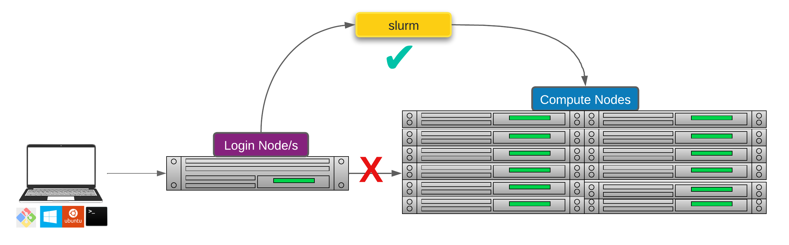

# 4.2 - Introduction to slurm

!!! clock "time"

    * Teaching: 20 minutes

!!! circle-info "Objectives and Key points"

    #### Objectives

    * Understand the reason for using a job scheduler when working with HPCs
    * Know the basic commands for starting and monitoring a `slurm` job

---

## Introduction to slurm scheduler and directives

An HPC system might have thousands of nodes and thousands of users. How do we decide who gets what and when? How do we ensure that a task is run with the resources it needs? This job is handled by a special piece of software called the scheduler. On an HPC system, the scheduler manages which jobs run where and when.

<center>{width="500"}</center>

In brief, scheduler is a mechanism to;

* Control access by many users to shared computing resources by queuing and scheduling of jobs
* Manage the reservation of resources and job execution on these resources 
* Allows users to "fire and forget" large, long calculations or many jobs ("production runs")

!!! circle-info "A bit more on why do we need a scheduler?"

    * To ensure the machine is utilised as fully as possible
    * To ensure all users get a fair chance to use compute resources (demand usually exceeds supply)
    * To track usage - for accounting and budget control
    * To mediate access to other resources e.g. software licences

There are several commonly used schedulers in HPC clusters around the world

* Slurm
* PBS, Torque
* Grid Engine

All NeSI clusters use `slurm` (**S**imple **L**inux **U**tility for **R**esource **M**anagement) scheduler (or job submission system) to manage resources and how they are made available to users.



<small>Researchers can not communicate directly to  Compute nodes from the login node. Only way to establish a connection OR send scripts to compute nodes is to use scheduler as the carrier/manager</small>

---

## Life cycle of a slurm job

<center>
{width="1000"}
</center>

!!! hand-holding-dollar "Commonly used `slurm` commands"

    |Command|Function|
    |:---|:---|
    |`sbatch`|Submit non-interactive (batch) jobs to the scheduler|
    |`squeue`|List jobs in the queue|
    |`scancel`|Cancel a job|
    |`sacct`|Display accounting data for all jobs and job steps in the slurm job accounting log or Slurm database|
    |`srun`|slurm directive for parallel computing|
    |`sinfo`|Query the current state of nodes|
    |`salloc`|Submit interactive jobs to the scheduler|

---

## Anatomy of a slurm script and submitting first slurm job 🧐

As with most other scheduler systems, job submission scripts in `slurm` consist of a header section with the shell specification and options to the submission command (`sbatch` in this case) followed by the body of the script that actually runs the commands you want. In the header section, options to `sbatch` should be prepended with `#SBATCH`.

<center>
{width="700"}
</center>


!!! square-pen "Commented lines `#`"

    Commented lines are ignored by the bash interpreter, but they are not ignored by `slurm`. The `#SBATCH` parameters are read by `slurm` when we submit the job. When the job starts, the bash interpreter will ignore all lines starting with `#`.
    
    Similarly, the 'shebang' line is read by the system when you run your script. The program at the path iis used to interpret the script. In our case `/bin/bash` (the program `bash` found in the */bin* directory).

---

??? circle-info "`slurm` variables"

    |Header|Example|Description|
    |:---|:---|:---|
    |--job-name|`#SBATCH --job-name MyJob`|The name that will appear when using squeue or sacct|
    |--account|`#SBATCH --account nesi12345`|The account your core hours will be 'charged' to|
    |--time|`#SBATCH --time DD-HH:MM:SS`|Job max walltime|
    |--mem|`#SBATCH --mem 512MB`|Memory required per node|
    |--cpus-per-task|`#SBATCH --cpus-per-task 10`|Will request 10 logical CPUs per task|
    |--output|`#SBATCH --output %j_output.out`|Path and name of standard output file. `%j` will be replaced by the job ID|
    |--error|`#SBATCH --error %j_error.out`|Path and name of standard eror file. `%j` will be replaced by the job ID|
    |--mail-user|`#SBATCH --mail-user=me23@gmail.com`|address to send mail notifications|
    |--mail-type|`#SBATCH --mail-type ALL`|Will send a mail notification at BEGIN END FAIL|

??? magnifying-glass "STDOUT/STDERR from jobs"

    * STDOUT - your process writes conventional output to this file handle
    * STDERR - your process writes diagnostic output to this file handle.
    
    **STDOUT** and **STDERR** from jobs are, by default, written to a file called `slurm-JOBID.out` and `slurm-JOBID.err` in the working directory for the job (unless the job script changes this, this will be the directory where you submitted the job). So for a job with ID 12345 STDOUT and STDERR will be `slurm-12345.out` and `slurm-12345.err`

    - When things go wrong, first step of **debugging** starts with a referral to these files. 

---

## Monitoring a slurm job while it runs

Once your job has been submitted, you might be interested in seeing how it is progressing through the job queue. We can monitor the life of our jobs with two main commands, as indicated above.

You can get a high-level view of all of your currently running jobs using the `squeue` command. By default this command shows all currently running jobs so is not very helpful. You can modify the command to report only your active jobs.

!!! terminal "code"

    ```bash
    squeue --me
    ```

    ??? success "Output"

        ```bash
        JOBID         USER       ACCOUNT   NAME        CPUS MIN_MEM PARTITI START_TIME     TIME_LEFT STATE    NODELIST(REASON)        
        NNNNNNNN      USERNAME   nesi03181 spawner-jupy   2      4G interac 2023-08-30T1     1:11:58 RUNNING  wbn004              
        NNNNNNNN      USERNAME   nesi03181 level1_blast  16     30G large   2023-08-30T1       18:05 RUNNING  wbn039 
        ```

This reveals some information about your **_currently running_** jobs. It tells you the resources allocated to the job (CPUs, memory) as well as when the job started running (if it has), and when it will time out.

If you want more detail about a particular job, you can use the `sacct` command, along with the job ID which was given to you when you submitted your script to see more information.

!!! terminal "code"

    ```bash
    sacct -j NNNNNNNN
    ```

    ??? success "Output"

        ```bash
        JobID           JobName          Alloc     Elapsed     TotalCPU  ReqMem   MaxRSS State      
        --------------- ---------------- ----- ----------- ------------ ------- -------- ---------- 
        NNNNNNNN        level1_blast        16    00:14:22     00:00:00     30G          RUNNING    
        NNNNNNNN.batch  batch               16    00:14:22     00:00:00                  RUNNING    
        NNNNNNNN.extern extern              16    00:14:22     00:00:00                  RUNNING 
        ```

This reports any sub-jobs which were launched as part of your `slurm` request.

---

## Creating your own slurm script (optional)

Since you were provided with a pre-written `slurm` script for the previous exercise, we will have a go at writting a new script from scratch while the `BLAST` job runs.

Below is a abstract version of the `slurm` life cycle to assist you with the process

<center></center>

??? question "Exercise"

    Create your own `slurm` script, which runs the following commands.

    ```bash
    sleep 100
    echo "I am a slurm job and I slept for 100 seconds"
    ```
    
    You can either use a command-line text editor, such as `nano` to write your file or use the file explorer to create an empty file when write into it as in the previous exercise. Use the following settings:

    * Use the account `nesi03181`
    * Set the job to run for 2 minutes
    * Request 1 CPU, and 512MB of memory

    ??? circle-check "Solution"

        ```bash
        #!/bin/bash 

        #SBATCH --job-name      myfirstslurmjob
        #SBATCH --account       nesi03181
        #SBATCH --time          00:02:00
        #SBATCH --cpus-per-task 1
        #SBATCH --mem           512MB
        #SBATCH --output        myfirstslurmjob.%j.out
        #SBATCH --error         myfirstslurmjob.%j.err

        sleep 100
        echo "I am a slurm job and I slept for 100 seconds"
        ```

??? bell "Quick Check before compiling the script - Assigning values to `slurm` variables"

    <center></center>

    <center></center>

---

## The importance of resource utilisation (cpu, memory, time)

Understanding the resources you have available and how to use them most efficiently is a vital skill in high performance computing. The three resources that every single job submitted on the platform needs to request are:

* CPUs (i.e. logical CPU cores), and
* Memory (RAM), and
* Time.

Selecting the correct amount of resources is important to getting optimal job runs. Since `slurm` 'charges' your account for the resources you request when the job leaves the queue and starts to run, asking for more than needed results in;

1. Jobs waiting in the queue for longer, as appropriate resource on the cluster must become available
1. Drop in **_fairshare score_**, which determines job priority through usage

On the other hand, asking for insufficienct resources can have the following consequences:

|Resource|Consequence|
|:---|:---|
|Number of CPUs|Job will run more slowly than expected, and so may run out time||
|Memory|Job will fail, probably with `OUT OF MEMORY` error, segmentation fault or bus error|
|Wall time|Job will run out of time and get aborted|

How we optimise our requests for `slurm` jobs is beyond the scope of this training, but be aware of the trade offs when writing your own scripts.

---
