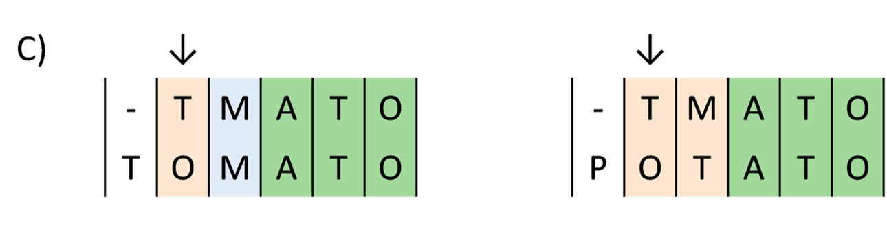
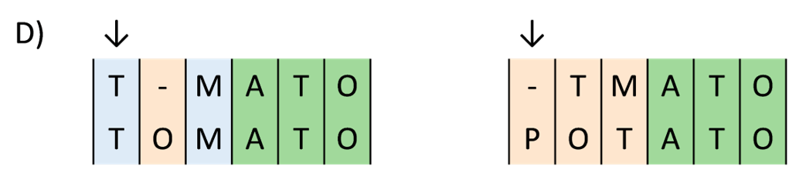

# Annotation of sequences

* Teaching: 30 minutes
* Exercises: 30 minutes

#### Objectives

* Understand the differences between nucleotide and protein sequence matching
* Be aware of which publicly available databases are appropriate for which data
* Learn how to submit `BLAST` jobs to the NeSI cluster using `slurm`
* Learn how to interpret `BLAST` results 
* Understand the meaning of *identity*, *coverage*, *e-value*, and *bitscore* metrics

#### Keypoints

* Annotation is required in order to identify the function and origin of sequences obtained from HTS analysis
* There are different databases available for annotation and classification
* Interpreting the results of BLAST alignments requires thought and attention 

---

## Contents

1. [The `BLAST` process](#the-blast-process)
1. [Submitting a nucleotide `BLAST` job on NeSI](#submitting-a-nucleotide-blast-job-on-nesi)
1. [Submitting a protein `BLAST` job on NeSI](#submitting-a-protein-blast-job-on-nesi)
1. [Interpretting the results of BLAST queries](#interpretting-the-results-of-blast-queries)
---

## The `BLAST` process

BLAST (**B**asic **L**ocal **A**lignment **S**earch **T**ool) was developed in 1990 [Altschul *et al.*, 1990](https://doi.org/10.1016/S0022-2836(05)80360-2) and is now one of the most well known, and widely used Bioinformatics tools.

BLAST compares novel (query) sequences against a database of reference sequences (target sequences) and reports back the similarity between each query and target sequence. Using the metadata associated with each reference sequence we can make inferences about the query sequence such as taxanomic origin, or function.

`BLAST` works by breaking each query sequence into a set of smaller *seed* sequences, and searching each target in the database for the presence of these seeds.  


Where matches are found, BLAST then extends the ends of the seed one position at a time and assesses how well the seed continues to match the targets.  


Matches and mismatches are recorded and the seed extenstion continues.    

  

BLAST is also able to introduce insertions to preserve a match between query and target sequences.  

  

The quality of the match between the query and the target are evaluated in terms of how well conserved the sequence composition is between the pair, including how many insertion or deletion events need to be introduced to maintain the matching.

In a BLAST analysis, every query sequence will be compared with every target in the database. Results are ranked by the quality of each match.  
Typically, we restrict our results to only return a certain number of the best matches, rather than everything with any degree of similarity to the query. Regardless of how many results are returned, for high quality matches we would expect to see a strong consensus in the gene function and taxonomy of the top matches. From these matches we can make inferences about the origin and function of the query sequence. 

## Submitting a nucleotide `BLAST` job on NeSI

The power of BLAST lies in its ability to exhaustively search for query sequences in very large databases of target sequence data, however this can make BLAST a computationally expensive process. This means that on NeSI, when we run a BLAST analysis we need to use ```slurm``` to request resources and schedule our job. 

BLAST is a commonly used tool and NeSI have template ```slurm``` scripts available for us to use. 
We will use a template today to prepare a ``slurm`` script to use BLAST to annotate a collection of sample sequences.

There are different types of BLAST we can use depending on the type of sequence data we have as input, and the types of databases we want to search to generate output. 


Here we want to predict the proteins associated with the ORFs we predicted from the genome sequence, so we will use BLASTX

Navigate to your working directory on NeSI. Create a folder `5_Gene_annotations` and copy the template blastx slurm script and the two unknown nucleotide open read frames (ORFs) from `/nesi/project/nesi03181/phel/module_3/5_Gene_annotations/` into your folder. 

Make sure you copy the nucleotide sequences for the unknown ORFs by checking the file suffix is ```.fna``` for fasta file. 

> <details>
> <summary>Solution</summary>
> 
> ```bash 
> $ cd /nesi/project/nesi03181/phel/USERNAME/
> 
> $ mkdir 5_Gene_annotations/
> $ cp ../module_3/5_Gene_annotations/blastx.sl ./5_Gene_annotations/
> $ cp ../module_3/5_Gene_annotations/M_bovis_ORF_*.fna ./5_Gene_annotations/
> ``` 
> </details>

Lets open the template slurm script and adjust it to suit our files. We can use the text editor Nano for this. 


```bash 
$ nano blastx.sl
```

To exit out of Nano use ```ctr o``` to writeout (save) your changes and then ```ctr x``` to exit. 

We can then submit our job
```bash
$ sbatch blastx.sl 
```

For todays session, we don't need to submit our job as we have pre computed results for each ORF that we will take a look at. 

If you wish, you can submit your script, but as each ORF takes about 40 mins to run and produce a result file you will likely need to come back after this session to see your results (A great job to start before lunch, or heading into the lab!) 

---

## Submitting a protein `BLAST` job on NeSI

As well as nucleotide sequences, we can also use amino acid sequences with BLAST to search and identify unknown proteins. In these cases we will use BLASTP. Although BLASTP is less computationaly expensive than BLASTX a ```slurm``` script is still required. 

Copy the template BLASTP slurm script and the two unknown protein sequences from `/nesi/project/nesi03181/phel/module_3/5_Gene_annotations/` into your folder. 

Make sure you copy the protein sequences by checking the file suffix is ```.faa``` for protein fasta file. 

> <details>
> <summary>Solution</summary>
> 
> ```bash 
> #Make sure you are in your dir, if not move there.
> $ cd /nesi/project/nesi03181/phel/USERNAME/
> $
> $ cp ../module_3/5_Gene_annotations/blastp.sl ./5_Gene_annotations/
> $ cp ../module_3/5_Gene_annotations/M_bovis_ORF_*.faa ./5_Gene_annotations/
> ```
> </details>

We can open the protein blast file in Nano, and adjust it to our data 

```bash 
$ nano blastp.sl
```

We can then submit our job
```bash
$ sbatch blastp.sl 
```

Again for today we will use pre-computed results for each ORF, but before looking at the results we will discuss how to interpret them. 

---

## Interpretting the results of BLAST queries

It is important to remember, like most bioinformatics tools, BLAST has a specific job, in this case sequence alignment. BLAST is really good at this job, but it does not offer interpretation of its alignments. Interpretation is completely up to the user on a case by case basis, therefore it is important to know your data and to understand the output metrics given by BLAST to help you make a biologically usefull interpretation of the results. 

BLAST gives four main metrics: coverage, identity, an e-value and a Bit score

**Coverage**

This value tells us as a percentage how much of our query aligns with the database match. 
A small coverage value means only a small part of our sequence has matched. A perfect match would have a coverage of 100. 

**Identity**

This represents the percent of bases which are identical between the query and the database hit. 

**E-value**

This is the number of hits equivalent to this hit that we would expect to see by chance alone. Smaller E-values represent better hits, but an exact E-value cut off needs to be decided on a case by case basis. E-values take into account both the coverage and identity scores for each hit so can be a more "complete" metric. 

**Bit score** 

Similarly to E-values, bit scores summarise the sequence similarity between the query and database hit. However bit scores are calculated independently from the query sequence length and the database size, as databases are constantly evolving this makes bit scores a constant statistical indicator. A higher bit score indicates a better hit. 

With this in mind lets look at the results from our *M. Bovis* ORFs

From ```../../module_3/5_Gene_annotations/output_files/``` copy the results files for each ORF to your working directory

Take a look at your results using the ```less``` or ```head``` command and fill out the ```results_form.tab``` to record your annotation for each ORF. 
 
Reminder of the headers we requested for our output files: 

Short hand | Meaning 
---|---
qseqid|Query sequence ID
sseqid|Subject or target sequence ID
pident|Percent of identical matches
length|Alignment Length 
mismatch|Number of mismatches
gapopen|Number of gap openings 
qstart|Start of alignment in query sequence 
qend|End of alignment in query sequence 
sstart|Start of alignment in subject sequence
send|End of alignment in subject sequence 
evalue|E value 
bitscore|Bit score 
sallseqid|All subjectsequence IDs 
score|Raw score value 
nident|Number of identical matches 
positive|Number of matches giving a positive score 
gaps|Total number of gaps 
ppos|Percent of matches giving a positive score 
qframe|Query frame 
sframe|Subject frame 
qseq|Query sequence
sseq|Subject sequence 
qlen|Query length 
slen|Subject length 
salltitles|All subject titles


---

