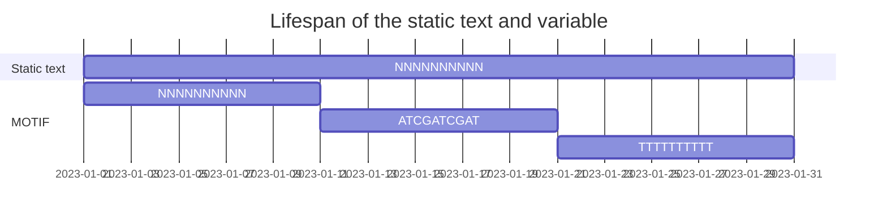

# Working with variables and loops

!!! clock "time"

    * Teaching: 30 minutes
    * Exercises: 30 minutes

!!! circle-info "Objectives and Key points"

    #### Objectives
    
    * Understand how to declare and print variables in the `bash` environment.
    * Create a simple loop that performs an operation on a set of files or variables.
    
    #### Keypoints
    
    * Variables are used when we require the computer to temporarily store a piece of information, particularly in the value of the information can change over time.
    * `for` loops can be used to automatically repeat a command, or set of commands, over a set of input values or files.

---

## Contents

1. [What are variables and why do we need them](#what-are-variables-and-why-do-we-need-them)
1. [Declaring variables and accessing their values](#declaring-variables-and-accessing-their-values)
1. [Writing loops using variables](#writing-loops-using-variables)
1. [Extending our loop with multiple variables](#extending-our-loop-with-multiple-variables)

---

## What are variables and why do we need them

Variables are one of the most fundamental aspects of writing code and scripts. Before explaining what one is, think back to our previous exercises in `bash` when we were searching for particular nucleotide sequences in a fastq file using the `grep` tool ([here](./11_shell_manipulation.md#searching-files-using-grep)). The commands we ran were perfectly fine, but would only ever work for that one nucleotide sequence in that one fastq file. If we wanted to search the same file for a different nucleotide pattern, or search multiple files for the same pattern we would have to rewrite the command and change part of the statement to the new requirement. For simple commands, or commands which we only need to perform once, this is fine but as you rely more and more on the command line it's really helpful to outsource as much work as possible to the command line rather then doing it all yourself.

This is the fundamental idea of variables - we are getting the computer to store a piece of information (file name, sqeuence motif, number in a sequence) which may change over time to be used or reused over successive commands. What's important about this is that unlike the `grep` examples in the previous exercise, over time the content that the variable represents may change. If we revisit the command from the previous exercise:

```bash
$ cd /nesi/project/nesi03181/phel/USERNAME/level2/shell_data/
$ grep NNNNNNNNNN SRR098026.fastq
```

We could run this command a thousand times and it would always return the same result. If I was instead to create a variable which represented this sequence, I could change the value that it represents and run the command a second time to get a new result. Without worry about the syntax for declaring or accessing the variable (which we will cover in the sections below), consider the following code:

```bash
$ MOTIF="NNNNNNNNNN"
$ grep ${MOTIF} SRR098026.fastq
```

While that statement may remain untouched and be reused over time, the line contains a variable called `MOTIF` which represents a dynamic value. This value might change over time, such that the same `grep` command will return different results. For example:

```bash
$ MOTIF="NNNNNNNNNN"
$ grep ${MOTIF} SRR098026.fastq
$
$ MOTIF="ATCGATCGAT"
$ grep ${MOTIF} SRR098026.fastq
$
$ MOTIF="TTTTTTTTTT"
$ grep ${MOTIF} SRR098026.fastq
```

We can use a tool like a Gantt chart to show the lifespan of each of the values being run through the `grep` command over time.



Why we need this technique can seem a little bit abstract at this stage but think of it like this - when you are performing routine diagnostic work, you will refer to the appropriate SOP detailing how a particular test is performed. If it is a PCR, for example, the SOP will detail the exact primer sequences to use, which chemicals to include in the reaction, the cycling conditions (temperatures, durations, and number of cycles). However, the SOP does not tell you the name of the sample you are using in the test, or what host it comes from. This is obviously because the SOP does not know specifically which sample the diagnostician is going to be working with but the instructions are applicable across many different samples. Using variables allows us to achieve this effect in a coding environment. We can hard specific, unchanging (hardcoded) rules written out as above, but then use variables as placeholder values which can be changed on a per-sample basis.

---

## Declaring variables and accessing their values

The code examples above declared a variable called `MOTIF` and assigned several pieces of information to it over time. We're now going to dive into that process in more detail. To begin with, we'll just copy the example above and create a variable named `MOTIF` and assign the text 'NNNNNNNNNN' to it. Type the following into the command line:

```bash
$ MOTIF="NNNNNNNNNN"
```

And it's done. You have now created a variable named 'MOTIF'. This variable represents a location in the computers memory, at which the text 'NNNNNNNNNN' is stored. If we want to view the content of the 'MOTIF' variable we can use the `echo` command.

```bash
$ echo MOTIF
```

What do you notice when you run this command. You see the word 'MOTIF' (the name of the variable) and not the value 'NNNNNNNNNN' (the value it is meant to contain) printed to the console. This happens because when working from the command line by default everything we enter into the terminal is considered a literal instruction to the computer. There is a specific notation required when we need to computer to understand that we are using a variable:

```bash
$ echo ${MOTIF}
```

In this case, the value of the variable `MOTIF` is correctly accessed by the computer, returning the nucleotide motif value instead of the word 'MOTIF'.

> <details>
> <summary>Notes on naming variables</summary>
> In these examples we are using uppercase words to represent our variable names but this is not neccessary. `bash` will accept any alphabetical letter (upper or lower case) as well as underscore characters in a variable name. This means that you can name your variables as a single letter, word, or a series of words joined together or separated by underscores with any casing. All of the following examples are valid (from the computer's point of view).
> 
> ```bash
> $ m="NNNNNNNNNN"
> $ M="NNNNNNNNNN"
> $ motif="NNNNNNNNNN"
> $ MOTIF="NNNNNNNNNN"
> $ mOtIf="NNNNNNNNNN"
> $ THE_NUCLEOTIDE_MOTIF_I_WANT_TO_USE_IN_MY_BASH_SCRIPT="NNNNNNNNNN"
> $ The_Nucleotide_Motif_I_Want_To_Use_In_My_Bash_Script="NNNNNNNNNN"
> $ TheNucleotideMotifIWantToUseInMyBashScript="NNNNNNNNNN"
> ```
> 
> The most important thing is to make sure that your variables are informative when the code is read, and easy to distinguish from each other. Variable names are case sensitive so if you are choosing to use mixed case you must make sure you use the same case when recalling the variable. Also, there is a trade off between making variable names long enough to be informative and so long that they become hard to read and type.
> 
> Generally speaking, it is best to keep your varaibles very narrow in scope - that is, you might have a set of variables used in a particular block of code but if you move to a new block you create fresh variables for that task. Keeping variables specific to a purpose reduces the need to complicated naming schemes and avoids issues which might arise when you accidentally access the wrong variable.
> </details>

> <details>
> <summary>Notes on accessing variables</summary>
>  
> When looking online for examples of variables being used, you might notice a few different styles used to call to a variable, such as
>
> ```bash
> $ echo $MOTIF
> $ echo ${MOTIF}
> $ echo "${MOTIF}"
> ```
>
> Technically these all work, but there are subtle differences in how they are interpretted by the computer executing the command. In the first value, everything that follows the <kbd>$</kbd> symbol is interpreted as part of a variable name until some character is encountered to break the name. This will typically be either a space or a quotation mark. In the second example, only the name enclosed by the <kbd>{</kbd> and <kbd>}</kbd> symbols is considered the variable name.
>
> In these examples it makes no difference but there are sometimes cases where we need to use this notation to explicitly tell the computer where the variable name begins and ends rather than let it work this out itself. The third example is useful if we are trying to access a value with space characters inside it. As we have seen in our examples to date, the `bash` environment uses spaces to separate terms in a command, for example:
>
> ```
> grep[space]NNNNNNNNNN[space]SRR098026.fastq
> |          |                |
> |          |                |
> |          |                Third term (file to search)
> |          Second term (search text)
> First term (command)
> ```
>
> If for some reason we were searching for a piece of text with a space in it, like a binomial species name, the space between the genus and species name would be incorrectly interpreted as the bounds between terms, like so:
>
> ```bash
> $ SPECIES="Escherichia coli"
> $ grep ${SPECIES} target_document.txt
> ```
>
> ```
> grep Escherichia coli target_document.txt
> |    |           |    |
> |    |           |    |
> |    |           |    Fourth term (another file to search)
> |    |           Third term (file to search)
> |    Second term (search text)
> First term (command)
> ```
>
> In this instance, wrapping the variable name in quotation marks will expand the command differently:
> ```bash
> $ grep "${SPECIES}" target_document.txt
> ```
>
> ```
> grep "Escherichia coli" target_document.txt
> |    |                  |
> |    |                  |
> |    |                  Third term (file to search)
> |    Second term (search text)
> First term (command)
> ```
>
> </details>

In the `bash` environment, variables persist until you reset your session. This means that when you log out and log back in, any variables you declare are gone. This is actually a really helpful feature as we do not end up with an ever-expanding list of variables to remember.

We can also overwrite a variable at any time, simply by making a new assignment statement:

```bash
$ MOTIF="NNNNNNNNNN"
$ MOTIF="ATCGATCGAT"
$ MOTIF="TTTTTTTTTT"
```

Finally, if you ever try to access a variable which does not exist, `bash` will return a piece of text with no characters in it. This is helpful in that it means scripts don't outright crash if you use the wrong varaible name, but unfortunately they also won't do what you intended.

```bash
$ echo "The value of MOTIF is '${MOTIF}'"
$ echo "The value a nonexistant variable is '${NON_EXISTANT_VARIABLE}'"
```

---

## Writing loops using variables

Loops are key to productivity improvements through automation as they allow us to write commands with repeat themselves a given number of times. This allows us to write a basic set of commands once and then let the computer apply the command(s) to some pre-defined set of values instead of typing out each iteration ourselves. This reduces the amount of typing we need to perform which among other things, reduces our likelihood of making errors. A loop essentially acts as a wrapper around a block of code, taking a list of values and executing the code on each element of the list. They are invaluable when performing the same operation on groups of files, such as compressing or performing quality trimming. 

When working with loops, we must make use of variables to identify pieces on information in the command which change with each iteration of the looped code block. We will use the example of `MOTIF` above to create a simple loop which searches through a file multiple times, looking for a different nucleotide sequence each time. The base command we will be using is:

```bash
$ grep -c ${MOTIF} SRR098026.fastq
```

This differs a little bit from the previous `grep` command. By adding the `-c` flag, we are making `grep` print the number of times the search sequence is counted in the file, rather than print the lines which contain the sequence. In practice this can be a useful feature in itself but we are mainly using it to keep the text printed by `grep` minimal.

The first loop we will write looks like this:

```bash
$ for MOTIF in "NNNNNNNN" "TGTTACAG" "CTCAAACC";
> do
>     grep -c ${MOTIF} SRR098026.fastq
> done
```

Before we run the command, let's look at the what each line and statement actually mean. The loop above can be broken down ito the following model:

```
for {VARIABLE} in {LIST OF VALUES};
do
    {code block}
done
```

The first line declares that we are running a `for` loop, which is one of the two major types of loops and the one most commonly used in command line scripting. Each time the loop runs (called an iteration), the next value in the list of values is assigned to the variable name then commands inside the loop are executed using that instance of the variable. Once the commands have executed, the value of `VARIABLE` is updated to the next value in the list and the process repeats.

The `do` and `done` words denote the start and end of the code block to be executed. For each value assigned to `VARIABLE` the commands between these keywords are executed in order, then once the `done` keyword is encountered the value of `VARIABLE` moves to th enext value in the list.

Let's start writing the loop, going line by line. Once you have entered the first line of the loop you should notice that the shell prompt changes from `$` to `>`. This change is to show us that we are currently writing an extension of the previous line and that the code will not execute if we were to press <kbd>Enter</kbd>. Only once you complete the loop declaration with the `done` keyword will the console execute the loop and return the prompt to the standard `$` value.

>Note: It's really easy to get stuck in a loop declaration if you forget to close off your loop block, or close any quotation marks in your code. At any time you can cancel your current command using <kbd>Ctrl</kbd>+<kbd>C</kbd>. This is helpful if you get stuck in a badly written loop, or notice an obvious error in a previous line which is going to prevent your loop for executing correctly.

If you are in the correct directory, when you execute the loop you should see output similar to the following:

```
223
0
0
```

That's great. We now have a loop that will check a specific fastq file for a set of nucleotide sequences but the output is a bit sparse.

> **Exercise**
>
> Extend this loop so that the value of the `${MOTIF}` variable is also printed to the console, so that we can track which nucleotide sequence each number corresponds to.
> 
> <details>
> <summary>Solution</summary>
> 
> ```bash
> $ for MOTIF in "NNNNNNNNNN" "GCTGGCGNNN" "TTTTTTTTTT";
> > do
> >     echo ${MOTIF}
> >     grep -c ${MOTIF} SRR098026.fastq
> > done
> ```
> ```
> NNNNNNNN
> 223
> TGTTACAG
> 0
> CTCAAACC
> 0
> ```
> </details>

---

## Extending our loop with multiple variables

Our loop is now functional, but it is quite narrow in scope. We're now going to try to expand it a little bit, so that it can be pointed to a file defined by a second variable. First up, we need to declare a variable that holds the value of one of the file names.

```bash
$ FILENAME=SRR098026.fastq
```

And now we must modify the loop code to point towards the value of `FILENAME` instead of the text `SRR098026.fastq`. Since it's not necesarily clear which file will be searched for these nucleotide sequences, also modify the loop to report the name of the file being searched, as well as the nucleotide sequence and its number of occurences in the input file.

> <details>
> <summary>Solution</summary>
> 
> ```bash
> $ for MOTIF in "NNNNNNNNNN" "GCTGGCGNNN" "TTTTTTTTTT";
> > do
> >     echo ${FILENAME}", nucleotide "${MOTIF}
> >     grep -c ${MOTIF} ${FILENAME}
> > done
> ```
> </details>

If your code works as expected, you can now change the value of `FILENAME` to any valid file and it will provide the equivalent searches in the next file. Confirm this by changing your `FILENAME` value and repeating the loop.

> <details>
> <summary>Solution</summary>
> 
> ```bash
> $ FILENAME=SRR098026.fastq
> $ for MOTIF in "NNNNNNNNNN" "GCTGGCGNNN" "TTTTTTTTTT";
> > do
> >     echo ${FILENAME}", nucleotide "${MOTIF}
> >     grep -c ${MOTIF} ${FILENAME}
> > done
> $ FILENAME=SRR097977.fastq
> $ for MOTIF in "NNNNNNNNNN" "GCTGGCGNNN" "TTTTTTTTTT";
> > do
> >     echo ${FILENAME}", nucleotide "${MOTIF}
> >     grep -c ${MOTIF} ${FILENAME}
> > done
> ```
> </details>

This is functional, but still quite messy. As a final exercise, we're going to write what is called a 'nested loop', a `for` loop within a `for` loop. The first (outer) loop will iterate through a set of fastq files and assign them to `FILENAME` and the second (inner) loop will perform the `grep` commands.

```bash
$ for FILENAME in *.fastq;
> do
>     echo "File: "${FILENAME}
>     for MOTIF in "NNNNNNNNNN" "GCTGGCGNNN" "TTTTTTTTTT";
>     do
>         echo "Nucleotide: "${MOTIF}
>         grep -c ${MOTIF} ${FILENAME}
>     done
> done
```

---
