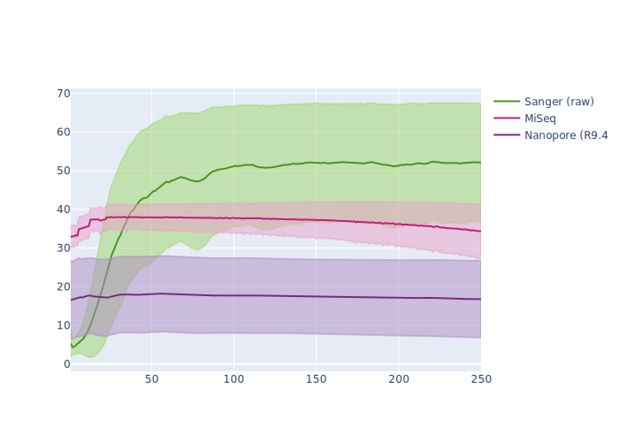

# 2.3 - Assembling Oxford Nanopore data

## Overview

!!! clock "time"

    * Teaching: xx minutes
    * Exercises: xx minutes
    
!!! circle-info "Objectives and Key points"

    #### Objectives
    * ...
    
    #### Keypoints
    
    * ...

---

## Introduction to Flye

Although the gap is closing rapidly, Oxford Nanopore sequences are fundamentally more error prone than the sequences we obtain through Illumina sequencing and a considerable amount of assembly is spent identifying and correcting errors to produce high-quality contigs from a comparably low-quality set of reads.

!!! jupyter ""

    <center></center>

The median sequence quality for the Nanopore data produced using the (now retired 9.4 chemistry) data sits around Q20 for most of the sequence. This corresponds to 99% accuracy which might sound good but by definition half of the sequences have lower quality than this. At the low end of this plot the sequences are slightly above Q10, which denotes 90% accuracy.

Finding consensus regions between pairs of reads, when one of them might differ by up to 10% of it's composition **_just due to sequencing error alone_** makes assembly a complicated process and assembly tools which are aware of the error profiles of our long read data are essential.

??? book-atlas "Why use `Flye`?"

    The complete workflow of `Flye` ([Kolmogorov *et al.*, 2019](https://doi.org/10.1038/s41587-019-0072-8)) is quite complicated process. The novel aspect of assembly with `Flye` when compared with other asssembly tools was the developers observation that when working with noisy reads (as mentioned above) mapping sequences against each other is confounded by highly similar repeat regions, which create hotspots of local alignment between reads with very different flanking sites.

    For our purposes, the main points of the assembly process to understand are:

    1. Repetitive regions of the genome are identified
    1. Repeat regions are clustered together to form deliberately misassembled **_disjointigs_**
    1. Disjointigs are concatenated and a repeat graph (similar to a de Bruijn graph) is created
    1. The input reads are mapped to the repeat graph
    1. Using the reads that map to the repeat region and it's 5' and 3' flanking regions, the loops in the assembly graph are unwound to create long contigs

To run `Flye`, navigate to your `assembly_nanopore/` directory, and prepare the following `slurm` script:

!!! file-code "flye_asm.sl"

    ```bash
    #!/bin/bash -e
    #SBATCH --account       nesi03181
    #SBATCH --job-name      flye_asm
    #SBATCH --time          00:10:00
    #SBATCH --cpus-per-task 16
    #SBATCH --mem           20G
    #SBATCH --error         flye_asm.%j.err
    #SBATCH --output        flye_asm.%j.out
    #SBATCH --mail-type     END
    #SBATCH --mail-user     YOUR_EMAIL

    module purge
    module load Flye/2.9.1-gimkl-2022a-Python-3.10.5

    # Set the path from which the script will execute SPAdes
    cd /nesi/project/nesi03181/phel/USERNAME/assembly_nanopore/

    # Execute SPAdes
    flye --threads ${SLURM_CPUS_PER_TASK} --genome-size 1m --nano-raw reads/Mbovis_87900.nanopore.fq.gz --out-dir assembly/
    ```

When you are ready, submit the job to `slurm`:

!!! terminal "code"

    ```bash
    sbatch flye_asm.sl
    ```

??? success "Output"

    ```
    Submitted batch job ########
    ```

!!! warning "How do I know my genome size!?"

    One of the frustrating things with a lot of long read assembly tools is that they ask you to provide an estimate of your genome size when performing assembly but this can be a bit of a problem if you don't know what you're sequencing, so you don't know the genome size...

    This parameter is mostly used for the tool to gauge coverage over the assembly as it is operating, so it is not critical that you provide an exact value. In our case above, the *M. bovis* genome is about 1.1 million nucleotides long but we submitted the assembly with an expected genome size of 1 million.

    If you have some knowledge or suspicion as to the identity of the organism you are sequencing then use the literature to find an average genome size for members of the species or genus that you believe you are working with.

??? note "A word on assembly tools"

    For the exercise today are using the `Flye` assembler with one of the *M. bovis* genomes. Like with other areas of genomics, there are many good options for assembly tools and our usage of `Flye` today is in no way an endorsement that we consider this tool to be the 'best' long read assembler. `Flye` is a very good tool and will give us good results with the data we process today, but when working with real data there are many other good options to try, including:

    1. `MaSuRCA` ([Zimin *et al.*, 2013](https://doi.org/10.1093/bioinformatics/btt476)) - [https://github.com/alekseyzimin/masurca](https://github.com/alekseyzimin/masurca)
    1. `UniCycler` (and `TriCycler`) ([Wick *et al.*, 2017](https://doi.org/10.1371/journal.pcbi.1005595)) - [https://github.com/rrwick/Unicycler](https://github.com/rrwick/Unicycler)
    1. `Canu` ([Koren *et al.*, 2017](http://www.genome.org/cgi/doi/10.1101/gr.215087.116))

    A recent comparison of assembly tools was published by [Wick & Holt (2021)](https://doi.org/10.12688/f1000research.21782.4) which tests some of the options listed above along with several other tools.

    In practice, there are sometimes particular cases where a tool will not be compatible with your data, so it is helpful to be aware of several tools so that you have options if assembly proves problematic for a particular sample.

As with the `SPAdes` session, we now have a folder named `assembly/` which contains a number of files, only some of which we care about. The key files for us are:

1. `assembly.fasta` - the assembled contigs, as a fasta file.
1. `flye.log` - the log file of the steps `SPAdes` performed and any warnings which occured during assembly.
1. `assembly_graph.gfa` - a map of how well the assembly is resolved.

---

## Assessing the results of the assembly

Once assembly is complete, we can view the assembly in the same way as we did for the short read data.

!!! question "Exercise"

    Produce a `QUAST` report on the Oxford Nanopore genome you have created, using the reference genome in the `reference/` folder.

    ??? circle-check "Solution"

        !!! terminal "code"

            ```bash
            module load QUAST/5.2.0-gimkl-2022a

            quast.py -r reference/Mbovis_87900.genome.fna --gene-finding -o quast/ assembly/assembly.fasta
            ```

        ??? success "Output"

            ```
            Version: 5.2.0

            System information:
            OS: Linux-3.10.0-693.2.2.el7.x86_64-x86_64-with-glibc2.17 (linux_64)
            Python version: 3.10.5
            CPUs number: 2

            Started: 2023-09-28 15:02:30

            # Text omitted...

            Finished: 2023-09-28 15:02:40
            Elapsed time: 0:00:10.422580
            NOTICEs: 4; WARNINGs: 1; non-fatal ERRORs: 0

            Thank you for using QUAST!
            ```

Open the resulting `quast/report.pdf` file in Jupyter using the file browser. How complete does the assembly appear to be, compared with the reference and your previous Illumina assembly?

??? info "Visualising assemblies with `bandage`"

    We can also visualise the assembly by looking at how well the loops and fragments of the assembly graph were resolved. For this, we require only the `assembly_graph.fastg` file from the `SPAdes` output:

    !!! terminal "code"

    ```bash
    module load Bandage/0.8.1_Centos

    Bandage image assembly/assembly_graph.gfa assembly_bandage.svg
    ```

    Opening the plot in your browser you will see a different story to what the `SPAdes` assembly provided. The data have assembled cleanly into a single contig, without bubbles, and there are no short fragments plotted.

---
