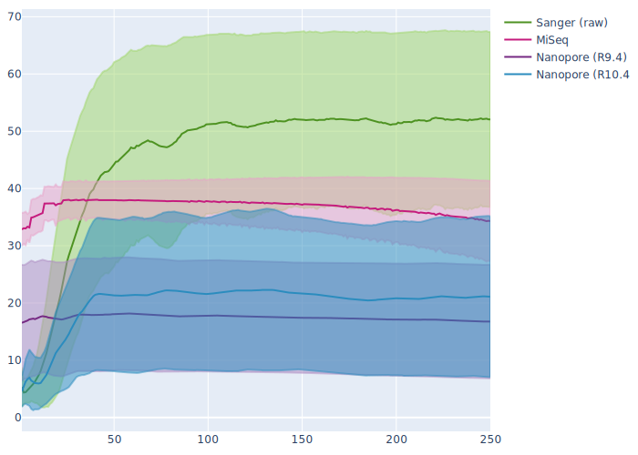

# 2.3 - Assembling Oxford Nanopore data

## Overview

!!! clock "time"

    * Teaching: 15 minutes
    * Exercises: 10 minutes
    
!!! circle-info "Objectives and Key points"

    #### Objectives
    
    * Perform an assemble of a bacterial genome using the `Flye` assembly tool.

    #### Keypoints

    * The `Flye` assembler is one of several very powerful tools for assembling genomes from long read data.
    * Different tools may be better suited for different data, and long read assembly is still a developing field so if working with these data, make sure to experiment with multiple tools.

---

## Introduction to Flye

Although the gap is closing rapidly, Oxford Nanopore sequences are fundamentally more error prone than the sequences we obtain through Illumina sequencing and a considerable amount of assembly is spent identifying and correcting errors to produce high-quality contigs from a comparably low-quality set of reads.

!!! jupyter "Comparison of average sequence qualities on different platforms"

    <center></center>

The median sequence quality for the Nanopore data produced using the (now retired 9.4 chemistry) data sits around Q20 for most of the sequence. This corresponds to 99% accuracy which might sound good, but by definition half of the sequences have lower quality than this. At the low end of this plot the sequences are slightly above Q10, which denotes 90% accuracy.

Finding consensus regions between pairs of reads, when one of them might differ by up to 10% of it's composition **_just due to sequencing error alone_** makes assembly a complicated process and assembly tools which are aware of the error profiles of our long read data are essential.

??? book-atlas "Why use `Flye`?"

    The complete workflow of `Flye` ([Kolmogorov *et al.*, 2019](https://doi.org/10.1038/s41587-019-0072-8)) is quite complicated process. The novel aspect of assembly with `Flye` when compared with other asssembly tools was the developers observation that when working with noisy reads (as mentioned above) mapping sequences against each other is confounded by highly similar repeat regions, which create hotspots of local alignment between reads with very different flanking sites.

    For our purposes, the main points of the assembly process to understand are:

    1. Repetitive regions of the genome are identified
    1. Repeat regions are clustered together to form deliberately misassembled **_disjointigs_**
    1. Disjointigs are concatenated and a repeat graph (similar to a de Bruijn graph) is created
    1. The input reads are mapped to the repeat graph
    1. Using the reads that map to the repeat region and it's 5' and 3' flanking regions, the loops in the assembly graph are unwound to create long contigs

To run `Flye`, navigate to your `assembly_nanopore/` directory, and prepare the following `slurm` script:

!!! file-code "flye_asm.sl"

    ```bash
    #!/bin/bash -e
    #SBATCH --account       nesi03181
    #SBATCH --job-name      flye_asm
    #SBATCH --time          00:10:00
    #SBATCH --cpus-per-task 16
    #SBATCH --mem           20G
    #SBATCH --error         flye_asm.%j.err
    #SBATCH --output        flye_asm.%j.out
    #SBATCH --mail-type     END
    #SBATCH --mail-user     YOUR_EMAIL

    module purge
    module load Flye/2.9.1-gimkl-2022a-Python-3.10.5

    # Set the path from which the script will execute Flye
    cd /nesi/project/nesi03181/phel/USERNAME/level2/assembly_nanopore/

    # Execute Flye
    flye --threads ${SLURM_CPUS_PER_TASK} \
        --nano-raw reads/Mbovis_87900.nanopore.fq.gz \
        --out-dir assembly/
    ```

When you are ready, submit the job to `slurm`:

!!! terminal "code"

    ```bash
    sbatch flye_asm.sl
    ```

??? success "Output"

    ```
    Submitted batch job ########
    ```

As with the `SPAdes` session, we will end up with a folder named `assembly/` which contains a number of files, only some of which we care about. The key files for us are:

1. `assembly.fasta` - the assembled contigs, as a fasta file.
1. `flye.log` - the log file of the steps `SPAdes` performed and any warnings which occured during assembly.
1. `assembly_graph.gfa` - a map of how well the assembly is resolved.

---

## A note on assembly tools

For the exercise today are using the `Flye` assembler with one of the *M. bovis* genomes. Like with other areas of genomics, there are many good options for assembly tools and our usage of `Flye` today is in no way an endorsement that we consider this tool to be the 'best' long read assembler. `Flye` is a very good tool and will give us good results with the data we process today, but when working with real data there are many other good options to try, including:

1. `UniCycler` (and `TriCycler`) ([Wick *et al.*, 2017](https://doi.org/10.1371/journal.pcbi.1005595)) - [https://github.com/rrwick/Unicycler](https://github.com/rrwick/Unicycler)
1. `Canu` ([Koren *et al.*, 2017](http://www.genome.org/cgi/doi/10.1101/gr.215087.116))
1. `raven` ([Vaser *et al.*, 2021](https://doi.org/10.1038/s43588-021-00073-4))

A recent comparison of assembly tools was published by [Wick & Holt (2021)](https://doi.org/10.12688/f1000research.21782.4) tests some of the options listed above along with several other tools. Their manuscript is a 'living paper', which has been updated several times as new versions of each tool are released. Different assemblers have risen to the top at different time points, so this is very much still an evolving field, and it is difficult to say which assembler is the 'best'.

In practice, there are sometimes particular cases where a tool will not be compatible with your data, so it is helpful to be aware of several tools so that you have options if assembly proves problematic for a particular sample.

---
