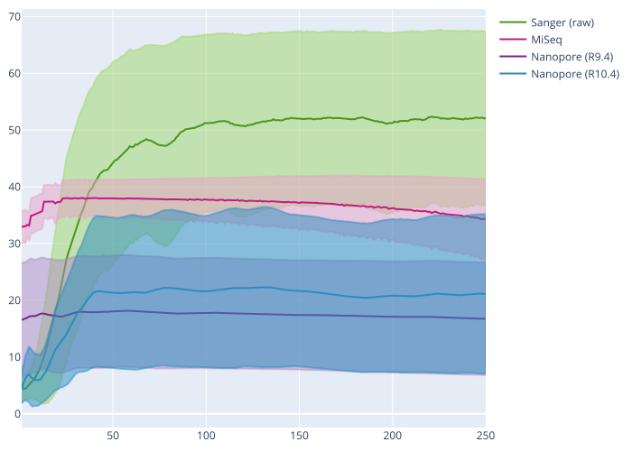

# 2.3 - Assembling Oxford Nanopore data

## Overview

!!! clock "time"

    * Teaching: 15 minutes
    * Exercises: 10 minutes
    
!!! circle-info "Objectives and Key points"

    #### Objectives
    
    * Perform an assemble of a bacterial genome using the `raven` assembly tool.

    #### Keypoints

    * The `raven` assembler is one of several very powerful tools for assembling genomes from long read data.
    * Different tools may be better suited for different data, and long read assembly is still a developing field so if working with these data, make sure to experiment with multiple tools.

---

## Introduction to Flye

Although the gap is closing rapidly, Oxford Nanopore sequences are fundamentally more error prone than the sequences we obtain through Illumina sequencing and a considerable amount of assembly is spent identifying and correcting errors to produce high-quality contigs from a comparably low-quality set of reads.

!!! jupyter "Comparison of average sequence qualities on different platforms"

    <center></center>

The median sequence quality for the Nanopore data produced using the (now retired 9.4 chemistry) data sits around Q20 for most of the sequence. This corresponds to 99% accuracy which might sound good, but by definition half of the sequences have lower quality than this. At the low end of this plot the sequences are slightly above Q10, which denotes 90% accuracy.

Finding consensus regions between pairs of reads, when one of them might differ by up to 10% of it's composition **_just due to sequencing error alone_** makes assembly a complicated process and assembly tools which are aware of the error profiles of our long read data are essential.

??? book-atlas "Why use `raven`?"

    The complete workflow of `raven` ([Vaser *et al.*, 2021](https://doi.org/10.1038/s43588-021-00073-4)) is quite complicated. For our purposes, the main points of the assembly process to understand are:

    1. Overlaps between reads are identified
    1. Identify problematic regions, such as chimeric reads
    1. Find new overlaps, removing incorrect connections
    1. Perform the initial assembly
    1. Identify suspicious connections in the assembly and remove them
    1. Polish the contigs using `racon`

To run `raven`, navigate to your `assembly_nanopore/` directory, and run the following command:

!!! terminal "code"

    ```bash
    raven reads/Mbovis_87900.nanopore.fq.gz > raven.fna
    ```

Unlike `SPAdes`, and many other assembly tools, we do not get much output from this rool. In the way we've run it only two files are craeted, and one of them is the assembled genome. For the purposes of the next exercise, we need to produce one more output file.

!!! question "Exercise"

    Search the `raven` help information and run the tool again, producing an assembly graph for the next exercise.

    !!! terminal "code"

        ```bash
        raven --help
        ```

    ??? circle-check "Solution"

        !!! terminal "code"

            ```bash
            raven --graphical-fragment-assembly raven.gfa reads/Mbovis_87900.nanopore.fq.gz > raven.fna
            ```

---

## A note on assembly tools

For the exercise today are using the `raven` assembler with one of the *M. bovis* genomes because it is fast and easy to use, while producing very high quality results. Like with other areas of genomics, there are many good options for assembly tools and our usage of `raven` today is in no way an endorsement that we consider this tool to be the 'best' long read assembler. `raven` is a very good tool and will give us good results with the data we process today, but when working with real data there are many other good options to try, including:

1. `UniCycler` (and `TriCycler`) ([Wick *et al.*, 2017](https://doi.org/10.1371/journal.pcbi.1005595)) - [https://github.com/rrwick/Unicycler](https://github.com/rrwick/Unicycler)
1. `Canu` ([Koren *et al.*, 2017](http://www.genome.org/cgi/doi/10.1101/gr.215087.116))
1. `Flye` ([Kolmogorov *et al.*, 2019](https://doi.org/10.1038/s41587-019-0072-8))

A recent comparison of assembly tools was published by [Wick & Holt (2021)](https://doi.org/10.12688/f1000research.21782.4) tests some of the options listed above along with several other tools. Their manuscript is a 'living paper', which has been updated several times as new versions of each tool are released. Different assemblers have risen to the top at different time points, so this is very much still an evolving field, and it is difficult to say which assembler is the 'best'.

In practice, there are sometimes particular cases where a tool will not be compatible with your data, so it is helpful to be aware of several tools so that you have options if assembly proves problematic for a particular sample.

---
