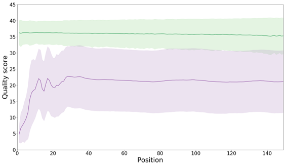

# Mapping Oxford Nanopore sequences to a reference

* Teaching: 10 minutes
* Exercises: 20 minutes

#### Objectives

* Use `minimap2` to index a reference genome and map long-read data produced with Oxford Nanopore sequencing technology to a reference genome.

#### Keypoints

* Understand how to index a reference sequence for mapping with `minimap2`, and know when you may need to perform this step.
* Understand how to apply `minimap2` to map a set of DNA paired-end reads to the reference.

---

## Contents

1. [Indexing the reference sequence](#indexing-the-reference-sequence)
1. [Mapping reads with `minimap2`](#mapping-reads-with-minimap2)
1. [Differences in sequence quality between short- and long-read platforms](#differences-in-sequence-quality-between-short--and-long-read-platforms)

---

## Indexing the reference sequence

Similar to `bowtie2`, it is possible to create a pre-computed index file for performing mapping using `minimap2`. However this is not strictly necessary when using `minimap2` - the tool will automatically read the reference file provided and determine if the file is already indexed or not. If the file is in a native state such as the `fasta` format `minimap2` will produce an index file on the fly for performing the alignment operations. If the index file is already indexed, this step is skipped.

Whether or not you need to perform this depends on the situation. The indexing process in `minimap2` is very fast and for quick, one-off applications you can probably skip it. If you are producing an index which is going to be reusedmany times it might be worth creating a common index file which can be recycled between mapping applications. This might particularly be desirable if you application is for some routine diagnostic purpose, so that you have a single mapping index for all analyses for quality tradking purposes.

To perform mapping, navigate to the `/nesi/project/nesi03181/phel/USERNAME/level2/mapping/` directory again, and map the smaller `fasta` file using `minimap2`:
 
```bash
$ module load minimap2/2.24-GCC-11.3.0
$ minimap2 -d references/Mbovis_87900.genome.mmi references/Mbovis_87900.genome.fna
```

Note that this time we provide the target path for the index file as a named parameter before providing the path to the `fasta` file to be indexed. We also have specified an extension for the output file (`.mmi`). Unlike `bowtie2`, which splits the indexing information over a number of files as size dictates, `minimap2` contains all indexing information in a single file. This can be handy for portability, and can also be convenient when writing commands as it is easier to use tab-completion to get to the index file directly.

---

## Mapping reads with `minimap2`

Similar to `bowtie2` there are a number of pre-configured settings for mapping with `minimap2`. Load the module and find out what these are by bringing up the help manual for `minimap2`.

```bash
$ module load minimap2/2.24-GCC-11.3.0
$ minimap2 -h
```

The setting we need to be aware of is the final one in the manual, the `-x` parameter. This is the toggle for applying appropriate parameters for applying short- or long-read mapping, with corrections for the known differences between the error profiles of PacBio and Nanopore sequence reads. The data we are working with in this exercise is based on the Oxford Nanopore MinION technology so this is the mapping preset we will apply.

```bash
$ minimap2 -ax map-ont references/Mbovis_87900.genome.mmi reads/Mbovis_87900.nanopore.fq.gz > Mbovis_87900.genome.nanopore.sam
```

---

## Differences in sequence quality between short- and long-read platforms

The nature of long-read sequencing is that it is inherently more error-prone than short-read sequencing. This is due to the fundamental difference in approach between long-read platforms, which sequence individual nucleic acid sequences, and short-read platforms which perform PCR amplification to create a clonal population of sequences from which sequencing signals are generated.

While the error rates of Nanopore and PacBio sequencing are drastically better than they were a few years ago (and accordingly, drastically better than the common perception of their error rates), they are still more prone to spontaneous sequencing errors when compared with Illumina sequences. For example, this figure was produced from sequencing data produced in the PHEL Virology & Phytoplasmology team, comparing the average nucleotide quality for the first 140 positions of sequencing data.



These data were generated with the older MinION `9.4.1` chemistry, which has since been replaced with newer pore structures, sequencing chemistry, and basecalling models but from our documentation on the meaning of these quality scores ([see here](../docs/fastq_format.md)) we can see a modest reduction in error rate between the Nanopore and Illumina sequences. Although there is less than a 1% difference in error rate between these two averages, when long-read platforms are producing sequences tens or hundreds of thousands of nucleotides in length, a 1% error rate does result in significant divergence from the original sequence.

In addition to stochastic error, which all platforms suffer from, there are also instances of platform-specific errors in which particular nucleotide motifs exhibit a propensity to certain error types. Dedicated long-read mapping tools, including `minimap2`, are trained on these platform-specific error profiles and can achieve greater mapping accuracy by according for these errors when they are aware of the sequencing platform used to produce the input sequences.

It is therefore critical to note which sequencing method was used in producing your HTS data and perform reference mapping with parameters customised to the platform.

---
