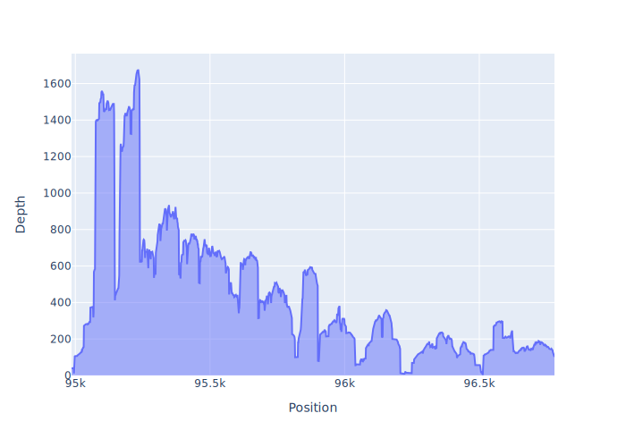

# 3.5 - Summarising coverage information from a mapping file

!!! clock "time"

    * Teaching: 15 minutes
    * Exercises: 20 minutes

!!! circle-info "Objectives and Key points"

    #### Objectives
    
    * Use `samtools flagstat` to get an overview of a `bam` file content.
    * Use `samtools depth` to produce a coverage table from the complete `bam` record.
    * Use `samtools depth` to produce a coverage table from a subsection of a complete `bam` record.
    
    #### Keypoints
    
    * Understand the reasons for summarising a `bam` file without digging into the contents in detail.
    * Understand the situations in which you might require the coverage information, either in its entirity or for a specific genomic region.

---

### Summarising the contents of a `bam` file

This section will start with a new mapping file, although you could apply these commands to anything produced as part of the [filtering exercises](./34_mapping_filters.md) instead. Navigate to the `/nesi/project/nesi03181/phel/USERNAME/level2/mapping_statistics/` directory and view the contents.

We wil take a look at the high-level summary of the contents of these files with the `samtools flagstat` command:

!!! terminal "code"

    ```bash
    module purge
    module load SAMtools/1.16.1-GCC-11.3.0

    samtools flagstat SRR18260232.raw_reads.bam
    ```

    ??? success "Output"

        ```
        8630882 + 0 in total (QC-passed reads + QC-failed reads)
        8629544 + 0 primary
        1338 + 0 secondary
        0 + 0 supplementary
        0 + 0 duplicates
        0 + 0 primary duplicates
        3236663 + 0 mapped (37.50% : N/A)
        3235325 + 0 primary mapped (37.49% : N/A)
        8629544 + 0 paired in sequencing
        4314772 + 0 read1
        4314772 + 0 read2
        3040828 + 0 properly paired (35.24% : N/A)
        3049552 + 0 with itself and mate mapped
        185773 + 0 singletons (2.15% : N/A)
        0 + 0 with mate mapped to a different chr
        0 + 0 with mate mapped to a different chr (mapQ>=5)
        ```

??? info ""

    This is not exactly easy to interpret. The documentation is [here](http://www.htslib.org/doc/samtools-flagstat.html) and requires you to look through the [`sam` file specification](http://samtools.github.io/hts-specs/SAMv1.pdf) to understand the fields.

In brief, the pairs of numbers on each line represent the number of mappings with passed/failed the alignment quality conditions. This is not the same thing as the fastq quality score - when we map reads there is a scoring system used to assess how well a read sticks to the reference at a given position. Depending on how mapping is performed there may be reads which do align to a region, but too poorly for `samtools` to consider them a likely match.

Going through the lines of the output, the most important parts are:

|Term|Meaning|
|:---|:---|
|`X + Y in total (QC-passed reads + QC-failed reads)`|Total mappings (sum of primary, secondary, and supplementary)|
|`X + Y primary`|Number of reads mapped without multiple or chimeric aligments (i.e. the most reliable ones)|
|`X + Y secondary`|Number of reads mapped with multiple mappings|
|`X + Y supplementary`|Number of reads mapped with a chimeric alignment|
|`X + Y duplicates`|Number of duplicate mappings|
|`X + Y properly paired (Z% : N/A)`|Number of instances where paired reads are mapped together in the correct orientation|
|`X + Y singletons (Z% : N/A)`|Number of instances of a read mapping when its paired partner failed to do so|


!!! info "Understanding the 'duplicates' term"

    The term duplicates is used to represent instances where two or more *identical* sequences mapped to the region, not different reads mapping to the same region in a manner that overlaps. In these instances, it is phenominally rare to see two identical reads produced as part of library preparation and they are much more commonly due to PCR artefacts which occur during library preparation, or some form of read duplication during sequencing.

    In some instances it is worth identifying and removing these duplication events using a tool like `picard` ([documentation](https://broadinstitute.github.io/picard/)).

    If you are working with amplicon sequence, where you have produced a PCR product which is then sent for sequencing your duplication rate will be high but this is an expected consequence of the method used to produce your input DNA. In such cases a high duplication rate is expected.

---

### Producing a coverage table from a complete alignment

Now that we have seen a high-level overview of the mapping in the table, how do we get something actionable out of this? One of the common tasks we need to perform with a mapping file is to assess the depth of coverage over the reference sequence to determine

!!! question "Is there sufficient depth of coverage to be confident in the consensus sequence of our reads?"

!!! question "Is the mapping depth even across the reference sequence, or does it pile up in hotspots?"

    Piling into hotspots can be indicative of poor mapping, where a low complexity region of a sequence (like the poly-A tail on a virus) is attracting a lot of non-specific binding.

    In a case like this you would not want to infer the average coverage by dividing the number of mapped reads by the reference length as there are likely to be spots with no mapping.

One of the simplest ways to view the per-position coverage of a mapping result is to use the `samtools depth` command, which reads through the `bam` file and reports the number of nucleotides mapped at each position of the reference sequence. It is very quick to run, and the output is a simple text table which can be imported into `Excel` or `R` to calculate statistics.

By default the tool prints to the command line which is not ideal, so we will capture the results with a redirection.

!!! terminal "code"

    ```bash
    samtools depth -a SRR18260232.clean_reads.bam > SRR18260232.clean_reads.txt
    ```

Running the `head` command should print the first 10 lines of the file to the command line. This is enough to see the structure of the file.

!!! file-code "First 10 lines of `SRR18260232.clean_reads.txt`"

    ```
    NZ_LAUS01000004.1       1       6
    NZ_LAUS01000004.1       2       9
    NZ_LAUS01000004.1       3       9
    NZ_LAUS01000004.1       4       9
    NZ_LAUS01000004.1       5       9
    NZ_LAUS01000004.1       6       9
    NZ_LAUS01000004.1       7       9
    NZ_LAUS01000004.1       8       9
    NZ_LAUS01000004.1       9       9
    NZ_LAUS01000004.1       10      9
    ```

Although there are no column headers, there are only three columns in the file so it is easy to just describe the contents. The first column is the name of the sequence in the reference file which is being reported. If you have a single sequence in your reference then this will be a single value throughout the file. If you are mapping to a draft reference genome, or a genome with plasmids or other non-chromosomal elements, the content of this column will change as you move through the file.

The second column is the nucleotide position in the reference sequence, and the third column is the number of nucleotides mapped against that position. From the command line it is hard to see the maximum depth, but we can use a quick combination of command line tools to tell us something of the mapping:

!!! terminal "code"

    ```bash
    cut -f3 SRR18260232.clean_reads.txt | sort | uniq -c | head -n1
    ```

    ??? success "Output"

        ```
        27988 0
        ```

What this command does is take the third column of the table (`cut`), sort the values (`sort`), and then tally up the unique instances and count them (`uniq -c`).

Which means that there are 27,988 positions in the reference with 0 nucleotides mapped. This tells us that there are some gaps in our mapping. Given that the reference sequence is 254,357 nucleotides long this means that about 11% of our genome does not have reads that correspond to it.

If you wanted to push this further, you could import the summary table into a tool like `Excel` or `R` and plot the depth of coverage along the genome or calculate the average depth and variance to decide if you wanted to trust this alignment.

We will not be pursuring this further in this workshop, as plotting is a fairly easy task which you can perform by yourself if you are interested.

---

### Producing a coverage table from a specific region of an alignment

Viewing the depth across the full genome is helpful if you're working with a small genome, such as a virus, but for larger organisms it's probably not going to be very informative. Depending on your application, you may not even want to view the coverage over an entire genome - there may be a specific marker gene or region of interest you wish to examine and as long as you have good coverage in this area, then that is sufficient for your application.

It is only a minor step to modify the previous `samtools` command to restrict the mapping down to a single region, or set of regions. We can do this by modifying the `samtools depth` command in one of two ways:

1. Adding the region of interest to be reported to the command line
1. Specifying a `bed` file that contains the region of interest.

The second option is good if it is a region we are going to be examining often, such as a known marker for a BAU test. It is also useful when specifying multiple regions, since it is essentially a small text table of start/stop coordinates. For simplicity we are not going to pursue this step in this training but if this is something you wish to do in your own work, you can find the documentation for writing `bed` files online [here](https://asia.ensembl.org/info/website/upload/bed.html).

For now, we are going to extract the depth information over two genes of the reference genome. There is no real trick to finding these gene coordinates - you simple need to read through an appropriate annotation file (such as the NCBI `genbank` file for the reference genome) and find them. This can also be done by downloading and viewing the genome in `Geneious`.

|Gene|Sequence|Start position|End position|
|:---|:---|:---:|:---:|
|Translation elongation factor 4|NZ_LAUS01000004.1|94,986|96,779|
|16S ribosomal RNA|NZ_LAUS01000004.1|41,621|43,134|

The syntax for performing this kind of depth summary is to add a parameter specifying the name of the sequence carrying the region, followed by the start and stop coordinates to be reported in the form `SEQUENCE:START-STOP`. We must also *index* the `bam` file, so that `samtools` is able to quickly parse the file, skipping the regions we are not interested in. Indexing will produce a file with the extension `bai`. We do not need to hold onto this file for long, it is quick to generate and not very large on disk space.

!!! info ""

    In our case there is only a single sequence in the reference genome, so all mapping must be to this lone sequence. Nevertheless, we must still specify the sequence as part of the command

!!! terminal "code"

    ```bash
    samtools index SRR18260232.clean_reads.bam
    samtools depth -a -r NZ_LAUS01000004.1:94986-96779 SRR18260232.clean_reads.bam  > SRR18260232.clean_reads.tef4.txt

    wc -l SRR18260232.clean_reads.txt SRR18260232.clean_reads.tef4.txt
    ```

    ??? success "Output"

        ```
        254357 SRR18260232.clean_reads.txt
        1794 SRR18260232.clean_reads.tef4.txt
        256151 total
        ```

As you can see, this has cut the mapping space down considerably. It is now of a size that, if this was your marker of interest, you could easily plot this information and see the mapping depth along the TEF4 gene:

??? info "Plotting code (interest only)"

    Here's a short snippet of `python` code to create a plot of the depth along the positions in the **tef4** file.

    !!! terminal "code"

        ```python
        import plotly.express as px
        import pandas as pd

        df = pd.read_csv("SRR18260232.clean_reads.tef4.txt", sep="\t", names=["Chr", "Position", "Depth"])

        fig = px.area(df, x="Position", y="Depth")
        fig.write_image("SRR18260232.clean_reads.tef4.svg")
        ```

        ??? success "Output"

            <center></center>

!!! question "Exercise"

    Create a 16S rRNA sequence coverage report using the `SRR18260232.raw_reads.bam` mapping file as your starting point.

    If you're interested, also produce a small plot of the results.

    ??? circle-check "Solution"

        !!! terminal "code"

            ```bash
            samtools index SRR18260232.raw_reads.bam
            samtools depth -a -r NZ_LAUS01000004.1:41621-43134 SRR18260232.raw_reads.bam  > SRR18260232.raw_reads.16s_rrna.txt
            ```

---
