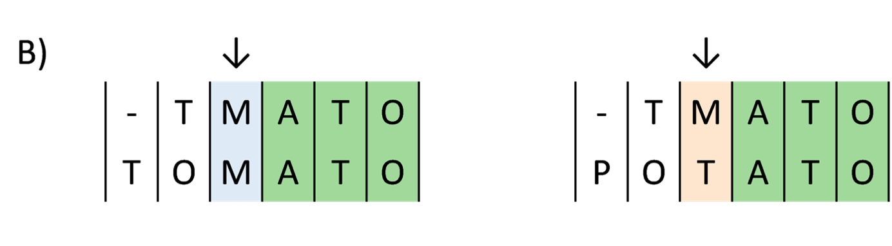

# 4.4 - Protein annotation with `BLAST`-like methods

!!! clock "time"

    * Teaching: 20 minutes
    * Teaching: 30 minutes

!!! circle-info "Objectives and Key points"

    #### Objectives

    * Know how to run a protein sequence classification using `BLASTp`
    * Know how to run a protein sequence classification using `diamond`
    * Understand the differences between these tools and when one might be more appropriate than the other.

---

## Refresher on the `BLAST` algorithm

We have covered the major concepts behind the `BLAST` approach to sequence classification in level 1 training ([materials here](../level1/41_blastn_annotation.md)) so will not be covering this in detail today.

However, as a general refresher, remember that the `BLAST` algorithm approaches sequence classification by comparing small sections of a query sequence to a reference database, and extending the matches where they are found.

??? note "Review of `BLAST` steps"

    {width="600"}

    Where matches are found, BLAST then extends the ends of the seed one position at a time and assesses how well the seed continues to match the targets.  

    {width="600"}

    Matches and mismatches are recorded and the seed extenstion continues.    

    {width="600"} 

    BLAST is also able to introduce insertions to preserve a match between query and target sequences.  

    {width="600"} 

In the level 1 training we applied this to nucleotide sequence data, and in practice there is very little difference `BLAST`-ing against nucleotide or protein sequences.

??? question "What's the difference?"

    Behind the scenes, `BLAST` uses different seed sizes for its initial matching, as protein sequences are typically shorter than nucleotide sequences and are more information-rich.

    There is also a different weighting system applied when evaluating the match between query and target positions to account for whether or not the amino acid residues being compared are identical, or if their chemistry is similar. Similar to the case with `BLASTn` the scoring system is based on real-world observations of amino acid substitution rates, but is more complex to allow for the differing charge, size, and polarity of the amino acids.

---

## Annotating proteins using `BLASTp`

As already mentioned, performing `BLAST` for protein sequences is very similar to the case for nucleotide sequences. The two differences are that we need to substitute the `blastn` exectuable with the `blastp` version, and point out command towards a reference database of protein sequences. We still load the same modules are for a nucleotide `BLAST`, there are just a few parts of the `slurm` script which need to change from the last time we ran this job.

!!! info "Using BLAST databases"

    If you recall the level 1 traning, you will remember that NeSI periodically download and store NCBI `BLAST` databases in a common location, accessed through the `BLASTDB/YYYY-MM` module series.

    Protein `BLAST` searches are significantly slower than nucleotide searches, so we will not be using this resource today as the queue and run times for the jobs we would need to run are not practical for the workshop today. We will instead use a local version of the [UniProt](https://www.uniprot.org/) `SwissProt` database which is much smaller.

Navigate to the `/nesi/project/nesi03181/phel/<username>/level2/annotation_protein/` directory and prepare the following `slurm` script:

!!! file-code "level2_blast.sl"

    ```bash
    #!/bin/bash -e
    #SBATCH --account       nesi03181
    #SBATCH --job-name      level2_blast
    #SBATCH --time          00:20:00
    #SBATCH --cpus-per-task 10
    #SBATCH --mem           20G
    #SBATCH --error         level2_blast.%j.err
    #SBATCH --output        level2_blast.%j.out
    #SBATCH --mail-type     END
    #SBATCH --mail-user     YOUR_EMAIL

    module purge
    module load BLAST/2.13.0-GCC-11.3.0

    cd /nesi/project/nesi03181/phel/<username>/level2/annotation_protein/

    blastp -num_threads ${SLURM_CPUS_PER_TASK} -max_target_seqs 10 -evalue 1e-3 -outfmt 6 \
        -db /nesi/project/nesi03181/phel/databases/swissprot_blastp/uniprot_sprot \
        -query input/input_seqs.faa -out outputs/blastp.txt
    ```

Submit this job to `slurm`:

!!! terminal "code"

    ```bash
    sbatch level2_blast.sl
    ```

??? success "Output"

    ```
    Submitted batch job XXXXXXXX
    ```

---

## Accelerating protein searches using `diamond`

Given the time required to produce results with the `BLASTp` approach, a lot of work has been conducted to speed up the results of protein alignment searches. A very useful alternative to `BLAST` when working with protein data, or when trying to perform translated (nucleotide queries, protein targets) searches is `diamond` ([Buchfink *et al.*, 2021](https://doi.org/10.1038/s41592-021-01101-x))

!!! info "Differences in `diamond` versions"

    In previous releases, `diamond` gave faster results at the cost of sensitivity but the more recent release of the tool purports comparable sensitivity with `BLASTp` at a greatly reduced run time. See Figure 1 in the manuscript above for comparisons of sensitivity and speed between more recent releases of `diamond` and `BLASTp`.

??? warning "Producing a `diamond` database"

    Unfortunately, `diamond` requires us to create our own classification database - there is no NCBI-supported release. However, `diamond` has a built-in method to modify an existing `BLAST` database to be compatible with `diamond`.

    You will probably not ever need to perform this operation yourself, but the database we are using today was produced using the following commands:

    !!! terminal "code"

        ```bash
        module purge
        module load BLASTDB/2023-10 DIAMOND/2.1.6-GCC-11.3.0

        mkdir /nesi/project/nesi03181/phel/databases/diamond_nr/
        cd /nesi/project/nesi03181/phel/databases/diamond_nr/

        cp ${BLASTDB}/nr* diamond_nr/
        diamond prepdb -d diamond_nr/nr
        ```

With our database in place, the command for running `diamond` is very similar (by design) to `BLASTp`:

!!! file-code "level2_blast.sl"

    ```bash
    #!/bin/bash -e
    #SBATCH --account       nesi03181
    #SBATCH --job-name      level2_diamond
    #SBATCH --time          00:10:00
    #SBATCH --cpus-per-task 16
    #SBATCH --mem           20G
    #SBATCH --error         level2_diamond.%j.err
    #SBATCH --output        level2_diamond.%j.out
    #SBATCH --mail-type     END
    #SBATCH --mail-user     YOUR_EMAIL

    module purge
    module load DIAMOND/2.1.6-GCC-11.3.0

    cd /nesi/project/nesi03181/phel/<username>/level2/annotation_protein/

    diamond blastp --threads ${SLURM_CPUS_PER_TASK} --ultra-sensitive --max-target-seqs 10 --evalue 1e-3 --outfmt 6 \
        --db /nesi/project/nesi03181/phel/databases/swissprot_dmnd/uniprot_sprot.dmnd \
        --query input/input_seqs.faa --out outputs/diamond.txt
    ```

Submit this job to `slurm`:

!!! terminal "code"

    ```bash
    sbatch level2_blast.sl
    ```

??? success "Output"

    ```
    Submitted batch job XXXXXXXX
    ```

---

## Comparing the outputs

In both of the jbos above, we specified the tab-delimited `BLAST6` output format, which is a table of the form;

|Column header|Meaning|
|:---|:---|
|qseqid|Sequence ID of the query sequence (input file)|
|sseqid|Sequence ID of the target sequence (reference database)|
|pident|Percentage of identical positions between query and target|
|length|Alignment length (sequence overlap) of the common region between query and target|
|mismatch|Number of mismatches between query and target|
|gapopen|Number of gap openings in the alignment|
|qstart|Position in the query sequence where alignment begins|
|qend|Position in the query sequence where alignment ends|
|sstart|Position in the target sequence where alignment begins|
|send|Position in the target sequence where alignment ends|
|evalue|The E-value for the query/target match, as described above|
|bitscore|The bit score for the query/target match, as described above|

As there are around 3,000 proteins in our input file which were classified, we are just going to focus on a single sequence and how it's annotation differs between `BLASTp` and `diamond`.

!!! question "Exercise"

    Use your knowledge the command line to print all results for the query sequence `46ee54c6-57d2-2d22-f454-9a5737db31e7_1` in both output files. You can either keep the results on the command line, or redirect them into files for analysis.

    ??? circle-check "Solution"

        ```bash
        grep "46ee54c6-57d2-2d22-f454-9a5737db31e7_1" outputs/blastp.txt 
        grep "46ee54c6-57d2-2d22-f454-9a5737db31e7_1" outputs/diamond.txt
        ```

        ??? success "outputs/blastp.txt"

            |qseqid|sseqid|pident|length|mismatch|gapopen|qstart|qend|sstart|send|evalue|bitscore|
            |:---|:---|:---:|:---:|:---:|:---:|:---:|:---:|:---:|:---:|:---:|:---:|
            |46ee54c6-57d2-2d22-f454-9a5737db31e7_1|sp\|P17779\|RDRP_PVXX3|100.000|719|0|0|1|719|240|958|0.0|1499|
            |46ee54c6-57d2-2d22-f454-9a5737db31e7_1|sp\|P09395\|RDRP_PVX|97.218|719|20|0|1|719|240|958|0.0|1462|
            |46ee54c6-57d2-2d22-f454-9a5737db31e7_1|sp\|Q07630\|RDRP_PVXHB|83.449|719|119|0|1|719|240|958|0.0|1256|
            |46ee54c6-57d2-2d22-f454-9a5737db31e7_1|sp\|P22591\|RDRP_PVXCP|82.476|719|126|0|1|719|240|958|0.0|1237|
            |46ee54c6-57d2-2d22-f454-9a5737db31e7_1|sp\|P20951\|RDRP_PMV|48.563|348|174|4|370|717|699|1041|2.79e-97|332|
            |46ee54c6-57d2-2d22-f454-9a5737db31e7_1|sp\|P20951\|RDRP_PMV|41.489|188|110|0|1|188|230|417|7.28e-39|159|
            |46ee54c6-57d2-2d22-f454-9a5737db31e7_1|sp\|P09498\|RDRP_WCMVM|50.140|357|168|6|364|719|446|793|3.73e-96|327|
            |46ee54c6-57d2-2d22-f454-9a5737db31e7_1|sp\|P09498\|RDRP_WCMVM|40.556|180|104|2|14|193|235|411|4.56e-30|131|
            |46ee54c6-57d2-2d22-f454-9a5737db31e7_1|sp\|P15402\|RDRP_WCMVO|49.860|357|169|6|364|719|446|793|2.67e-94|322|
            |46ee54c6-57d2-2d22-f454-9a5737db31e7_1|sp\|P15402\|RDRP_WCMVO|38.776|196|116|3|15|210|236|427|1.67e-29|129|
            |46ee54c6-57d2-2d22-f454-9a5737db31e7_1|sp\|Q07518\|RDRP_P1AMV|47.238|362|180|8|363|719|531|886|1.71e-88|306|
            |46ee54c6-57d2-2d22-f454-9a5737db31e7_1|sp\|Q07518\|RDRP_P1AMV|41.765|170|96|3|14|182|236|403|7.82e-31|134|
            |46ee54c6-57d2-2d22-f454-9a5737db31e7_1|sp\|Q918W3\|RDRP_ICRSV|48.986|345|171|5|375|719|821|1160|1.13e-87|305|
            |46ee54c6-57d2-2d22-f454-9a5737db31e7_1|sp\|Q918W3\|RDRP_ICRSV|26.070|257|175|4|14|268|242|485|1.60e-20|100|
            |46ee54c6-57d2-2d22-f454-9a5737db31e7_1|sp\|P28897\|RDRP_SMYEA|48.387|341|170|6|380|719|493|828|1.08e-85|298|
            |46ee54c6-57d2-2d22-f454-9a5737db31e7_1|sp\|P28897\|RDRP_SMYEA|32.524|206|129|3|15|211|254|458|1.05e-24|114

        ??? success "outputs/diamond.txt"

            |qseqid|sseqid|pident|length|mismatch|gapopen|qstart|qend|sstart|send|evalue|bitscore|
            |:---|:---|:---:|:---:|:---:|:---:|:---:|:---:|:---:|:---:|:---:|:---:|
            |46ee54c6-57d2-2d22-f454-9a5737db31e7_1|sp\|P17779\|RDRP_PVXX3|100|719|0|0|1|719|240|958|0.0|1425|
            |46ee54c6-57d2-2d22-f454-9a5737db31e7_1|sp\|P09395\|RDRP_PVX|97.2|719|20|0|1|719|240|958|0.0|1390|
            |46ee54c6-57d2-2d22-f454-9a5737db31e7_1|sp\|Q07630\|RDRP_PVXHB|83.4|719|119|0|1|719|240|958|0.0|1197|
            |46ee54c6-57d2-2d22-f454-9a5737db31e7_1|sp\|P22591\|RDRP_PVXCP|82.5|719|126|0|1|719|240|958|0.0|1179|
            |46ee54c6-57d2-2d22-f454-9a5737db31e7_1|sp\|P20951\|RDRP_PMV|34.8|819|425|15|1|717|230|1041|8.77e-125|409|
            |46ee54c6-57d2-2d22-f454-9a5737db31e7_1|sp\|P09498\|RDRP_WCMVM|37.3|707|294|12|14|719|235|793|5.69e-117|384|
            |46ee54c6-57d2-2d22-f454-9a5737db31e7_1|sp\|P15402\|RDRP_WCMVO|36.7|706|298|12|15|719|236|793|7.69e-115|378|
            |46ee54c6-57d2-2d22-f454-9a5737db31e7_1|sp\|Q07518\|RDRP_P1AMV|38.5|716|365|23|14|719|236|886|4.72e-114|377|
            |46ee54c6-57d2-2d22-f454-9a5737db31e7_1|sp\|P28897\|RDRP_SMYEA|34.2|710|323|13|15|717|254|826|5.27e-103|346|
            |46ee54c6-57d2-2d22-f454-9a5737db31e7_1|sp\|P15095\|RDRP_NMV|32.2|860|419|23|15|719|243|1093|5.58e-100|340|

Comparing the outputs, you can see that `diamond` produced slightly fewer hits than `BLASTp`, but the top four results for both methods are the same:

|Target|`BLASTp`<br />Identity|<br />E-value|<br />Bitscore|`diamond`<br />Identity|<br />E-value|<br />Bitscore|
|:---|:---:|:---:|:---:|:---:|:---:|:---:|
|sp\|P17779\|RDRP_PVXX3|100.000|0|1,499|100.0|0|1,425|
|sp\|P09395\|RDRP_PVX|97.218|0|1,462|97.2|0|1,390|
|sp\|Q07630\|RDRP_PVXHB|83.449|0|1,256|83.4|0|1,197|
|sp\|P22591\|RDRP_PVXCP|82.476|0|1,237|82.5|0|1,179|

We can check the complete annotation of this protein to determine its function and organism from which the reference sequence originated.

!!! question "Exercise"

    Search the top result(s) through the [UniProt search tool](https://www.uniprot.org/) and report the most likely function of this sequence, and the organism that it was obtained from.

    ??? circle-check "Solution"

        |Sequence|Function|Organism|
        |:---|:---|:---|
        |sp\|P17779\|RDRP_PVXX3|RNA-directed RNA polymerase|Potato virus X (strain X3)|
        |sp\|P09395\|RDRP_PVX|RNA-directed RNA polymerase|Potato virus X|
        |sp\|Q07630\|RDRP_PVXHB|RNA-directed RNA polymerase|Potato virus X|
        |sp\|P22591\|RDRP_PVXCP|RNA-directed RNA polymerase|Potato virus X (strain CP)|

---
