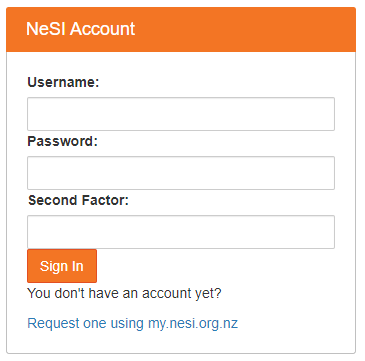
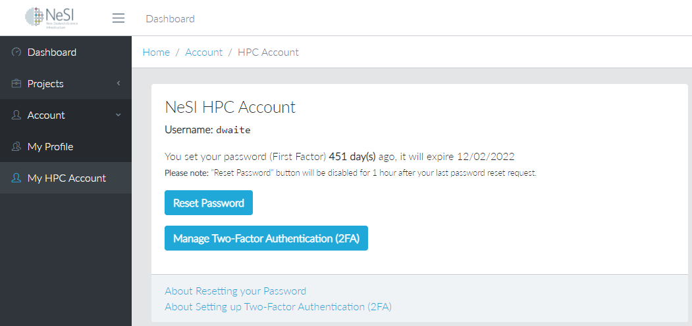
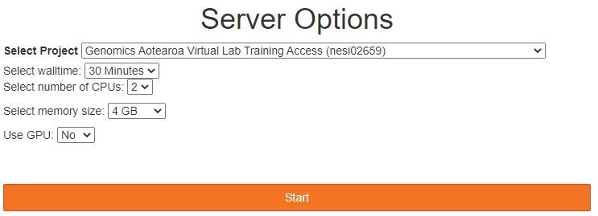
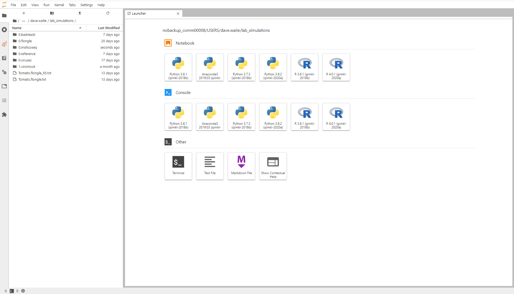
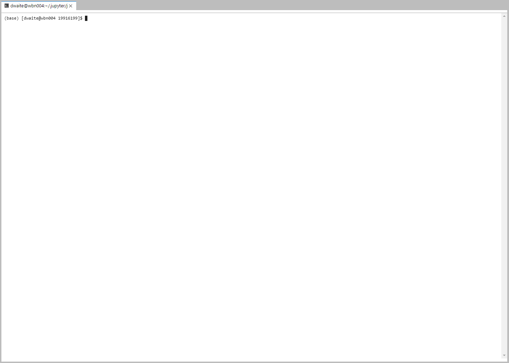

# Introducing the Shell

* Teaching: 20 minutes
* Exercises: 10 minutes

#### Objectives

* Describe key reasons for learning shell.
* Navigate your file system using the command line.
* Access and read help files for `bash` programs and use help files to identify useful command options.
* Demonstrate the use of tab completion, and explain its advantages.

#### Key points

* The shell gives you the ability to work more efficiently by using keyboard commands rather than a GUI.
* Useful commands for navigating your file system include: `ls`, `pwd`, and `cd`.
* Most commands take options (flags) which begin with a `-`.
* Tab completion can reduce errors from mistyping and make work more efficient in the shell.

---

## Contents

1. [Background](#background)
1. [How to access the shell](#how-to-access-the-shell)
1. [Navigating your file system](#navigating-your-file-system)
1. [Speeding up navigationg with tab completion](#speeding-up-navigationg-with-tab-completion)
1. [Summary](#summary)

---

## Background

#### What is a shell and why should I care?

A shell is a computer program that presents a command line interface which allows you to control your computer using commands entered with a keyboard instead of controlling graphical user interfaces (GUIs) with a mouse/keyboard combination.

Command line interfaces are very common when working in bioinformatics, as creating a GUI is platform-dependant. To create a tool with a GUI that works on Windows, OS X, and Linux requires at least three different versions of the tool to be written. In contrast, the command line is common to all three platforms.

Apart from this practical issue, there are many reasons to learn about the shell:

* **The shell makes your work less boring**
  * In bioinformatics you often need to do the same set of tasks with a large number of files.
  * Learning the shell will allow you to automate those repetitive tasks and leave you free to do more exciting things.
* **The shell makes your work less error-prone**
  * When humans do the same thing a hundred different times (or even ten times), they're likely to make a mistake.
  * Your computer can do the same thing a thousand times with no mistakes.
* **The shell makes your work more reproducible**
  * When you carry out your work in the command-line your computer keeps a record of every step that you've carried out, which you can use to re-do your work when you need to.
  * It also gives you a way to communicate unambiguously what you've done, so that others can check your work or apply your process to new data.
* **Many bioinformatic tasks require large amounts of computing power and can't realistically be run on your own machine**
  * These tasks are best performed using remote computers or cloud computing.
  * These devices require a remote connection which is most stably provided through a command line interface.

In this lesson you will learn how to use the command line interface to move around in your file system.

---

## How to access the shell

To access the shell on your own computer requires platform-specific software. On a Mac or Linux machine, you can access a shell through a program called `Terminal`, which is already available on your computer. If you're using Windows, you can access the Windows shell through the `Command Prompt`, or a Unix-like shell called `Cygwin` can be installed onto your computer through Activate.

For this workshop we will be connecting to the NeSI platform and using the shell that runs on the NeSI login node. We will access this through your web browser, by navigating to NeSI's [JupyterHub](https://jupyter.nesi.org.nz/). When you arrive at this website, you will be prompted to provide your access details.



You need to provide three pieces of information to log in. Your **username** was assigned to you when you registered for your NeSI account. It is *usually* either given as `<First name><Last name>` or `<Last name><First initial>`.

> <details>
> <summary>Forgotten username</summary>
>
> If you cannot remember your user name,  navigate to the [MyNeSI](https://my.nesi.org.nz/) account management website. Once you have logged in, there is an option on the left-hand menu titled **My HPC Account**. Clicking here will show your user name.
>
> 
>
> </details>

You will also need to provide your password, and the current two-factor code displayed by the Authenticator app.

Once these details are submitted, you will be redirected to a loading page. Click the `Select Project` dropdown box and select project `nesi03181`.



This is the project we will be working under for training. Select a number of hours appropriate to the training session, and leave the other settings at default.

Please note that project `nesi03181` is open to all users participating in training projects on NeSI. **DO NOT** use this project for diagnostic work!

After logging in, you will see a screen showing something like this: 


Once the Jupyter server has finished loading, you will then transfer through to the following view:



For now, we will just launch a basic terminal environment, so click on the **Terminal** icon. This will lauch the command line interface that we will be using for the remainder of this workshop.



We will spend most of our time learning about the basics of the shell by manipulating some experimental data. Some of the data we're going to be working with is quite large, so a copy of the data has been placed in your working directory for this workshop. We will now begin to explore the working directory.

---

## Navigating your file system

The part of the operating system responsible for managing files and directories is called the **file system**. It organizes our data into files,
which hold information, and directories (also called "folders"), which hold files or other directories. This is **exactly* the same as what you will be used to using the `File Explorer` on your home and work computers, except that we do not have visual prompts to tell us where we are in the file system.

To the left hand side of your terminal cursor is a dollar sign character (`$`). The dollar sign is a **prompt**, which shows us that the shell is waiting for input; your shell may use a different character as a prompt and may add information before the prompt. When typing commands, either from these lessons or from other sources, do not type the prompt, only the commands that follow it.

> <details>
> <summary>Simplfying the command prompt</summary>
>
> By default, the command prompt (the characters to the left of the cursor) will display some information about your current session. On NeSI this will look like:
> 
> ```bash
> [username@hostname directory] $
> ```
>
> If you would like to change your prompt to remove this information entry the command:
> 
> ```bash
> PS1="$ "
> ```
>
> Into your shell, then press the <kbd>Enter</kbd> key. If you prefer having the information displayed, you can revert to the original display using:
> 
> ```bash
> PS1='[\u@\h \W]\$'
> ```
>
> Or you can reset your original prompt by exiting the shell and opening a new session. It isn't necessary to change the prompt - it is often helpful to display the current directory while working from the command line. Changing the display is up to you.
> </details>

Let's find out where we are by running a command called `pwd` (which stands for "print working directory"). At any moment, our **current working directory** is our default directory, i.e. the directory that the computer assumes we want to run commands in, unless we explicitly specify something else.

```bash
$ pwd
```

You will see a return line of text, which looks something like the following:

```bash
/home/username
```

This is your home directory. It is private to you, and has limited file storage space. When working on NeSI we typically want to leave our home directory and navigate to a project directory. We will use the `cd` ("change directory") command to swtich our current working directory to a new location in the NeSI file system.

```bash
$ cd /nesi/nobackup/nesi03181/username/
```

From this location, let's now look at how our file system is organised. We can see what files and subdirectories are in this directory by running `ls`,
which stands for "listing":

```bash
$ ls
R  r_data  shell_data
```

`ls` prints the names of the files and directories in the current directory in alphabetical order, arranged neatly into columns. We'll be working within the `shell_data` subdirectory, and creating new subdirectories, throughout this workshop.  

If we want to now navigate into the `shell_data` folder we must once again call the `cd` command:

```bash
$ cd shell_data/
```

>**NOTE:** This time, the command is much shorter as it makes use of a **relative path**. The different kinds of pathing are discussed in the next exercise, so do not worry too much about this right now.

>**NOTE:** It's easy to get lost in a text-based file system. If you ever get stuck, and do not know how to get out of your current location, calling either of:
> ```bash
> $ cd ~
> ```
> or
> ```bash
> $ cd
> ```
> Will return you do your **home directory** (`/home/username/`).

Let's look at what is in the `shell_data` directory:

```bash
$ ls
sra_metadata  untrimmed_fastq
```

We can make the `ls` output more comprehensible by using the **flag** `-F`, which tells `ls` to add a trailing `/` to the names of directories:

```bash
$ ls -F
sra_metadata/  untrimmed_fastq/
```

Anything with a `/` after it is a directory. Things with a `*` after them are programs. If there are no decorations, it's a file.

`ls` has lots of other options. To find out what they are, we can type:

```bash
$ man ls
```

`man` (short for manual) displays detailed documentation (also referred as man page or man file) for `bash` commands. It is a powerful resource to explore `bash` commands, understand their usage and flags.

Some manual files are very long. You can scroll through the file using your keyboard's down arrow or use the <kbd>Space</kbd> key to go forward one page and the <kbd>b</kbd> key to go backwards one page. When you are done reading, hit <kbd>q</kbd> to quit.

> ### Exercise
>
> As we can see above, sometimes there is more information we need to know about files than what the default `ls` command provides.
> Use the `man` command to find the flag that enables **long listing format** when executing the `ls` command.
> What can you see from the output?
>
> <details>
> <summary>Solution</summary>
>
> ```bash
> $ ls -l
> drwxr-x--- 2 dcuser dcuser 4096 Jul 30  2015 sra_metadata
> drwxr-xr-x 2 dcuser dcuser 4096 Nov 15  2017 untrimmed_fastq
> ```
> The additional information given includes the name of the owner of the file, when the file was last modified, and whether the current user has permission to read and write to the file.
> </details>

No one can possibly learn all of these arguments, that's what the manual page is for. You can (and should) refer to the manual page or other help files
as needed.

Let's go into the `untrimmed_fastq/` directory and see what is in there.

```bash
$ cd untrimmed_fastq
$ ls -F
SRR097977.fastq  SRR098026.fastq
```

This directory contains two files with `.fastq` extensions. FASTQ is a format for storing information about sequencing reads and their quality. We will be learning more about FASTQ files in a later lesson.

---

## Speeding up navigationg with tab completion

Typing out file or directory names can waste a lot of time and it's easy to make typing mistakes. Instead we can use **tab complete** as a shortcut. When you start typing out the name of a directory or file, then hit the <kbd>Tab</kbd> key, the shell will try to fill in the rest of the directory or file name.

Return to your working directory:

```bash
$ cd /nesi/nobackup/nesi03181/username/
```

Then enter:

```bash
$ cd she<tab>
```

The shell will fill in the rest of the directory name for `shell_data`.

Now change directories to `untrimmed_fastq` in `shell_data`

```bash
$ cd shell_data/
$ cd untrimmed_fastq/
```

Using tab complete can be very helpful. However, it will only autocomplete a file or directory name if you've typed enough characters to provide a unique identifier for the file or directory you are trying to access.

For example, if we now try to list the files which names start with `SR` by using tab complete:  

```bash
$ ls SR<tab>
```

The shell auto-completes your command to `SRR09`, because all file names in the directory begin with this prefix. Hitting <kbd>Tab</kbd> twice in quick succession will prompt the the shell to list all possible choices.

```bash
$ ls SRR09<tab><tab>
SRR097977.fastq  SRR098026.fastq
```

Tab completion can also fill in the names of programs, which can be useful if you remember the beginning of a program name.

```bash
$ pw<tab><tab>
pwck              pwd               pwhistory_helper  pwscore
pwconv            pwdx              pwmake            pwunconv
```

Displays the name of every program that starts with `pw`. 

---

## Summary

We now know how to move around our file system using the command line. This gives us an advantage over interacting with the file system through a GUI as it allows us to work on a remote server, carry out the same set of operations on a large number of files quickly, and opens up many opportunities for using bioinformatic software that is only available in command line versions. 

In the next few exercises, we'll be expanding on these skills and seeing how using the command line shell enables us to make our workflow more efficient and reproducible.

[Next lesson](02-the-filesystem.md)
