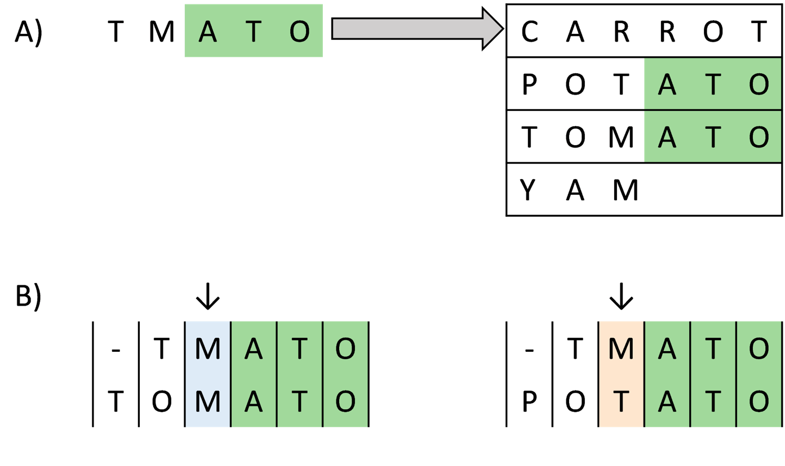
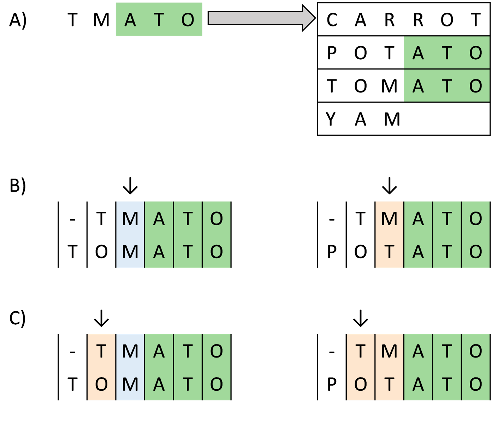
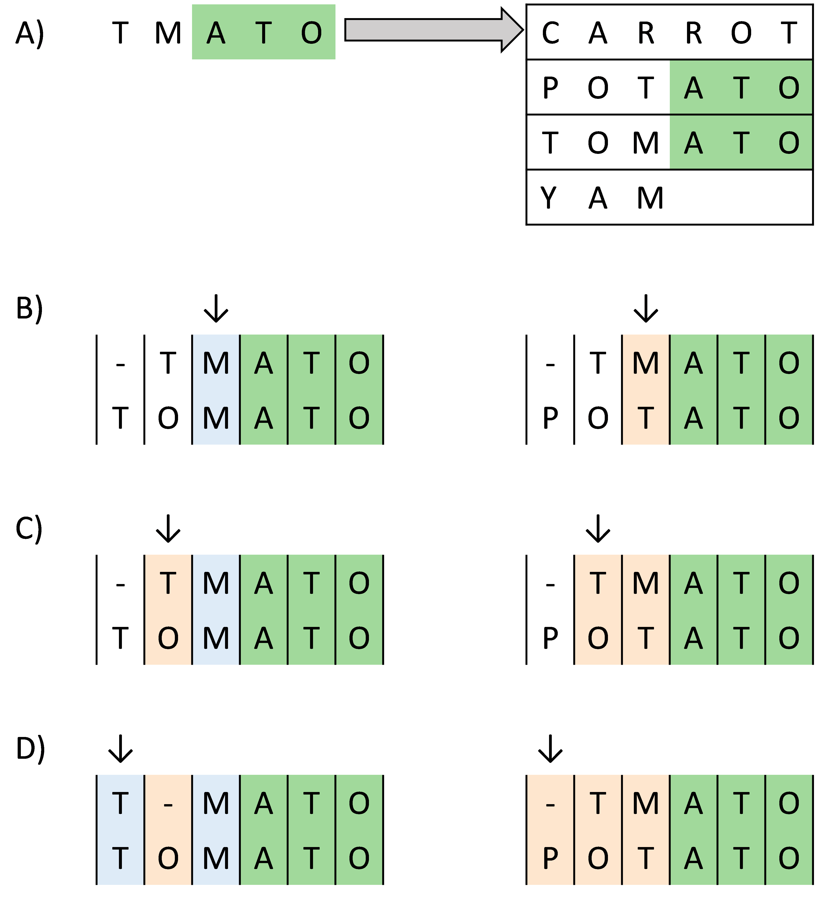

# Annotation of sequences

* Teaching: 30 minutes
* Exercises: 30 minutes

#### Objectives

* Understand the differences between nucleotide and protein sequence matching
* Be aware of which publicly available databases are appropriate for which data
* Learn how to submit `BLAST` jobs to the NeSI cluster using `slurm`
* Learn how to interpret `BLAST` results 
* Understand the meaning of *identity*, *coverage*, *e-value*, and *bitscore* metrics

#### Keypoints

* Annotation is required in order to identify the function and origin of sequences obtained from HTS analysis
* There are different databases available for annotation and classification
* Interpreting the results of BLAST alignments requires thought and attention 

---

## Contents

1. [The `BLAST` process](#the-blast-process)
1. [Submitting a nucleotide `BLAST` job on NeSI](#submitting-a-nucleotide-blast-job-on-nesi)
1. [Submitting a protein `BLAST` job on NeSI](#submitting-a-protein-blast-job-on-nesi)
1. [Interpretting the results of BLAST queries](#interpretting-the-results-of-blast-queries)
---

## The `BLAST` process

BLAST (**B**asic **L**ocal **A**lignment **S**earch **T**ool) was developed in 1990 [Altschul *et al.*, 1990](https://doi.org/10.1016/S0022-2836(05)80360-2) and is now one of the most well known, and widely used Bioinformatics tools.

BLAST compares novel (query) sequences against a database of reference sequences (target sequences) and reports back the similarity between each query and target sequence. Using the metadata associated with each reference sequence we can make inferences about the query sequence such as taxanomic origin, or function.

`BLAST` works by breaking each query sequence into a set of smaller *seed* sequences, and searching each target in the database for the presence of these seeds.  

Where matches are found, BLAST then extends the ends of the seed one position at a time and assesses how well the seed continues to match the targets.  

Matches and mismatches are recorded and the seed extenstion continues.    

  

BLAST is also able to introduce insertions to preserve a match between query and target sequences.  

  

The quality of the match between the query and the target are evaluated in terms of how well conserved the sequence composition is between the pair, including how many insertion or deletion events need to be introduced to maintain the matching.

In a BLAST analysis, every query sequence will be compared with every target in the database. Results are ranked by the quality of each match.  
Typically, we restrict our results to only return a certain number of the best matches, rather than everything with any degree of similarity to the query. Regardless of how many results are returned, for high quality matches we would expect to see a strong consensus in the gene function and taxonomy of the top matches. From these matches we can make inferences about the origin and function of the query sequence. 
