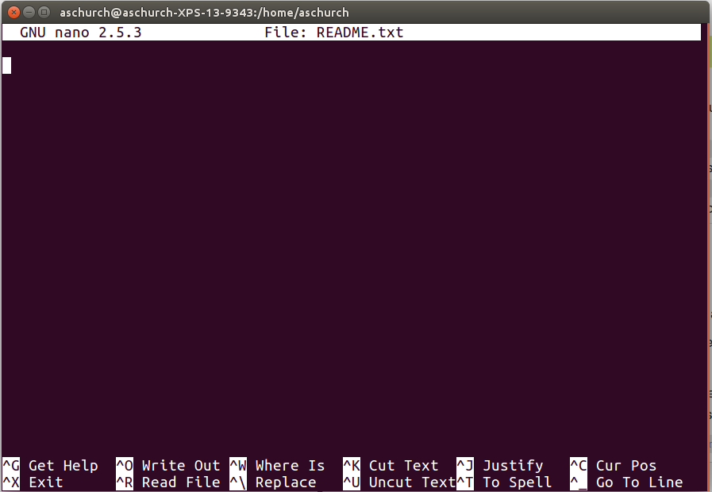
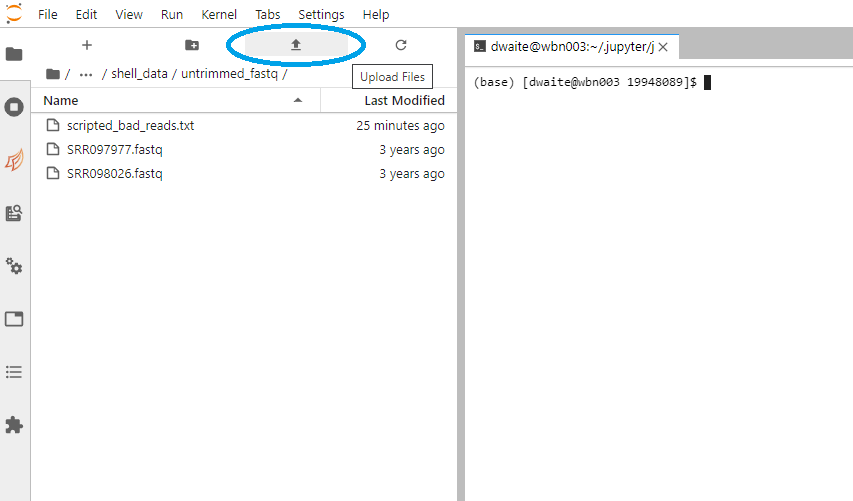
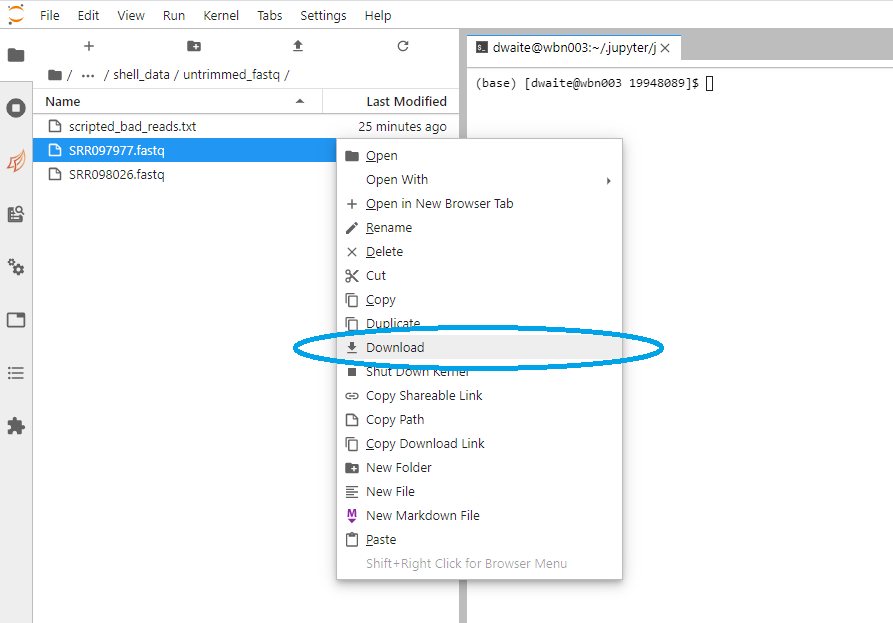

# Writing scripts and transferring data

* Teaching: 20 minutes
* Exercises: 10 minutes

#### Objectives

* Use the `nano` text editor to modify text files.
* Write a basic shell script.
* Use the `bash` command to execute a shell script.
* Use `chmod` to make a script an executable program.

#### Keypoints

* Scripts are a collection of commands executed together.
* Transferring information to and from virtual and local computers.

---

## Contents

1. [Writing files](#writing-files)
1. [Writing scripts](#writing-scripts)
1. [Making the script into a program](#making-the-script-into-a-program)
1. [Moving and downloading data](#moving-and-downloading-data)

---

## Writing files

We've been able to do a lot of work with files that already exist, but what if we want to write our own files? We're not going to type in a FASTA file but there are a lot of reasons we'll want to write a file, or edit an existing file.

To add text to files, we're going to use a text editor called `nano`. We're going to create a file to take notes about what we've been doing with the data files in `untrimmed_fastq/`.

This is good practice when working in bioinformatics. We can create a file called `README.txt` that describes the data files in the directory or documents how the files in that directory were generated.  As the name suggests, it's a file that we or others should read to understand the information in that directory.

Let's change our working directory to `untrimmed_fastq/` using `cd`, then run `nano` to create a file called `README.txt`:

```bash
$ cd /nesi/project/nesi03181/phel/USERNAME/shell_data/untrimmed_fastq
$ nano README.txt
```

You should see something like this:



The text at the bottom of the screen shows the keyboard shortcuts for performing various tasks in `nano`. We will talk more about how to interpret this information soon.

> #### Which Editor?
>
> When we say, "`nano` is a text editor"this really does mean "text": it can only work with plain character data, not tables, images, or any other human-friendly media. It is used in this exercise because it is one of the least complex text editors. There are a number of powerful alternatives to `nano`, such as [Emacs](http://www.gnu.org/software/emacs/) and [Vim](http://www.vim.org/).
>
> On Windows, [Notepad++](http://notepad-plus-plus.org/) is a great text editor, vastly superior to the standard `Notepad` tool.

Let's type in a few lines of text. Describe what the files in this directory are or what you've been doing with them.

Once we're happy with our text, we can press <kbd>Ctrl</kbd>-<kbd>O</kbd> (press the <kbd>Ctrl</kbd> or <kbd>Control</kbd> key and, while holding it down, press the <kbd>O</kbd> key) to write our data to disk. You'll be asked what file we want to save this to. Press <kbd>Return</kbd> to accept the suggested default of `README.txt`.

Once our file is saved, we can use <kbd>Ctrl</kbd>-<kbd>X</kbd> to quit the editor and return to the shell.

> #### Control, Ctrl, or `^` Key
>
> The Control key is also called the `Ctrl` key. There are various ways in which using the Control key may be described. For example, you may see an instruction to press the <kbd>Ctrl</kbd> key and, while holding it down, press the <kbd>X</kbd> key, described as any of:
>
> * `Control-X`
> * `Control+X`
> * `Ctrl-X`
> * `Ctrl+X`
> * `^X`
> * `C-x`
>
> In `nano`, along the bottom of the screen you'll see `^G Get Help ^O WriteOut`. This means that you can use <kbd>Ctrl</kbd>-<kbd>G</kbd> to get help and <kbd>Ctrl</kbd>-<kbd>O</kbd> to save your file.

Now you've written a file. You can take a look at it with `less` or `cat`, or open it up again and edit it with `nano`.

> ### Exercise
>
> Open `README.txt` and add the date to the top of the file and save the file. 
>
> <details>
> <summary>Solution</summary>
>
> Use `nano README.txt` to open the file. Add today's date and then use <kbd>Ctrl</kbd>-<kbd>X</kbd> followed by `Y` and <kbd>Enter</kbd> to save.
> </details>

---

## Writing scripts

A really powerful thing about the command line is that you can write **scripts**. Scripts let you save commands to run them and also lets you put multiple commands together. Though writing scripts may require an additional time investment initially, this can save you time as you run them repeatedly. Scripts can also address the challenge of reproducibility: if you need to repeat an analysis, you retain a record of your command history within the script.

One thing we will commonly want to do with sequencing results is pull out bad reads and write them to a file to see if we can figure out what's going on with them. We're going to look for reads with long sequences of `N`'s like we did before, but now we're going to write a script, so we can run it each time we get new sequences, rather than type the code in by hand each time.

We're going to create a new file to contain these commands, and we will call it `bad-reads-script.sh`. The `sh` isn't required, but using that extension tells us that it's a shell script.

```bash
$ nano bad-reads-script.sh
```

Bad reads have a lot of `N`'s, so we're going to look for  `NNNNNNNNNN` with `grep`. We want the whole FASTQ record, so we're also going to get the one line above the sequence and the two lines below. We also want to look in all the files that end with `.fastq`, so we're going to use the `*` wildcard.

We introduced the `-v` option in the previous exercise and we will also use the `-h` option to "suppress the prefixing of file names on output", as specified in the documentation shown by `man grep`.

```bash
grep -B1 -A2 -h NNNNNNNNNN *.fastq | grep -v '^--' > scripted_bad_reads.txt
```

Type your `grep` command into the file and save it as before. Be careful that you do not add the `$` at the beginning of the line.

Now comes the neat part. We can run this script. Type:

```bash
$ bash bad-reads-script.sh
```

It will look like nothing happened, but now if you look at `scripted_bad_reads.txt`, you can see that there are now reads in the file.

> ### Exercise
>
> We want the script to tell us when it's done. Update the script to print the text `Script finished!` after the `grep` commands complete.
>
> <details>
> <summary>Solution</summary>
>
> ```bash
> nano bad-reads-script.sh
> ```
> ```
> grep -B1 -A2 -h NNNNNNNNNN *.fastq | grep -v '^--' > scripted_bad_reads.txt
> echo "Script finished!"
> ```
> </details>

---

## Making the script into a program

We had to type `bash` because we needed to tell the computer what program to use to run this script. Instead, we can turn this script into its own program. We need to tell it that it's a program by making it executable. We can do this by changing the file permissions. We talked about permissions in a previous exercise.

First, let's look at the current permissions.

```bash
$ ls -l bad-reads-script.sh
-rw-rw-r-- 1 dcuser dcuser 0 Oct 25 21:46 bad-reads-script.sh
```

We see that it says `-rw-r--r--`. This shows that the file can be read by any user and written to by the file owner (you). We want to change these permissions so that the file can be executed as a program. We use the command `chmod` like we did earlier when we removed write permissions. Here we are adding (`+`) executable permissions (`+x`).

```bash
$ chmod +x bad-reads-script.sh
```

Now let's look at the permissions again.

```bash
$ ls -l bad-reads-script.sh
-rwxrwxr-x 1 dcuser dcuser 0 Oct 25 21:46 bad-reads-script.sh
```

Now we see that it says `-rwxr-xr-x`. The `x`'s that are there now tell us we can run it as a program. So, let's try it! We'll need to put `./` at the beginning so the computer knows to look here in this directory for the program.

```bash
$ ./bad-reads-script.sh
```

The script should run the same way as before, but now we've created our very own computer program!

---

## Moving and downloading data

So far, we've worked with data that is pre-loaded on the instance in the cloud. Usually, however, most analyses begin with moving data onto the instance. Below we'll show you some commands to download data onto your instance, or to move data between your computer and the cloud.

### Getting data from the cloud

There are two commonly used programs that will download data from a remote server to your local (or remote) machine: `wget` and `curl`. They were designed to do slightly different tasks by default, so you'll need to give the programs somewhat different options to get the same behaviour, but they are mostly interchangeable.

1. `wget` is short for "world wide web get", and it's basic function is to **download** web pages or data at a web address.
1. `curl` is a pun, it is supposed to be read as "see URL", so its basic function is  to **display* webpages or data at a web address.

Which one you need to use mostly depends on your operating system, although both are available on NeSI. You can see this by searching for them with the `which` command:

```bash
$ which curl
/usr/bin/curl
```

```bash
$ which wget
/usr/bin/wget
```

``which`` is a BASH program that looks through everything you have installed, and tells you what folder it is installed to. If it can't find the program you asked for, it will return a message informing you of this outcome and telling you which places were searched, using a `:`-separated list:

```bash
$ which randomtool
/usr/bin/which: no randomtool in (/opt/slurm/sbin:/opt/slurm/bin:/opt/nesi/share/bin:/usr/local/bin:/usr/bin:/usr/local/sbin:/usr/sbin:/opt/nesi/bin:/opt/ibutils/bin)
```

The exact list of locations searched depends on your `bash` environment but you should see something similar to the message above.

We will now download the file `species_EnsemblBacteria.txt` from the [EnsemblGenomes](http://ensemblgenomes.org/) web server. This can be done using either tool, although they need to be executed in slightly different ways. Since we wanted to *download* the file rather than just view it, we used we can use `wget` without any modifiers. With `curl` however, we have to use the `-O` flag which tells `curl` to download the page instead of showing it to us **and** specifies that it should save the file using the same name it had on the server: `species_EnsemblBacteria.txt`

```bash
$ wget ftp://ftp.ensemblgenomes.org/pub/release-37/bacteria/species_EnsemblBacteria.txt
```

or

```bash
$ curl -O ftp://ftp.ensemblgenomes.org/pub/release-37/bacteria/species_EnsemblBacteria.txt
```

It's important to note that both `curl` and `wget` download to the computer that the command line belongs to. If you are logged into NeSI on the command line and execute either of the commands above, the file will be downloaded to your current working directory on NeSI, not your local computer.

>**NOTE:** There are many other ways to download data from service providers. In some cases, particular vendors such as [GeneWiz](https://www.genewiz.com/) have their own custom tools which must be used for downloading data. Other institutions may prefer the [Globus](https://www.globus.org/) service. These are all possible on NeSI, but need to be established on a case-by-case basis.

### Moving files between your computer and NeSI

What if the data you need is on your local computer, but you need to get it *into* NeSI? There are several ways to do this. Since we are working in JupyterHub, there are built-in controls we can use to transfer data.

**Uploading**



**Downloading**



Alternatively, you can use the `WinSCP` tool to transfer files directly from your computer into NeSI. This requires some configuration, but is much more friendly when moving large files, or a large number of files.

### Uploading data with `scp`

If you really have a large amount of data to transfer, our server can transfer data to NeSI via the `scp` command. Logging into the AHL and PHEL servers requires a separate user profile so will not be covered in this workshop. However, if you find that the two options covered here are not sufficient for the transfers you wish to make, access to the servers can be organised.

---

[Next lesson](06-organisation.md)
