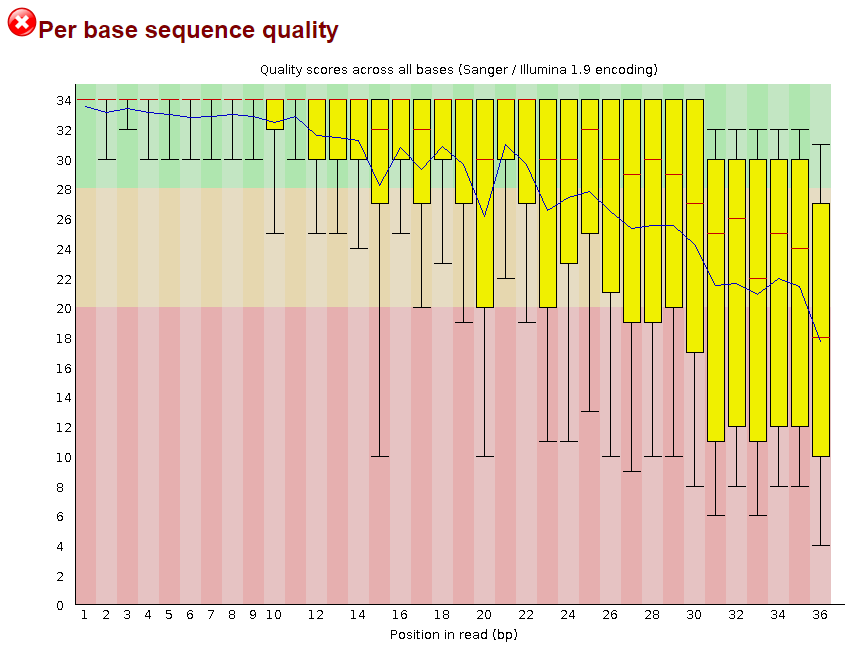
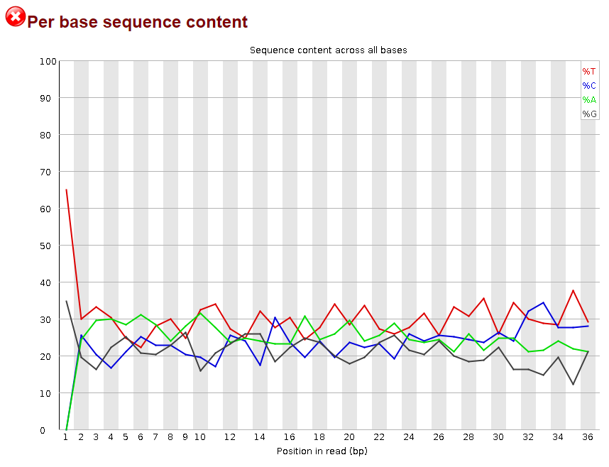
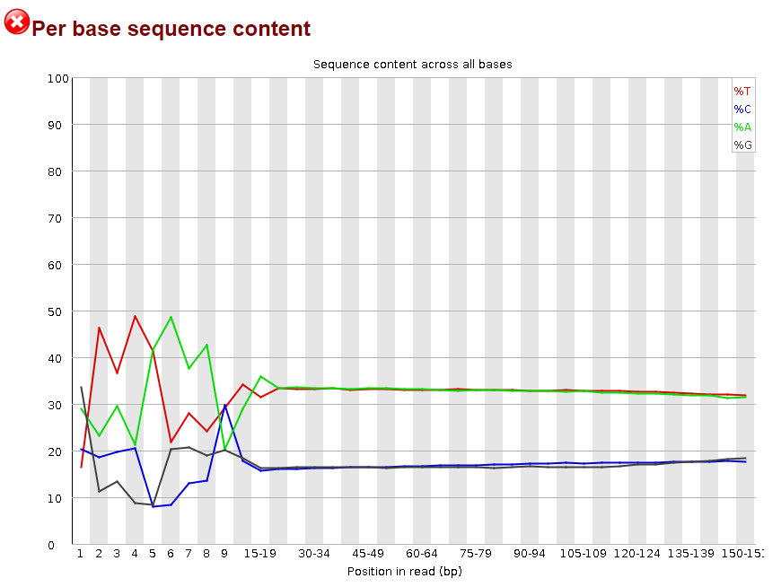
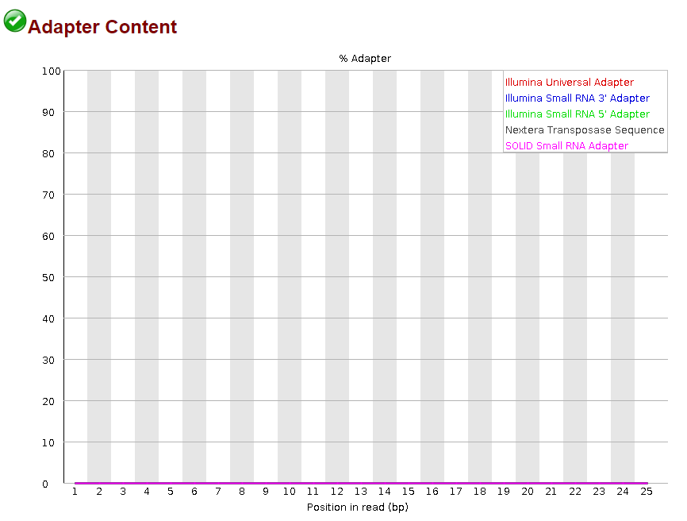

# Working with Illumina data

* Teaching: ??? minutes
* Exercises: ??? minutes

#### Objectives

* Know how to assess the quality of Illumina sequence data using visualisation tools such as `FastQC`
* Be able to perform quality filtering to remove adapter and barcode regions, as well as low quality sequence spans

#### Keypoints

* Raw sequencing data is usually not appropriate for immediate analysis
* `FastQC` is a powerful tool for quickly generating visual reports to summarise key aspects of Illumina data
* Sequences can be filtered to remove low quality sequences and sequencing artefacts using `fastp`

---

## Contents

1. [Assessing sequence quality](#assessing-sequence-quality)
1. [Trimming paired data and preserving read order](#trimming-paired-data-and-preserving-read-order)
1. [Trimming poor quality sequence and adapters](#trimming-poor-quality-sequence-and-adapters)

---

## Assessing sequence quality

When we obtain data from a sequencing facility, it is always important to check the overall quality of the sample, and to confirm whether or not sequencing constructs have been removed from the seqence data. Im particular, we want to know:

1. Are there adapter and/or barcode sequences attached to the reads
1. Are there any obvious low-quality regions of sequence
1. Is there a quality drop-off towards the end of read-pair sequence which might necessitate trimming

A very useful tool for answering these questions is `FastQC`. This tool takes a set of fastq files as input and produces reports for each one to allow us to answer the questions above, as well as examine over features of the sequences such as compositional bias, *k*-mer frequency profiles, and sequence duplication levels.

To activate `FastQC` on NeSI, we need to load the `slurm` module using the command

```bash
$ module purge
$ module load FastQC/0.11.7
```

>**NOTE:** Remember that it is always useful to begin a new session with the `module purge` command, particularly when working through the JupyterHub portal. If you have already run this command without loading new software, you can skip this command.

We can run `FastQC` from the command line, either one file at a time, or by passing a list of files using the wildcard (`*`) operator:

```bash
$ cd /nesi/project/nesi03181/phel/USERNAME/fastq_processing
$ fastqc -o results/ data/*.fastq
```

`FastQC` generates output reports in `.html` files and a `.zip` file that contains the main display resources. These can be viewed in a standard web browser. Since we are connection to NeSI using the JupyterHub system, we can view these directly:

>**NOTE:** `FastQC` does not load the forward and reverse pairs of a library in the same window, as it works on individual fastq files and is not aware of any read pairing in your library. You need to be mindful of how your samples relate to each other and in which order you have opened them if you are trying to compar the forward and reverse complement of a sequencing library.

1. Click on the folder icon in the top left to open the folder navigator pane (if not already open).
1. Use the file browsing system to navigate through to `/nesi/project/nesi03181/phel/USERNAME/fastq_processing/results/`
1. Double click on the output `.fastqc.html` files to open them in the a new tab

Let's now look at some of the outputs, starting with the summary for sample `SRR097977`.


This is the basic view for `FastQC` output. At the left-hand side of the tab is a navigation menu, which can move you quickly through the pages of summary information. Alternatively, you can simply scroll down the page to find the section you are most interested in.

From the summary view, the main point of interest is the 'Basic Statistics' table. This gives you some brief summary information for your input file, such as the name of the file read (this can be important if you are working with many files), the fastq encoding, the numbers of sequences and the average length. You should already have a rough expectation for these numbers based from correspondence with your sequencing provider.

#### Per base sequence quality

Scrolling down (or clicking on the 'Per base sequence quality' link) will take us to the main piece of information we wish to know about the samples - the overall quality of the sequences.



This view provides us with a nice graphical summary of the average sequence quality along the length of our reads. Fastq Q-scores are ranked on the y-axis and the nucleotide position in the read (or range of positions, for reads which are several hundred nucleotides in length) are plotted sequentially along the x-axis. The sample `SRR097977` shows a severe, but expected pattern of quality, whereby the sequence quality degrades as the reading window moves towards the right-hand side of the sequence.

This view provides us with two pieces of information - how strictly we need to trim our sequences, and what effect we could expect to see on our number of sequences and sequence length after quality filtering.

#### Per base sequence content

The next piece of information which can be helpful to check is the average distribution of nucleotides across the sequence length. When examining this feature of an Illumina run, we do not expect to see an even split between the four nucleotides at each position. This is because most genomes have a bias for a high or low proportion of G-C pairs compared with A-T pairs. For example, the human genome is on average 41% G and C nucleotides, and 59% A and T nucleotides. On average then, when we look to the nulcotide frequency distribution for a random genome we should not expect 25% of each nucleotide in each position, but *we should* see equal frequencies of A/T and G/C.



This is not the case in the `SRR097977` data which we were looking at, but we already know that this is a reasonably low-quality library. For a more realistic result, let's take a look at some better data taken from the Sequence Read Archive.

> ### Exercise
>
> In a previous exercise you copied some *M. bovis* MiSeq data into the `data/` folder along with the `SRR097977` and `SRR098026` files. These files were compressed and so end with a `.gz` file extension and were not included in the previous `FastQC` summary. Run `FastQC` again, this time on the `Mb1` sequences.
> 
> <details>
> <summary>Solution</summary>
>
> ```bash
> $ fastqc -o results/ data/Mb1_1.fastq.gz data/Mb1_2.fastq.gz
> ```
> </details>

Take a look at the result of the `Mb1_1` file. The per base sequence content plot should look similar to this:



Here we can see a much more realistic result for the sequencing output. These sequencing data are from a *Mycoplasma bovis* genome (BioProject [PRJEB38523](https://www.ncbi.nlm.nih.gov/bioproject/PRJEB38523), sequencing run [ERR4179828](https://www.ncbi.nlm.nih.gov/sra/ERR4179828)). *M. bovis* has an average GC richness of ~29%, which is consistent with the results in this figure - both the `C%` and `G%` values are between 15% and 18% for the length of the sequence, and the `A%` and `T%` are slightly over 30%.

This is true for *most* of the sequence, but at the starting nucleotides something is clearly different. A pattern such as this is quite a common occurance and is due to methodological biases inherent in library preparation strategies. This phenomenon has been demonstrated in the context of RNASeq libraries<sup>[1](#hansen), [2](#vangurp)</sup> and has also been observed in DNA libraries prepared with transposon-based kits such as the Nextera preparation kits. If you follow the link above to [ERR4179828](https://www.ncbi.nlm.nih.gov/sra/ERR4179828) you can see in the metadata that these sequences are from an Illumina MiSeq run prepared with the Nextera XT system.

<a name="hansen"><sup>1</sup></a>Hansen KD, Brenner SE, Dudoit S (2010) Biases in Illumina transcriptome sequencing caused by random hexamer priming. Nucleic Acids Res. 38(12):e131. https://doi.org/10.1093/nar/gkq224

<a name="vangurp"><sup>2</sup></a>van Gurp TP, McIntyre LM, Verhoeven KJF (2013) Consistent Errors in First Strand cDNA Due to Random Hexamer Mispriming. PLoS ONE 8(12): e85583. https://doi.org/10.1371/journal.pone.0085583

#### Adapter content

As you will know from previous training workshops, when sequencing is peformed we must add adapter sequences to our extracted DNA (or cDNA) to facilitate sequencing. Because these adapter constructs become part of the DNA sequence, they are also read by the sequencing machine and reported as observed sequence. It is *generally* good practice for a sequencing facility to scrub these adapter sequences from your data before returning it to you, and if you are using a multiplexed (barcoded) method of sequencing this almost certainly must be performed before your sequence is made available.

However, this is never guaranteed and it is always good practice to confirm that there are no adapters or barcodes in your library before you attempt to analyse the data. Since adapters are attached to the start of the DNA fragment being sequenced, they will always appear in the starting positions of your reads if not removed.

> ### Exercise
>
> Think about what the per base sequence content of a library that has not had adapters removed would look like. How could you go about detecting whether or not adapters your present at the start of your sequences if;
> 
> 1. You know what adapters were used in your sequencing experiment? (i.e. the sequencing centre has told you what preparation method was used)
> 2. You *do not* know what adapters were used in your sequencing experiment? (i.e. you know that some preparation was performed, but the sequencing centre has not revealed the information to you)
> 
> Try to formulate your answers in terms only of tools used in this workshop, or the previous Level 1 training.
> 
> <details>
> <summary>Solution</summary>
>
> **Note:** These are not the only valid answers. If you have an answer that differs from the answers below, share it with the workshop attendees to discuss it.
> 
> 1. You could use a tool such as a search function in `less`, or `grep` to count the instances of the adapter sequence within your library.
> 2. If you were to use the per base sequence content view from `FastQC`, the frequencies for the first 10 - 20 nucleotides would skew to 100% for the adapter sequence used.
> 
> </details>

It is important to think carefully about the expected attributes of your sequence data as you work with it. Although there are plenty of tools (`FastQC` included) which can automatically detect the common library adapters, 'common' is a relative term and depends on how frequently updated the tool is compared with the latest sequencing technologies.

Take a look at the adapter content view for the `Mb1_1` library. Are there any adapter or preparation sequences detected in these data? Are they where you would expect them?



It appears that any Illumina sequencing adapters that were used in the library preparation has already been removed from the start of the sequences, but there are Nextera transposase sequences present in the tail end of some sequences.

> ### Exercise
>
> Considering what you know about the Illumina sequencing platform, how do you think it is possible to get adapters or sequencing constructs on the tail end (far end) of a sequence?
> 
> <details>
> <summary>Solution</summary>
>
> This is a phenomenon known as read-through. When the DNA fragment being sequenced is shorter than the read length. For example, in these data the read length is 150 bp. If a fragment of only 80 nucleotides in length is sequenced, the sequencing machine does not know that there are only 80 positions to read and it will not terminate after those 80 nucleotides are processed. Instead, the sequencer will continue to read the seuqence it can find at the 5' end of the 80 nucleotides, which will be the reverse adapter.
> 
> </details>

---

## Trimming paired data and preserving read order

Once we have visualised our sequence quality, we need to make some decisions regarding whether we perform quality filering or not, how severely the data must be trimmed, and whether or not we need to remove adapter sequences.

There are many tools available for trimming sequence data, and today we are only going to work with one - [fastp](https://github.com/OpenGene/fastp). This tool was selected for its speed and performance, as well as having a good suite of quality-of-life features, but it there are many alternate tools out there which can perform the same job.

`fastp` is available on NeSI as a pre-installed software module. To access it, we must once again run the `module load` command:

```bash
$ module load fastp/0.20.0-GCCcore-7.4.0
```

At it's most basic level, `fastp` simply takes one input sequence file, trims the sequences according to some default values, then saves the output to a new file:

```bash
$ fastp -i in.R1.fq.gz -o out.R1.fq.gz
```

Sequences from the input file are read and trimmed for regions that do or do not match filtering criteria. For example, reject adapter regions will be removed, as will regions of the sequence where the average quality falls below a required threshold. If this means that the entirity of a sequence falls below the selection criteria, the resulting sequence will not be written to the output file. Often, short sequences will also be rejected from the output.

Our sequences consist of paired reads. Filtering paired reads is a slightly more complicated process than trimming single-end reads. You cannot just run the trimming tool over each sequence file:

```bash
$ fastp -i in.R1.fq.gz -o out.R1.fq.gz
$ fastp -i in.R2.fq.gz -o out.R2.fq.gz
```

This is because that between the paired sequence files, the forward/reverse reads are ordered such that the first sequence in the `R2` (reverse) file is the partner to the first sequence in the `R1` (forward file). If a sequence in one of these files is rejected by the filtering system but it's partner passes filtering, then there will be an uneven number of sequences written into the two output files.

This is a massive problem, because when we perform tasks like assembly and read mapping, the tools will assume that the sequence order is identical between forward and reverse files. For example, if we have a pair of files where the sequences align like so:

```
R1-----------------------R2
@Seq1-----------------@Seq1
@Seq2-----------------@Seq2
@Seq3-----------------@Seq3
@Seq4-----------------@Seq4
@Seq5-----------------@Seq5
@Seq6-----------------@Seq6
@Seq7-----------------@Seq7
@Seq8-----------------@Seq8
@Seq9-----------------@Seq9
```

And after filtering we might get an output like:

```
R1-----------------------R2
@Seq1-----------------@Seq1
@Seq2-----------------@Seq2
@Seq3-----------------@Seq3
----------------------@Seq4
@Seq5-----------------@Seq5
@Seq6-----------------@Seq6
@Seq7----------------------
@Seq8-----------------@Seq8
@Seq9-----------------@Seq9
```

Where `Seq4_R1` and `Seq7_R2` are removed, then our downstream analysis tools will not be aware of these gaps, and read the pairing information as:

```
R1-----------------------R2
@Seq1-----------------@Seq1
@Seq2-----------------@Seq2
@Seq3-----------------@Seq3
@Seq5-----------------@Seq4
@Seq6-----------------@Seq5
@Seq7-----------------@Seq6
@Seq8-----------------@Seq8
@Seq9-----------------@Seq9
```

Where there are now some mismatched pairs - `Seq5_R1` pairs with `Seq4_R2`, `Seq6_R1` with `Seq5_R2`, and `Seq7_R1` with `Seq6_R2`. The impact this has varies depending on what is being done with the next stage of analysis, but whether these errors cause chimeric assembly or simply a failure to successfully map a sequence pair to a reference genome, it is entirely an aretfact of our analysis procedure.

>**NOTE:** This is just a simple example where a single sequence was removed from each direction. In practice the problem would be much more severe, as there would almost certainly be an uneven number of reads filtered from each direction so the order would never recover after the first removal, as it did in this example.

Any worthwhile trimming tool is aware of this problem, and has a built-in capacity for filtering these issues. In the case of `fastp`, this is the correct way to filter the sequences:

```bash
$ fastp -i in.R1.fq.gz -I in.R2.fq.gz -o out.R1.fq.gz -O out.R2.fq.gz
```

With this usage, `fastp` takes a second, optional, input with the `-I` parameter which is understood to be the pair of the `-i` input. Similarly, the `-O` output file is the output for the `-I` file, and pairs with the `-o` output file. If the example sequences above were run in this manner, we would get the following output:

```
out.R1.fq.gz---out.R2.fq.gz
@Seq1-----------------@Seq1
@Seq2-----------------@Seq2
@Seq3-----------------@Seq3
@Seq5-----------------@Seq5
@Seq6-----------------@Seq6
@Seq8-----------------@Seq8
@Seq9-----------------@Seq9
```

Which is great. We have lost a few sequences, but those that we retained are still ordered.

There is a problem here, though. The `Seq4_R1` and `Seq7_R2` sequence were of poor quality and did not pass quality filtering, but their partner sequence did pass. In the usage above, the `Seq4_R2` and `Seq7_R1` sequence are still filtered out of the data even though they are of sufficient quality. This is a fairly common occurance, so filtering tools have an additional output type for these unpaired (also called 'orphan' or singleton) sequences which pass filtering when their partner do not.

The command is not getting a bit long, so we will use the `\` character to break the command over several lines:

```bash
$ fastp -i in.R1.fq.gz -I in.R2.fq.gz \
        -o out.R1.fq.gz -O out.R2.fq.gz \
        --unpaired1 out.R1.unpaired.fq.gz \
        --unpaired2 out.R2.unpaired.fq.gz
```

This time the output would look like:

```
out.R1.fq.gz---out.R2.fq.gz
@Seq1-----------------@Seq1
@Seq2-----------------@Seq2
@Seq3-----------------@Seq3
@Seq5-----------------@Seq5
@Seq6-----------------@Seq6
@Seq8-----------------@Seq8
@Seq9-----------------@Seq9

out.R1.unpaired.fq.gz
@Seq7_R1

out.R2.unpaired.fq.gz
@Seq4_R2
```

This is a much better solution, as we are now retaining more high quality data. However, `fastp` has one more nice feature that we can exploit - if we don't set a value for the `--unpaired2` parameter, the sequences which *would* have gone to this file are instead sent to the same place as `--unpaired1`. This means that we can capture all of our unpaired reads in a single file.

```bash
$ fastp -i in.R1.fq.gz -I in.R2.fq.gz \
        -o out.R1.fq.gz -O out.R2.fq.gz \
        --unpaired1 out.unpaired.fq.gz \
```

This time the output would look like:

```
out.R1.fq.gz---out.R2.fq.gz
@Seq1-----------------@Seq1
@Seq2-----------------@Seq2
@Seq3-----------------@Seq3
@Seq5-----------------@Seq5
@Seq6-----------------@Seq6
@Seq8-----------------@Seq8
@Seq9-----------------@Seq9

out.unpaired.fq.gz
@Seq4_R2
@Seq7_R1
```

> ### Exercise
>
> Load the `fastp` tool in your JupyterHub session, and have a quick test run of the different behaviours. Run the tool a few different times using the examples above (i.e. retaining pairs only, writing unpaired sequences out into individual files or the same files.
>
> **NOTE:** `fastp` produces a lot of output text while running, and creates some report files. You can ignore this for now.
>
> <details>
> <summary>Solution</summary>
>
> 1) Run `fastp` ignoring unpaired sequences:
> ```bash
> $ fastp -i data/Mb1_1.fastq.gz -I data/Mb1_2.fastq.gz -o results/fastp_test.R1.fastq.gz -O results/fastp_test.R2.fastq.gz
> ```
>
> 2) Run `fastp` and write unpaired sequences to individual outputs:
> ```bash
> $ fastp -i data/Mb1_1.fastq.gz -I data/Mb1_2.fastq.gz \
>         -o results/fastp_test.R1.fastq.gz -O results/fastp_test.R2.fastq.gz \
>         --unpaired1 results/fastp_test.R1.unpaired.fastq.gz \
>         --unpaired2 results/fastp_test.R2.unpaired.fastq.gz
> ```
>
> 3) Run `fastp` ignoring unpaired sequences:
> ```bash
> $ fastp -i data/Mb1_1.fastq.gz -I data/Mb1_2.fastq.gz \
>         -o results/fastp_test.R1.fastq.gz -O results/fastp_test.R2.fastq.gz \
>         --unpaired1 results/fastp_test.unpaired.fastq.gz
> ```
> </details>

---

## Trimming poor quality sequence and adapters

Now that we understand the importance of keeping our fastq outputs ordered, and how to achieve this with `fastp`, let's look at the actual filtering process. From the command line, you can view the manual for `fastp` by running it either without any parameters, or with the `--help` parameter.

```.bash
$ fastp
$ fastp --help
```

There are quite a few options we can modify here, and we are going to ignore most of them in the interests of time. The two main aspects of trimming that we want to work through are the adapter removal options, and the quality filtering options.

#### Adapter removal

Traditionally, sequencing trimming tools require you to provide a list of the adapters in your data set via a fasta file. The sequences of this file are then matched against the start and end of each fastq sequence read by the tool and trimming occurs when there is a match. `fastp` does provide this option, via the `--adapter_fasta` parameter, i.e.:

```bash
$ fastp --adapter_fasta my_adapter_list.fasta -i ... -o ...
```

But it introduces two quality of life improvements that are often easier to work with. Since there should only be a single adapter in your data, rather than create a file of adapter sequences, the sequences can be passed directly to the program, saving the effort of creating the file and also making your work more transparent when viewing `history` logs:

```bash
$ fastp --adapter_sequence=AGATCGGAAGAGCACACGTCTGAACTCCAGTCA \
        --adapter_sequence_r2=AGATCGGAAGAGCGTCGTGTAGGGAAAGAGTGT \
        -i ... -o ...
```

In this example, the Illumina TruSeq adapters are provided to be removed from the sequences.

If even that is too much effort, or we do not know what adapters were used, `fastp` also has the ability to auto-detect adapters in the sequences. When running in this way, `fastp` will read the first 1,000,000 sequences in the file and search for common nucleotide patterns in the read. The sequences that `fastp` identifies as the adapter are reported as part of the console output, and can then be compared against known lists of sequencing adapters to confirm they are correct.

```bash
$ fastp --detect_adapter_for_pe -i ... -o ...
```

This is a very helpful feature, but be warned that if your library has already been trimmed of adapters and you force `fastp` to find them, results can be quite weird.

> ### Exercise
>
> Run `fastp` against the `Mb1_1.fastq.gz` and `Mb1_2.fastq.gz` files, with and without adapter trimming. Run the command again with automatic adapter detection. Look at the outputs in `FastQC` and see how they differ.
>
> <details>
> <summary>Solution</summary>
>
> ```bash
> $ fastp -i data/Mb1_1.fastq.gz -I data/Mb1_2.fastq.gz -o results/fastp_test.R1.fastq.gz -O results/fastp_test.R2.fastq.gz
> $ FastQC results/fastp_test.R1.fastq.gz results/fastp_test.R2.fastq.gz
>
> $ fastp --disable_adapter_trimming \
>         -i data/Mb1_1.fastq.gz -I data/Mb1_2.fastq.gz \
>         -o results/fastp_test.no_removal.R1.fastq.gz -O results/fastp_test.no_removal.R2.fastq.gz
> $ FastQC results/fastp_test.no_removal.R1.fastq.gz results/fastp_test.no_removal.R2.fastq.gz
>
> $ fastp --detect_adapter_for_pe \
>         -i data/Mb1_1.fastq.gz -I data/Mb1_2.fastq.gz \
>         -o results/fastp_test.auto_removal.R1.fastq.gz -O results/fastp_test.auto_removal.R2.fastq.gz
> $ FastQC results/fastp_test.auto_removal.R1.fastq.gz results/fastp_test.auto_removal.R2.fastq.gz
> ```
> </details>

#### Quality filtering

Although it's nearly the last feature we will address in this exercise, quality filtering is really the main reason we use tools like `fastp`. There are several ways to screen a sequence for quality, once we have determined what we want our lower limit of acceptable quality to be.

1. Remove a sequence with an average quality below this value
1. Cut the regions of a sequence with quality below this value

The later of these is definitely the better option, as a sequence with quite high average quality can still have large spans of low-quality sequence which will interfere with out analysis. The second option is usually refered to as 'sliding window' evaluation and consists of the sequence being read from one end to the other, reading a small number of bases (the window) and assessing the average quality over these nucleotides. The window progresses (slides) along the sequence, and at the first instance of average quality dropping below the threshold, the sequence is cut and the remainder discarded.

In this kind of analysis, the default threshold is a Q-score of 20, and the window size is 4. These are fairly standard values, but can be changed if desired. This method is enabled by the `--cut_right` parameter in `fastp`, as the sliding window moves from the left-hand side (start) or the sequence to the right-hand side (end), and everything discarded after the cut point is therefore the right half of the sequence.

`fastp` does have two other ways of trimming low quality regions, in which is begins from the start or end of the sequence and removes nucleotides below the quality threshold until a high quality base is encountered. When working with Illumina data this method is probably not very valuable, as sequence quality usually starts off quite high with Illumina data and tends to degrade ove time. However, there are some sequencing platforms that can yield poor quality at the start of a sequence, so it is worth knowing that this behaviour is possible.

> ### Exercise
>
> Inspect the help options for `fastp` and formulate a command to perform sliding window filtering with a window length of 8 nucleotides, and a quality threshold of 15.
>
> <details>
> <summary>Solution</summary>
>
> ```bash
> $ fastp --cut_right --cut_window_size 8 --cut_mean_quality 15 \
>         -i ... -I ... -o ... -O ... --unpaired1 ...
> ```
> </details>

#### Other features

There are just a few more features of `fastp` which can be useful to know.

1. `--thread`: Increase the number of computer processes (threads) used to process the sequences. Using more threads typically makes the job faster to complete. The default value is 2.
1. `--html`/`--json`: Change the names of the report files generated during a run. This is very useful when processing many samples, as the default output names (`fastp.html` and `fastp.json`) are recycled on each use and successive runs of `fastp` overwrite the output of previous runs.
1. `--length_required`: Discard sequences shorter than the specified length (after trimming) regardless of their quality.
1. `--n_base_limit`: Discard sequences with more than the specified limit of `N` characters, regardless of the sequence quality.

---

[Next lesson]()
