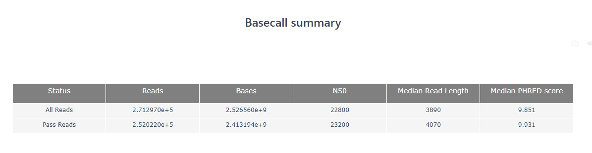
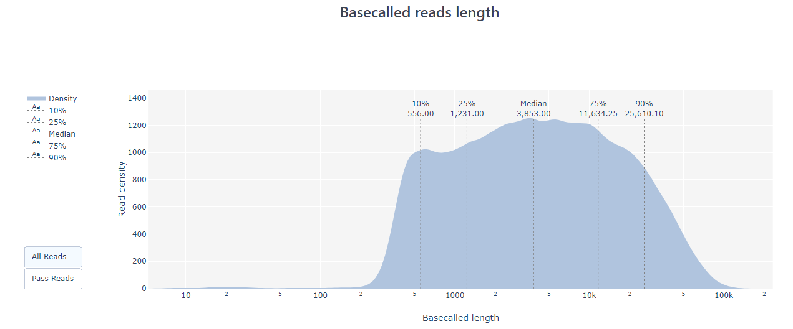
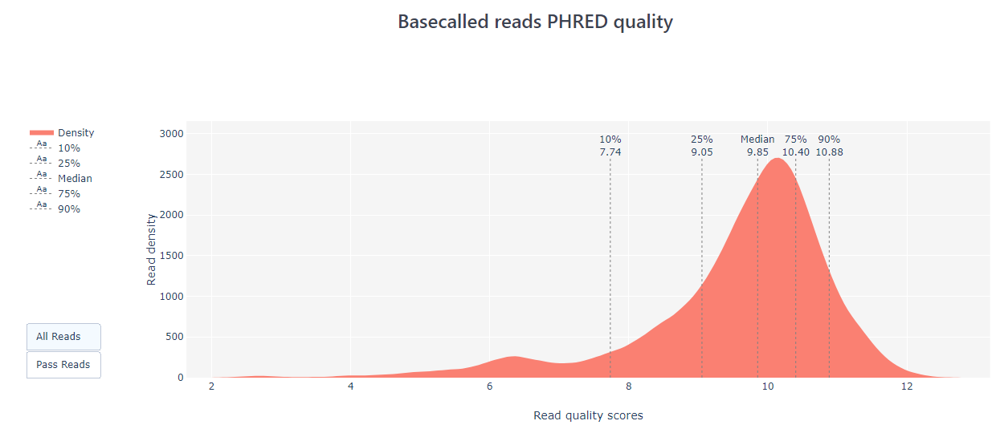

# Working with Oxford Nanopore data

* Teaching: 20 minutes
* Exercises: 10 minutes

#### Objectives

* Know how to assess the quality of Illumina sequence data using visualization tools such as pycoQC
* Be able to perform quality filtering of nanopore data and to remove short reads

#### Keypoints

* Base calling is in most cases done in parallel with sequencing through the `MinKNOW` tool
* `pycoQC` is a great tool for generating interactive reports to explore key aspects of a Nanopore sequencing dataset
* Sequences can be filtered to remove low quality reads and short reads using `nanofilt`

---

## Contents
1. [Notes on base calling](#notes-on-base-calling)
1. [Assessing sequence quality](#assessing-sequence-quality)
1. [Removing short and low quality reads](#Removing-short-and-low-quality-reads)

---

## Notes on base calling

Base calling is the process of translating the raw signal generated by the Nanopore sequencer into nucleotide bases (*i.e.* ATCG). Base calling is in most cases performed 'live' in real time while sequencing is performed so that when the sequencing run is finished, we have our data ready for analysis. There are several base calling tools available, but the official production version developed by Oxford Nanopore Technologies is `guppy`. `guppy` uses neural networks to convert raw signal into sequence data and in addition can  perform identification and removal of Oxford Nanopore sequencing adapters, barcodes, and low quality sequence regions.

When we set the sequencing run parameters using the `MinKNOW` software, we can specify if we want the base calling to be performed automatically by the computer. When the basecalling option is ON, the output of the sequencing run will be saved in fastq files.


When performing base calling in `guppy` there are several prediction models that can be used, offering increased sequence quality and accuracy of translation at the cost of longer run times and more computational power. `MinKNOW` allows us to select between the fast and high-accuracy methods.


>**Note:** With the release of `guppy` version 5 there are also 'super accurate' models which provide higher quality translations than the high-accuracy model. These models can only be used when running `guppy` through the command line.

If we choose to not perform the base calling in real time, we will need to perform the manually call the electronic signal files on the raw output files. These are stored in the `fast5` format. In order to do this, we can work with `guppy` in the command line in NeSI or the computers which PHEL use to run the MinION devices. We are not going to do this in the present workshop, as we normally request `MinKNOW` to perform basecalling in real time.

When performing base calling during the sequencing run, we also have the option to quality filter the sequences straight away, saving us the need to perform this task afterwards. When using this tool, the output fastq files are split into folders of sequences that passed and failed to pass the required Q threshold so we do not *lose* the low quality sequences.


---

## Assessing sequence quality

The initial step for every sequencing project is quality control to assess the quality of your data. This will give you some statistics of your sequencing data, such as length and quality score distributions, as well as highlight potential problems with your input DNA/RNA, the sequencing run or the output itself.

An increasing number of tools are available for sequence data assessment, with different strengths and intended applications. In this session we will introduce the tool `pycoQC`. This is a data visualisation and quality control tool for Nanopore data. In contrast to `FastQC` (which we used in the previous exercise) `pycoQC` requires a specific output file from the sequencing run which is **_not_** in fastq format. This file, named `sequencing_summary.txt` is generated `guppy` during run time.. This file will be located in the same folder that contains the output from the base caller.

>**Note:** Although `FastQC` *can* be used for assessing Nanopore data, it is designed for short sequences and the figures and outputs when long reads are visualised can be confusing without customisation.

> ### Exercise
>
> Using your knowledge of the shell, navigate to `/nesi/project/nesi03181/phel/module_2/` and copy the directory `nanopore_data/` to your own working directory (/nesi/project/nesi03181/phel/USERNAME/).
> 
> <details>
> <summary>Solution</summary>
>
> ```bash
> $ cd /nesi/project/nesi03181/phel/module_2/
> $ cp -r nanopore_data/ ../USERNAME/fastq_processing/data/
> ```
> </details>

To activate pycoQC on NeSI, we need to first load the `slurm` module.

```bash
$ module purge
$ module load pycoQC/2.5.2-gimkl-2020a-Python-3.8.2
```

To run `pycoQC` we simply provide the input file and an output file destination.

```bash
$ cd /nesi/project/nesi03181/phel/USERNAME/fastq_processing/
$ pycoQC -f data/nanopore_data/sequencing_summary.txt -o results/pycoQC_report.html
```

`pycoQC`  generates output reports as html files, which we can open the same way as we did for `FastQC`.

> ### Exercise
>
> Inspect the different plots and statistics.
> 
> 1. How many reads do you have in total?
> 1. What is the median, minimum, and maximum read length?
> 1. What do the mean quality and the quality distribution of the run look like? (Remember, Q10 means an error rate of 10%)
> 
> <details>
> <summary>Solution</summary>
>
> 1. ~270k reads in total (see the Basecall summary of `pycoQC`'s output page)
> 
> 1. The median read length can also be found in the same place. The median length is 3,890 bp for all reads, or 4,070 for those that passed `MinKNOW`'s quality filtering. To find the minimum and maximum read lengths look at the 'Basecalled read lengths' plot. If you hover over the start and the end of the plotted length distribution you will see the length followed by the number of reads. The minimum read length for the passed reads is about 200 bp, the maximum length ~130,000 bp.
> 
> 1. The median quality of the reads can be found in the basecall summary, and the distribution in the 'Basecalled reads PHRED quality plot'. The majority of the reads has a Q-score below 10, i.e., an error rate of >10%. These results can be considered normal although it is possible to obtain better quality.
> 
> </details>

In addition to read statistics, `pycoQC` also gives a lot of information about the sequencing run and the flowcell itself such as sequencing run, yield over time, number of active pores, etc. One of the strengths of `pycoQC` is that it is interactive and highly customisable. Plots can be cropped, you can zoom in and out, sub-select areas and export figures. For detailed usage and examples see the `pycoQC` documentation: [https://a-slide.github.io/pycoQC/](https://a-slide.github.io/pycoQC/).

---

## Removing short and low quality reads

Removing short reads and eliminating low quality data can improve your downstream analysis. For example, it can be beneficial to remove short reads for whole genome sequencing projects. `Nanofilt` is a tool that can filter reads by quality score and length. It is also capable of cropping a specified number of bases from the start or the end of a read, which can be useful sometimes.

In the directory `/nesi/project/nesi03181/phel/USERNAME/fastq_processing/data/nanopore_data/` we should have a Nanopore sequence file `Mb1.fastq`. We will use this file to practice with `Nanofilt`.

```bash
$ module purge
$ module load nanofilt/2.6.0-gimkl-2020a-Python-3.8.2
$ NanoFilt -q 15 -l 500 --headcrop 50 < Mb1.fastq > Mb1_nanofiltered.fastq
```

>**Note:** You will be familiar with using the `>` character to redirect the *standard output* of a command into a new file, but here we are using a new redirection command `<` as well. This is a a command that reads the file into the *standard input* channel of the tool. It is the equivalent of the following command:
>```bash
> $ cat Mb1.fastq | NanoFilt -q 15 -l 500 --headcrop 50 > Mb1_nanofiltered.fastq
> ```

In this example we are:

* Removing all reads with quality scores under 15 (`-q`)
* Removing all reads shorter than 500 bp (`-l`)
* Trimming the first 50 nucleotides off all reads (`–headcrop`)

Let's check what happened to our reads using `FastQC`. We need to use `FastQC` for this purpose because `pycoQC` only works with the `sequencing_summary.txt` file.

```bash
$ module purge
$ module load FastQC
$ cd /nesi/project/nesi03181/phel/USERNAME/fastq_processing/
$ fastqc -o results/ data/nanopore_data/*.fastq
```

Since `FastQC` can be a bit slow on these large Nanopore datasets so we will use pre-computed results for the next exercise.

> ### Exercise
>
> In `/nesi/project/nesi03181/phel/USERNAME/fastq_processing/data/nanopore_data/` there is a hidden folder named `.FastQC_results/` with a `FastQC` report for each of the 2 Nanopore datasets `Mb1.fastq` and `Mb1_nanofiltered.fastq`.
> Open both html reports and compare the results. What are the main differences between the raw dataset and the filtered dataset? 
> 
> <details>
> <summary>Solution</summary>
>
> There are two main points to note:
> 1. We can see that the total number of reads in the filtered dataset is smaller, because we have removed reads with quality values under 15 and shorter than 500 bp.
> 1. The overall quality has increased as a result of removing low quality reads.
> </details>

---
