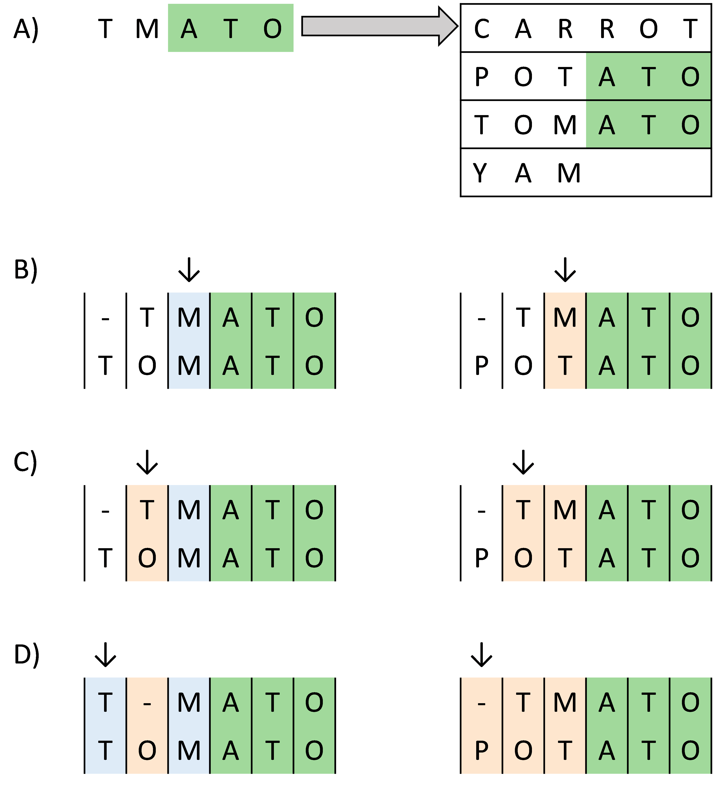
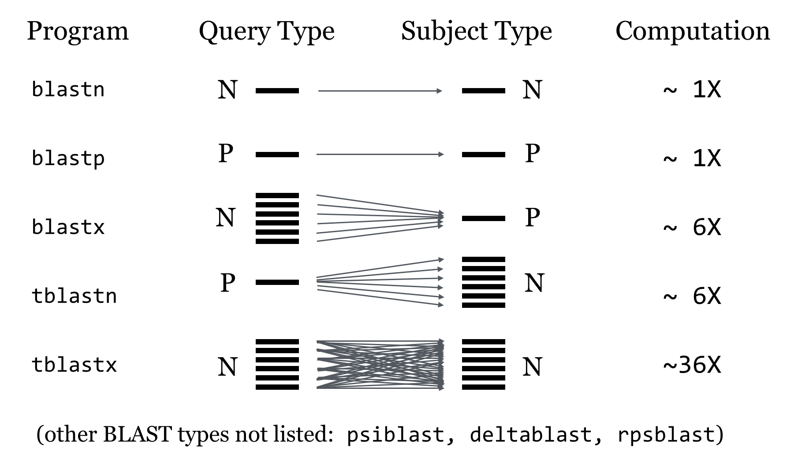

# Annotation of sequences

* Teaching: 30 minutes
* Exercises: 30 minutes

#### Objectives

* Understand the differences betweem nucleotide and protein sequence matching
* Be aware of which publicly available databases are appropriate for which data
* Learn how to submit `BLAST` jobs to the NeSI cluster using `slurm`

#### Keypoints

* Annotation is required in order to identify the function and origin of sequences obtaining from HTS analysis
* There are different databases available for annotation and classification
* Interpreting the results of BLAST alignments can be a tricky process
  * Understand the meanings of the identity, coverage, e-value, and bitscore metrics when assessing a BLAST output

---

## Contents

1. [The `BLAST` process](#the-blast-process)
1. [Submitting a nucleotide `BLAST` job on NeSI](#submitting-a-nucleotide-blast-job-on-nesi)
1. [Submitting a protein `BLAST` job on NeSI](#submitting-a-protein-blast-job-on-nesi)
1. [Interpretting the results of BLAST queries](#interpretting-the-results-of-blast-queries)
---

## The `BLAST` process

The fundamental unit of sequence comparison is the 'Blast Local Alignment Search Tool' (BLAST) method, originally developed in 1990 ([Altschul *et al.*, 1990](https://doi.org/10.1016/S0022-2836(05)80360-2)). Without going into excessive detail, the approach is to take a set of novel (query) sequences and compare each sequence against a reference database of sequences with a known annotation of taxonomic origin (target sequences). From sufficiently well-matched pairings between query and target, we infer that the origin of the sequence, and possibly the function of the gene, are shared.

`BLAST` works by breaking each query sequence into a set of smaller *seed* sequences, and searching each target in the database for the presence of these seeds. Where matches are found, the tool then extends the ends of the seed and assesses how well the ends of the query beyond the seed match the corresponding regions of the target. The quality of the match between the query and the target are evaluated in terms of how well conserved the sequence composition is between the pair, as well as how many insertion or deletion events need to be introduced to maintain the matching.



In the example above, we are trying to match a query sequence `TMATO` against a database of four vegetable names, with the following process

- **A)** The seed sequence `ATO` is identified in the query and two target sequences (green).
- **B)** The query/target pairs are aligned and the character upstream from `ATO` is examined. Matches (blue) and mismatches (orange) are recorded.
- **C)** The process repeats at the next position, scoring mismatches for both targets.
- **D)** The final position is examined.
  - For the target sequence `TOMATO` it is possible to insert a gap into the query sequence to preserve positional homology between query and target and improve the final score.
  - For the `POTATO` target the number of matching positions is never increased from the initial three.

Over the course of this matching, every target in the database will be assessed for it's suitability to match with the query sequence, and results ranked by how well they match. Typically, we restrict our results to only return a certain number of best matches, rather than report everything with any degree of similarity to the query. Regardless of how many results are returned, for a good set of matches we would expect to see a strong consensus in the gene function and taxonomy of the top hits for our query. From this consensus we can make inferences about the role of the sequence and which organism from which it may have originated.

---

## Submitting a nucleotide `BLAST` job on NeSI

The power of BLAST lies in its ability to exhaustively search for query sequences in very large databases of target sequence data, however this can make BLAST a computationally expensive process. This means that on NeSI, when we run a BLAST analysis we need to use ```slurm``` to request resources and schedule our job. 

Lucky for us, BLAST is a commonly used tool and our friends at NeSI have template ```slurm``` scripts available for us to use. 
We will use this template today to prepare a ``slurm`` script to use BLAST to annotate the predicted open reading frames we identified in the *M. Bovis* genome with ```prodigal```

There are different types of BLAST we can use depending on the type of sequence data we have as input, and the types of databases we want to search to generate output. 



Here we want to use nucleotide sequence to predict the protein associated with an ORF, so we will use BLASTX

Navigate to your working directory on NeSI. Create a folder `5_Gene_anotations` and copy the template blastx slurm script and the two unknown nucleotide open read frames (ORFs) from `/nesi/project/nesi03181/phel/module_3/5_Gene_annotations/` into your folder. 

Make sure you copy the nucleotide sequences for the unknown ORFs by checking the file suffix is ```.fna``` for fasta file. 

> <details>
> <summary>Solution</summary>
> 
> ```bash 
> $ cd /nesi/project/nesi03181/phel/USERNAME/
> 
> $ mkdir 5_Gene_annotations/
> $ cp ../../module_3/5_Gene_annotations/blastx.sl ./5_Gene_annotations/
> $ cp ../../module_3/5_Gene_annotations/M_bovis_ORF_*.fna ./5_Gene_annotations/
> ``` 
> </details>


Lets open the template slurm script and adjust it to suit our files. We can use the text editor Nano for this. 


```bash 
$ nano blastx.sl
```

To exit out of Nano use ```ctr o``` to writeout (save) your changes and then ```ctr x``` to exit. 

We can then submit our job
```bash
$ sbatch blastx.sl 
```

For todays session, we won't submit our job as each ORF takes about 40 mins to run and produce a result file (A great job to start before lunch, or heading into the lab!) 
Instead we will use pre-computed results for each ORF 

From ```../../module_3/5_Gene_annotations/blastx_output_files/``` copy the results files for each ORF

Take a look at your results using the ```less``` command and fill out the ```blastx_results_form.txt``` to record your annotation for each ORF.   

---

## Submitting a protein `BLAST` job on NeSI

As well as nucleotide sequences, we can also use amino acid sequences with BLAST to search and identify unknown unknown proteins. In these cases we will use BLASTP. Although BLASTP is less computationaly expensive than BLASTX a ```slurm``` script is still required. 

Copy the template BLASTP slurm script and the two unknown protein sequences from `/nesi/project/nesi03181/phel/module_3/5_Gene_annotations/` into your folder. 

Make sure you copy the protein sequences by checking the file suffix is ```.faa``` for protein fasta file. 

> <details>
> <summary>Solution</summary>
> 
> ```bash 
> #Make sure you are in your dir, if not move there.
> $ cd /nesi/project/nesi03181/phel/USERNAME/
> $
> $ cp ../../module_3/5_Gene_annotations/blastp.sl ./5_Gene_annotations/
> $ cp ../../module_3/5_Gene_annotations/M_bovis_ORF_*.faa ./5_Gene_annotations/
> ```
> </details>

We can open the protein blast file in Nano, and adjust it to our data 

```bash 
$ nano blastp.sl
```

We can then submit our job
```bash
$ sbatch blastp.sl 
```

Again for today we will use pre-computed results for each ORF which can be found here ```../../module_3/5_Gene_annotations/blastp_output_files/``` copy these results files to your working directory

Take a look at your results using the ```less``` command and fill out the ```blastp_results_form.txt``` to record your annotation for each ORF.   

---

## Interpretting the results of BLAST queries

It is important to remember, like most bioinformatics tools, BLAST has a specific job, in this case sequence alignment. BLAST is really good at this job, but it does not offer interpretation of its alignments. Interpretation is completely up to the user on a case by case basis, therefore it is important to know your data and to understand the output metrics given by BLAST to help you make a biologically usefull interpretation of the results. 

BLAST gives four main metrics: coverage, identity, an e-value and a Bit score

**Coverage**

This value tells us as a percentage how much of our query aligns with the database match. 
A small coverage value means only a small part of our sequence has matched. A perfect match would have a coverage of 100. 

**Identity**

This represents the percent of bases which are identical between the query and the database hit. 

**E-value**

This is the number of hits equivalent to this hit that we would expect to see by chance alone. Smaller E-values represent better hits, but an exact E-value cut off needs to be decided on a case by case basis. E-values take into account both the coverage and identity scores for each hit so can be a more "complete" metric. 

**Bit score** 

Similarly to E-values, bit scores summarise the sequence similarity between the query and database hit. However bit scores are calculated independently from the query sequence length and the database size, as databases are constantly evolving this makes bit scores a constant statistical indicator. A higher bit score indicates a better hit. 


---
