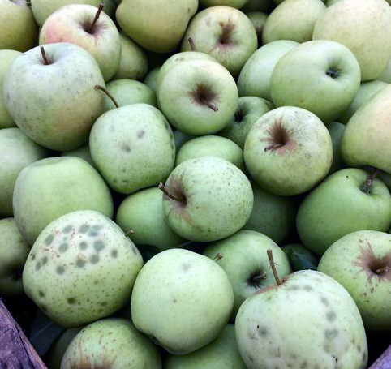
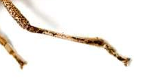

### Final Project 

Damage to a harvest of apples has been found

The farmer is asking for help to identify the cause, and you suspect insects may be responsible for the symptoms observed. 

Unfortunately no indentifiable insects have been found, but fragments of a suspect insect were found within the crate of apples. 

The sample has been sent for molecular analysis and the sequencing results are now available. 

For this project you will need to use the sequencing data provided to identify the insect and determine if this is likely to be responsible for the damage observed. 

